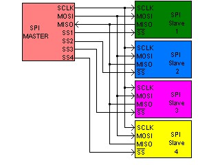
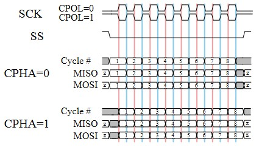
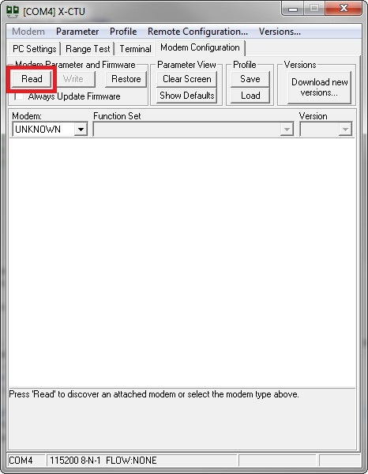
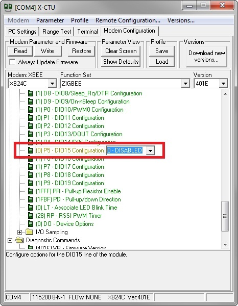

<h1>1. Programming Guide</h1>

# 1.1 Standard GPIO

## Introduction

A standard **General Purpose Input/Output (GPIO)** is a generic pin on the XBee module 
whose behavior (including whether it is an input or output) can be controlled through an XBee application.

A standard **GPIO** can be used for the following purposes:

* Reading from switches.
* Reading from sensors such as IR, liquid level.
* Writing output to LEDs for status, relays, etc.

## Initialization and Configuration

When a standard GPIO is added to the project using the Smart-Editor, it will automatically 
assign a free XBee pin for the GPIO. This pin can be changed and locked at any time from the XBee Pins section of the editor.

The Smart-Editor will automatically define a macro with the component's name associated to its pin. This macro should be used in all functions referring to this pin instead of the pin name (i.e.: **gpio0** instead of **XPIN_2**).

Once the standard GPIO component is added to the Smart-Editor, you will need to configure the following settings:

* **GPIO type**. Specify whether the GPIO is input or output.
* **Pullup enable**. Determine if the pullup is enabled or disabled.
* **Enable Slew Rate**. Specify whether the slew rate will be enabled or disabled.
* **Drive Strength**. Configure the drive strength to high or low.

>  **Reset pin (_XPIN_5_ in _S2B_ &amp; _S3B_ modules or _XPIN_6_	in _S2C_ &amp; _S8_ modules) is only available as <u>INPUT</u>.**

>  **BKGD pin (_XPIN_8_ in _S2B_ &amp; _S3B_ modules or _XPIN_9_	in _S2C_ &amp; _S8_ modules) is only available as <u>OUTPUT</u>.**

The component will be automatically initialized and configured by the hardware initialization process of the application.

## Usage

Once you have initialized and configured the standard GPIO, you can read its value and, if it is configured as output, set it. To do so, the standard GPIO component allows for the following commands in code:

* **gpio_get(xpin_t pin)**

> Gets (reads) the value of the specified XBee pin returning 1 if the pin is in high level and 0 if it is	in low level.

> **Usage example:**

> This piece of code will read and save the value of XBee pin 7 of the module:

>  `gpio_get(XPIN_7);`

* **gpio_set(xpin_t pin, bool_t val)**

> Sets the specified pin in high or low level.

> **Usage example:**

> This piece of code will set the value of XBee pin 7 of the module to high (1):

>  `gpio_set(XPIN_7, 1);`

>  **Notice that the XBee pin must be configured as output in order	to set it.**

* **gpio_toggle(xpin_t pin)**

> Sets the value of the specified pin to the opposite of current.

> **Usage example:**

> This piece of code will invert the value of _gpio0_:

>  `gpio_toggle(gpio0);`

> It is equivalent to **gpio_set(gpio0, !gpio_get(gpio0);**

>  **Notice that the XBee pin must be configured as output in order to toggle it.**

Finally, some applications may need to reconfigure the GPIO in runtime, to do so the API provides the following function:

* **gpio_config(xpin_t gpio, uint8_t cfg)**

> _port_ parameter is the port name macro define dby Smart-Editor (i.e.: "gpio0") and _cfg_ is an ORed integer indicating the configuration.

* Possible macro configurations are the same as the following:
	* **GPIO_CFG_INPUT** or **GPIO_CFG_OUTPUT**: to set the pin as input or output respectively.
    * **GPIO_CFG_PULL_UP_EN** or **GPIO_CFG_PULL_UP_DIS**: to enable or disable the pin's internal pull-ups.
    * **GPIO_CFG_SLEW_RATE_EN** or **GPIO_CFG_SLEW_RATE_DIS**: to enable or disable the pin's slew rate.
    * **GPIO_CFG_DRV_STR_LOW** or **GPIO_CFG_DRV_STR_HIGH**: to set the port pin's drive strenght to low or high respectively.

> **Usage example:**

> This piece of code configures _gpio0_ as an output with low drive_strenght:

>  `gpio_config(port0, GPIO_CFG_OUTPUT | GPIO_CFG_DRV_STR_LOW);`

## API Reference

You can find the full API documentation of this component in the [API Reference](http://exsilium.github.io/xbee-sdk-doc/group__api__gpios__gpio.html) section of the library

# 1.2 IRQ GPIO

## Introduction

A GPIO Interrupt Request is a special input that triggers an interrupt when an active edge or level is detected on its associated pin.

A GPIO IRQ can be used for the following purposes:

* Reading from switches or buttons, without the need of polling.
* Attaching a keyboard.
* Reading from sensors such as IR or liquid level.
* Awaking the CPU when it is in STOP mode.

## Initialization and Configuration

When an IRQ GPIO is added to the project using the Smart-Editor, a free XBee pin will automatically be assigned to it. This pin can be changed and locked at any time from the XBee Pins section of the editor.

The Smart-Editor will automatically define a macro with the component's name associated to its pin. This macro should be used in all functions referring to the pin, instead of the pin's name (i.e.: irq0 instead of XPIN_20).

Once the IRQ GPIO component is added to the Smart-Editor, you will need to configure the following settings:

* **Detection mode:** specify whether the IRQ is triggered when an edge or a level is detected.
* **Active level/edge:** determines whether the IRQ's active level/edge is high or low.
* **Pin pull:** allows you to configure the internal pull resistor. Options are: _High_, _Low_ and _None_. However, this field differs between modules as some support pull-ups and pull-downs and some only support pull-ups.

>  **The pull resistors are set by the radio microprocessor. The _PR_ and _PD_ AT parameters are set automatically by the application and should not be modified by the user in runtime.**

>  **Some pins do not support internal pull, if an unsupported pin is selected a WARNING message will appear in the _Problems_ tab when building the project.**

The Smart-Editor automatically includes the IRQ's callback code in the _main.c_ file. The IRQ acknowledge is made automatically. However, as it is executed in interrupt context, this callback should be as fast as possible or the application may crash due to a watchdog timeout. This should be taken into consideration for _Level_ interrupts especially as they may be called many times before the main for(;;) loop feed the _watchdog_.

The component is automatically initialized and configured by the hardware initialization process of the application.

## Usage

Once the IRQ GPIO is initialized and configured, the user callback in _main.c_ will be called every time an active edge or level is detected. If you want to disable IRQs, the API provides two functions for doing so:

* **gpio_irq_enable(bool_t enable)**

> Enables or disables all GPIO IRQs.

> **Usage example:**

> The following piece of code disables all IRQs for one second and enables it again:

> 

```
gpio_irq_enable(FALSE);
delay_ticks(HZ);
gpio_irq_enable(TRUE);
```

* **gpio_enable_xpin_irq(xpin_t pin, bool_t  enable)**

> Enables or disables specific pin IRQ, if the pin is not IRQ capable it returns a negative integer indicating error. This should not happen if the component's name macros are used.

> **Usage example:**

> The following piece of code disables _"button1"_ IRQ:

>  `gpio_enable_xpin_irq(button1, 0);`

## API Reference

You can find the full API documentation of this component in the [API Reference](http://exsilium.github.io/xbee-sdk-doc/group__api__gpios__irq.html) section of the library

# 1.3 GPIO Port

## Introduction

A standard General Purpose Input/Output Port (GPIO Port) is a group of pins on the XBee module whose behavior (including whether they are an input or output) can be controlled through an XBee application.

A GPIO port can be used for the following purposes:

* Reading from input arrays.
* Writing output to LEDs for status, relays, etc.
* Communicating with parallel devices such as character displays.

## Initialization and Configuration

When a GPIO port is added to the project using the Smart-Editor, it will automatically assign two free XBee pins for the port, and if the port's pin number is modified, it will try to assign free pins. Pin assignation can be changed and locked at any time from the XBee Pins section of the editor.

The Smart-Editor will automatically define a macro with the port's name associated to its pins, indeed it is declared as a _xpin_t_ array. This macro should be used in all functions referring to this port.

Once the GPIO port component is added to the Smart-Editor, you will need to configure the following settings:

* **Port pins:** Select the number of pins that compose the port.
* **GPIO type:** Specify whether the port is input or output.
* **Pullup enable:** Determine whether or not the pullups are enabled.
* **Enable Slew Rate:** Specify whether the slew rate will be enabled or disabled.
* **Drive Strength:** Configure the drive strength to high or low in case of output mode.

>  **Reset pin (_XPIN_5_ in _S2B_ &amp; _S3B_ modules or _XPIN_6_ in _S2C_ &amp; _S8_ modules) is only available as <u>INPUT</u>.**

>  **BKGD pin (_XPIN_8_ in _S2B_ &amp; _S3B_ modules or _XPIN_9_ in _S2C_ &amp; _S8_ modules) is only available as <u>OUTPUT</u>.**

The component will be automatically initialized and configured by the hardware initialization process of the application.

## Usage

Once you have initialized and configured the GPIO port, you can read its value or change it if it is configured as output. To do so, the GPIO port component allows for the following commands in code:

* **port_get(port_t port)**

> Gets (reads) the value of the specified port returning an 8-bit unsigned integer representing the value (1 if the pin is in high level and 0 if it is in low level).

> **Usage example:**

> The following piece of code will read and save in the value of _port0_ in the _data_ variable:

>  `data = port_get(port0);`

* **port_set(port_t port, uint8_t  val)**

> Sets the specified port value.

> **Usage example:**

> The following piece of code will set the bit0 and bit1 pins of port "port0" to high level, and the other bits to low level:

>  `port_set(port0, 0x03);`

>  **The port must be configured as output in order to set it.**

> There are also port bit-operations that can be used to set and get a single port bit:

* **port_bit_get(port_t port, uint8_t bit)**

> Gets (reads) the value of the specified port's bit returning an integer representing the value (1 if the pin is in high level and 0 if it is in low level).

> **Usage example:**

> The following piece of code will read the bit2 (3rd bit) of _port0_:

>  `port_bit_get(port0, 2);`

* **port_bit_set(port_t port, uint8_t  bit, bool_t val)**

> Sets the specified port's bit value.

> **Usage example:**

> The following piece of code will set the bit2 (3rd bit) _port0_ to high level, leaving the other pins unaffected:

>  `port_set_bit(port0, 2, 1);`

>  **The port must be configured as output in order to set it.**

Finally, some applications may need to reconfigure the port in runtime. To do so, the API provides the following function:

* **port_config(port_t port, uint8_t cfg)**

> _port_ parameter is the port name macro defined by the Smart-Editor (i.e.: "port0") and _cfg_ is an ORed integer indicating the configuration.

* Possible macro configurations are the same as the ones for GPIO configurations:
	* **GPIO_CFG_INPUT** or **GPIO_CFG_OUTPUT**: to set the port as input or output respectively.
    * **GPIO_CFG_PULL_UP_EN** or **GPIO_CFG_PULL_UP_DIS**: to enable or disable the port pins' internal pull-ups.
    * **GPIO_CFG_SLEW_RATE_EN** or **GPIO_CFG_SLEW_RATE_DIS**: to enable or disable the port pins' slew rate.
    * **GPIO_CFG_DRV_STR_LOW** or **GPIO_CFG_DRV_STR_HIGH**: to set the port pins' drive strength to low or high respectively.

> **Usage example:**

> The following piece of code configures _port0_ as an output with low drive_strength:

>  `port_config(port0, GPIO_CFG_OUTPUT | GPIO_CFG_DRV_STR_LOW);`

## API Reference

You can find the full API documentation of this component in the [API Reference](http://exsilium.github.io/xbee-sdk-doc/group__api__gpios__port.html) section of the library

# 1.4 Analog to Digital Converter

## Introduction

An Analog to Digital Converter (ADC) is a device that translates an analog voltage to a digital value that a microprocessor can understand. In the Programmable XBee there are several channels available depending on module version and technology; however, these channels all work the same way.

There is an on-chip 12-bit linear successive approximation ADC integrated in the Freescale microprocessor.

The external reference pin must be connected to the reference ranging from 1.8 VDC to VDD.

## Initialization and Configuration

When an ADC channel is added to a project for the first time, the Smart-Editor will automatically add the hidden ADC configuration component. This component determines the following parameters for all ADC channels:

* **Conversion mode:** Selects between an 8-bit, 10-bit or 12-bit resolution.
* **Optimization:** Selects the optimization between conversion speed or power	consumption.

Also, any time an ADC channel is added to the project using the Smart-Editor, an available XBee pin is automatically assigned to the component. This pin can be changed and locked at any time from the XBee Pins section of the editor.

The Smart-Editor will automatically define a macro with the component's name associated to its pin. This macro should be used in all functions referring to the pin, instead of the pin's name (i.e.: adc0 instead of XPIN_2).

## Usage

### - Reading ADC value

In runtime, the ADC channels' values can be read with the following function.

* **uint16_t adc_ch_read(xpin_t pin)**

> This function returns the value read from the ADC channel associated with _pin_ (channel name should be used). If the pin is not a valid ADC channel, it returns 0xFFFF.

> **Usage example:**

> The following piece of code will return the current value of _adc0_:

>  `adc0_value = adc_ch_read(adc0);`

### - Converting read value

The conversion between read value and voltage is made using the following formula:

>  `Voltage = VRef / FS x Read Value`

Values for the above formula are:

* **VRef** = External voltage reference.
* **FS** = Full scale value, will vary depending on resolution:
	* **8-bit**: 255 (0xFF)
    * **10-bit**: 1023 (0x3FF)
    * **12-bit**: 4095 (0xFFF)

* **Usage example:**

> For a **Vref** = 3.3 V and a **Resolution** = 12-bit; if **Read Value** = 0x800 (2048d):

>  `Voltage = VRef / FS x Read Value = 3.3 / 4095 x 2048 = 1.65 V`

### - Enabling/Disabling the ADC channel

Once initialized, an ADC channel can be enabled or disabled at any time using the following API function:

* **adc_ch_enable(xpin_t pin, bool_t enable)**

> When enabling or disabling an ADC channel two parameters are necessary. The first parameter is the XBee pin (as with other functions, the ADC channel's component name should be used). The second parameter may be 0/1 or be the predefined macros TRUE/FALSE.

> This is useful when the component is no longer needed, and conversion can be disabled to reduce power consumption.

> This function returns 0 if success and -ERANGE if _pin_ is not a valid ADC channel.

> **Usage example:**

> The following piece of code will completely disable the adc0 component:

>  `icapture_enable(icpin0, FALSE);`

> This component can be enabled again at a later time, and it will remain with its configured settings and last counter value.

### - Reconfiguring ADC settings

The hardware init routine _sys_hw_init()_ automatically configures the ADC channels. However, they can be reconfigured at runtime with the following functions:

* **adc_config(uint8_t config)**
	* Configures the general ADC settings.
    * _config_ should be an OR between two macros, one for the resolution and one for the optimization settings:
		* Resolution macros:
			* **ADC_CFG_MODE_8BIT**: Sets the resolution to 8-bit.
            * **ADC_CFG_MODE_10BIT**: Sets the resolution to 10-bit.
            * **ADC_CFG_MODE_12BIT**: Sets the resolution to 12-bit.
        * Optimization macros:
			* **ADC_CFG_OPTIMIZE_FOR_SPEED**: Conversion optimized for speed.
            * **ADC_CFG_OPTIMIZE_FOR_POWER**: Conversion optimized for reducing	power consumption.

> **Usage example:**

> The following piece of code configures the ADC channels to 8-bit resolution and reduced power consumption:

>  `adc_config(ADC_CFG_MODE_8BIT | ADC_CFG_OPTIMIZE_FOR_POWER);`

## API Reference

You can find the full API documentation of this component in the [API Reference](http://exsilium.github.io/xbee-sdk-doc/group__api__adc.html) section of the library

# 1.5 Power Management

The goal of power management is to reduce device power consumption while still allowing the device to perform a requested operation. The Programmable XBee has two chips that can be set to low power, the radio and the Freescale CPU.

Depending on the XBee module variant you are using, you may refer to a different guide of the Power Management:

* [1.5.1 ZigBee](#151-power-management-for-zigbee) 
* [1.5.2 DigiMesh](#152-power-management-for-digimesh)

## 1.5.1 Power Management for ZigBee

### Introduction

The level of power saving that is achievable in the ZigBee modules will depend on the functionality implemented. The following concepts need to be clear in order to define this functionality:

* Does the device need to receive and transmit packets? Just transmit or just receive?
* If the device does not need to receive, it can fully switch off the radio for long periods of	time, therefore saving power until it needs to transmit.
* If the device needs to receive, how much delay in reception can it tolerate: 1, 10, 28 seconds? The device's radio and coordinator must be configured to allow the radio to sleep for a specific period of time,     which will save power while coordinator buffers the packets for it.
* If the device does not need to transmit, it's not necessary for the CPU to control the radio.	The radio can sleep autonomously, awaking the CPU only when there is a packet to be received.

To achieve this functionality 3 parameters have to be precisely configured:

* On the device: radio parameters.
* On the device: CPU sleep times, awake methods and radio handling.
* On the coordinator: radio parameters.

The examples within this section will clarify these concepts and help you start a real application utilizing power management.

### Signals involved in Power Management

There are two signals involved in power management for ZigBee:

* **SLEEP_RQ** (XPIN9 on S2B, XPIN10 on S2C): The purpose of this signal is to allow the CPU to request	that the radio go into stop mode. It's an output for the CPU connected to an input in the radio.
	* The pm_set_radio_mode(PM_MODE_STOP) function will put the SLEEP_RQ pin to high     	in order to let the ember radio go into low power mode.
    * The pm_set_radio_mode(PM_MODE_RUN) function will put SLEEP_RQ pin to low in order to     	awaken the radio.

> The behavior of the radio, depending on pin state, will be different depending on which     power management mode is configured.

* **ON/<span style="text-decoration: overline">SLEEP</span>** (XPIN13 on S2B, XPIN26 on X2C): The purpose of this signal is to allow the ember radio to awaken a sleeping CPU when it receives a ZigBee packet, so that the CPU can process it accordingly. The signal is an output for the radio connected to an input in the CPU.

> If the CPU has gone to sleep as a result of the pm_set_cpu_mode(PM_MODE_STOP,0) function, it will awaken when the radio receives a packet and raise the ON/<span style="text-decoration: overline">SLEEP</span> pin.

> The CPU input where this signal is connected awakens the CPU on both rising and falling edges. This introduces complexity while using the power management API, as some of the radio transitions can produce an undesired awakening of the CPU if the radio and CPU sleep synchronization process is not correctly executed.

Pins where these signals are connected are dedicated to power management once 'the power management' component is in the project. If this component is not included, some pins can be used for other purposes, depending on module variant and revision.

### Power Management API

The Programmable XBee API contains functions which can be used to put the CPU and radio into a desired power state. It also contains a function used to query the state of the radio:

* void pm_set_cpu_mode(pm_mode_t mode, uint32_t sleep_seconds);
* void pm_set_radio_mode(pm_mode_t mode);
* pm_mode_t pm_get_radio_mode(void);
* uint8_t pm_get_wakeup_source(void)

where:

* pm_mode_t can be PM_MODE_STOP or PM_MODE_RUN.
* sleep_seconds sets the maximum time you want the CPU to sleep if it is not interrupted      (this value can be set to 'infinite' so that the CPU will only awaken from interrupts).

This API is implemented in *src\cpu\pm.c* file. See the [API Reference](http://exsilium.github.io/xbee-sdk-doc/group__cpu__pm.html) section for more information.

### Initialization and Configuration

#### - First step

The first step towards allowing a Programmable XBee device to perform power management is adding the 'power management' component to the project using the Smart-Editor.

#### - Second step

The second step is configuring power management mode in the power management component. Power management mode can be set to two different modes: pin sleep and cyclic sleep:

* **Pin sleep:**

> In pin sleep mode, the CPU has full control of the radio. The radio will sleep after the CPU sets the SLEEP_RQ pin to high using the pm_set_radio_mode(PM_MODE_STOP) function, and won't awaken until the pm_set_radio_mode(PM_MODE_RUN) function sets the SLEEP_RQ pin to low again.

> In pin sleep mode there are no other parameters to configure in the power management component.

> This mode is not suitable for applications that need to receive packets at random times, as     incoming packets will be lost while the radio is sleeping. It is suitable for applications where the device does nothing or simply collects data for long periods of time (ranging from minutes to hours, or even days). Within these long periods of inactivity communication with the coordinator is not expected; the device will not be able     to receive packets and it's desirable to save as much power as possible. For this reason, both the radio and CPU of the device are in low power mode. When necessary, the device will awaken the CPU and radio and transmit collected data.

> Special care has to be taken when configuring the coordinator's radio parameters. The aim here is to ensure that the coordinator doesn't remove the device from the 'child table' during the time that the radio is asleep and not sending poll requests to the coordinator. This way, the device can transmit data as soon as it awakens the radio without needing to implement complex re-connection algorithms. The coordinator parameters that need to be configured are 'Cyclic Sleep Period' (SP) and 'Number of Cyclic Sleep     Periods' (SN). Configure these option's values so that (3*SP*10*SN) is greater than the amount of time the XBee module will have the radio turned off.

> The SP parameter within the coordinator is normally pre-established for other end devices' usage using cyclic sleep mode. Assume that, for example, it is set to 0x1F4=500 (see the details cyclic sleep mode section for more details).

> If a device will put the radio to sleep for 1 day, which is equal to 86400000 ms, the SN value should be configured within coordinator as:

* **MaxRadioSleepTime** = 3*SP*10*SN
* **SN** = MaxRadioSleepTime/3/SP/10
* **SN** = 86400000 / 3 / 500 / 10 = 5760 = 0x1680 -&gt; 1680

> A ready to use example making use of this mode is available at **examples\PowerManagement\ZigBee\Long_Time_Sleeping_Sensor**. See the example Readme.txt file for details.

>  *Don't forget to configure the coordinator's radio parameters as described in the example's Readme.txt file.*

* **Cyclic sleep:**

> In cyclic sleep mode, the radio sleeps and awakens almost autonomously based on its own configured parameters. The ember radio will be in low power mode, awaking from time to time to check and see if packets are buffered for it in the coordinator. If there aren't any buffered packets, the radio will sleep again and the CPU will continue sleeping it it was sleeping. If there are packets, the radio will awaken the CPU using the ON/<span style="text-decoration: overline">SLEEP</span> pin.

> The CPU has some control over the radio as it can prematurely awaken the radio using the     pm_set_radio_mode(PM_MODE_RUN) command. This is useful for applications in cyclic sleep mode when they want to transmit data as it will assure that the radio is ON at the time of the transmission.

>  **The radio will go to sleep itself in this configuration mode after some time,	even if CPU does not call the pm_set_radio_mode(PM_MODE_STOP) command.**

>  **The radio and CPU sleep synchronization process is important when using	this power management mode to prevent an undesired awakening of the CPU. This subject will be explained later.**

> In cyclic sleep mode there are several parameters that can be configured in the power management component:

* **Sleep Option (SO)**: Defaults to short sleep. This setting should not be changed		to cope with the examples and procedures described in this guide.
* **Sleep Period (SP)**: Defaults to 5000; ranges from 320 to 28000 mS. It		Sets the number of milliseconds that the radio will sleep before it awakens again to poll the		coordinator for packets. It is likely that you will customize this parameter for cyclic sleep mode.
* **Time before sleep (ST)**: Defaults to 500; ranges from 1 to 65535. It		Sets the number of milliseconds of inactivity (no serial or RF data is sent or received)		before going to sleep.

> It may be necessary to increase this time if transition problems arise. For example, an issue will result from the "Wake up on packet receiving and on GPIO press for ransmitting" because	the radio has already gone to sleep when the application tries to transmit data.

* **Number of sleep periods (SN)**: Defaults to 65535; ranges from 1 to 65535. If SN is		1 when the sleep option (SO) is configured to short sleep, the On Sleep pin will be asserted during every sleep period. Otherwise, the On Sleep pin will be asserted when a package is received or when the number of SN cycles has been consumed.

> This configuration should not be modified. The high default value prevents the radio from disturbing the CPU if there are no packets pending to receive.

> This mode is useful for applications where a device needs to be continuously joined to the coordinator so that no incoming packets are lost. A fast response to packets is not required, so a radio can sleep for periods up to 28 seconds (which is the maximum time that a coordinator buffers packets) in order to save power. The CPU is always in low power mode until packets arrive.

> The application will set the radio and CPU's chips to STOP mode (sleep or low-power consumption). A radio chip is configured to check every (SP) time if there are any packets for it. If there are one or more packets, the radio chip asserts the ON/<span style="text-decoration: overline">SLEEP</span> pin and wakes up the Freescale microprocessor to handle the interrupt request from the XBee-Layer.

> Special care has to be taken when configuring the coordinator's radio parameters. The aim here is	to ensure that the XBee module doesn't lose any packets during the time the radio is asleep. In order to do so, the coordinator must buffer the packets destined to it for the amount of time the radio is asleep. The coordinator parameter which needs to be configured is 'Cyclic Sleep Period' (SP). Configure this option's value so that (SP*10) is equal or greater than the amount of time that the XBee module will have the radio turned off (SP parameter on the power management component). Note that the SP field within the power management component is the absolute time in decimal milliseconds, and does not have to be multiplied or divided by 10 as in the coordinator configuration.

> If the SP parameter within the power management component is set to 5000, meaning 5000 mS or 5 seconds, the SP parameter within the coordinator must be set to 5000 / 10 = 500 = 0x1F4 -&gt; 1F4.

> A couple of ready to use examples making use of this mode are available at **examples\PowerManagement\ZigBee**:

* **wake_up_on_packet_rx**: listens for incoming packets so it doesn't need to manually handle the radio using the pm_set_radio_mode function.
* **wake_up_on_packet_rx_gpio_tx**: It can additionally transmit data when a GPIO is pressed so it needs to manually handle the radio using the pm_set_radio_mode function to assure that the radio is awoken when the application tries to transmit data.

> See the examples Readme.txt files for details.

>  *Don't forget to configure the coordinator's radio parameters as described in the example's Readme.txt file.*

### Usage

Use the Power Management API to put the CPU and radio into the desired power state according to the desired functionality. See the [Power Management API](http://exsilium.github.io/xbee-sdk-doc/group__cpu__pm.html) section for more information.

The Power Management API provides basic functions for putting the CPU and radio into desired power states, as well as a function used to query the state of the radio. The examples provided within this guide cover most of the typical implementations doing ZigBee communication while also performing power management. They show how, when, and where to use (and not to use) these functions in order to achieve the desired functionality, while also saving as much power as possible and maintaining radio and CPU sleep synchronization.

>  *There is a function to know which source caused the CPU to wake up, check "pm_get_wakeup_source()" in the [API Reference](http://exsilium.github.io/xbee-sdk-doc/group__cpu__pm.html)*

### Radio and CPU sleep synchronization

Throughout the power management chapter the importance of radio and CPU sleep synchronization has been mentioned. The following sections will describe radio and CPU sleep synchronization in detail.

#### - Synchronization while going to sleep

It was stated in the signals involved in power management section that the CPU awakens on both rising and falling transitions of the pin which the radio uses to signal its sleep state (ON/<span style="text-decoration: overline">SLEEP</span>).

To begin the process of synchronization while going to sleep issue the following code:

> 

```
pm_set_radio_mode(PM_MODE_STOP);

printf("Going to sleep... (waiting for Zigbee packet)\n");

pm_set_cpu_mode(PM_MODE_STOP, WAIT_INFINITE); /* Start sleeping */
```

The first function within this code makes the CPU raise the SLEEP_RQ pin, letting the radio go to sleep. After printing a message, the third function within this code will put the CPU into stop mode. However, the radio may still be on due to the Time before sleep (ST) parameter (wich was configured in the power management component). By default, this parameter establishes that the radio will be on for 500 ms after the last awakening or radio usage. When the radio finally goes to sleep it will lower the ON/<span style="text-decoration: overline">SLEEP</span> pin prematurely awaking the CPU and putting the application main loop into an unpredictable state.

To resolve this issue, you can add a while loop which will wait for the radio to turn off:

> 

```
pm_set_radio_mode(PM_MODE_STOP);

/* Radio doesn't sleep immediately even when requested. 
 * Don't sleep the cpu until radio is already slept to prevent a false awake
 * of the cpu caused by the high to low edge of the On/sleep radio pin.
 */ 
while (pm_get_radio_mode() == PM_MODE_STOP);
printf("Going to sleep... (waiting for Zigbee packet)\n");

pm_set_cpu_mode(PM_MODE_STOP, WAIT_INFINITE); /* Start sleeping */
```

Depending on the amount of time configured for the Time before sleep (ST) parameter, too much time may be spent not ticking the sys_xbee_tick() which will lead to loss of ZigBee packets.

To resolve this issue, use the following code:

> 

```
pm_set_radio_mode(PM_MODE_STOP);

/* Radio doesn't sleep immediately even when requested. 
 * Don't sleep the cpu until radio is already slept to prevent a false awake
 * of the cpu caused by the high to low edge of the On/sleep radio pin.
 */ 

if (pm_get_radio_mode() == PM_MODE_STOP) {
   printf("Going to sleep... (waiting for Zigbee packet)\n");

   pm_set_cpu_mode(PM_MODE_STOP, WAIT_INFINITE); /* Start sleeping */

}
```

This code will assure that the main loop continuously ticks the sys_xbee_tick until the 
radio finally goes to sleep, at which point you can also put the CPU to sleep.

#### - Synchronization while waking

After the CPU is awoken, depending on the application, you may want to assure that the radio is on before continuing execution on the main loop; especially if the application pretends to transmit data at that point.

First, issue the following code:

> 

```
pm_set_cpu_mode(PM_MODE_STOP, WAIT_INFINITE); /* Start sleeping */
/* When cpu wakes-up, it continues executing from here */

pm_set_radio_mode(PM_MODE_RUN);

printf("Awaked\n\n");
```

This approach will not wait for the radio to turn on. The radio will awaken quite fast once requested (usually 14mS), but not immediately. If you don’'t wait for the radio to turn on, and the application's main loop tries to transmit data immediately, data may not be transmitted correctly (the radio could be off).

To resolve this issue, you can add a while loop which will wait for the radio to turn on before transmitting any data:

> 

```
pm_set_cpu_mode(PM_MODE_STOP, WAIT_INFINITE); /* Start sleeping */
/* When cpu wakes-up, it continues executing from here */
pm_set_radio_mode(PM_MODE_RUN);

while (pm_get_radio_mode() != PM_MODE_RUN);

printf("Awaked\n\n");
```

While waking, there is no random time or parameter that will extend the amount of time that the radio needs to wake up completely. This code will implement a while loop lasting no more than 14 ms. Any period of time greater than 14mS would be too long of an amount of time not ticking the sys_xbee_tick. This sequence is the final step in the synchronization while waking process.

#### - Manual handling of the radio

Applications that do not make use of the radio to transmit data may not need to use the pm_set_radio_mode function to STOP or RUN the radio. These applications, normally using cyclic sleep mode, will only use the radio to receive data. The radio will awaken automatically when a packet is received, also awakening the CPU so it's not necessary to handle the radio manually. However, with this kind of application, it's still necessary to synchronize the CPU and the radio when going to sleep to prevent a false awakening of the CPU.

### API Reference

You can find the full API documentation of this component in the [API Reference](http://exsilium.github.io/xbee-sdk-doc/group__cpu__pm.html) section of the library

## 1.5.2 Power Management for DigiMesh

### Introduction

The level of power saving that is achievable in the DigiMesh modules will depend on the radio power management mode and sleep/awake programmed periods. The examples within this section will clarify these concepts and help you start a real application supporting power management.

### Signals involved in Power Management

There is one signal involved in power management for DigiMesh:

* **ON/<span style="text-decoration: overline">SLEEP</span>** (XPIN13 on S3B, XPIN26 on X8): The purpose of this signal is to allow the radio to wake-up a sleeping CPU when it finishes its sleeping cycle, so that the CPU can process possible incoming packets accordingly. The signal is an output for the radio connected to an input in the CPU.

> If the CPU has gone to sleep as a result of the pm_set_cpu_mode(PM_MODE_STOP, 0) function, it will be awakened when the radio awakes and raise the ON/<span style="text-decoration: overline;">SLEEP</span> pin.

> The CPU input where this signal is connected awakens the CPU on both rising and falling edges. This introduces complexity while using the power management API, as some of the radio transitions can produce an undesired awakening of the CPU if the radio and CPU sleep synchronization process is not correctly executed.

The pin where this signal is connected is dedicated to power management once 'the power management' component is in the project. If this component is not included, the pin can be used for other purposes.

### Power Management API

The Programmable XBee API contains functions which can be used to put the CPU into a 
desired power state. It also contains a function used to query the state of the radio:

* pm_set_cpu_mode(pm_mode_t mode, uint32_t sleep_seconds);
* pm_mode_t pm_get_radio_mode(void);

where:

* pm_mode_t can be PM_MODE_STOP or PM_MODE_RUN.
* sleep_seconds sets the maximum time you want the CPU to sleep if it is not interrupted      (this value can be set to WAIT_INFINITE so that the CPU will be only awakened by interrupts).

This API is implemented in the **src\cpu\pm.c** file. See the [API Reference](http://exsilium.github.io/xbee-sdk-doc/group__cpu__pm.html) section for more information.

### Initialization and Configuration

#### - First step

The first step towards allowing a Programmable XBee device to perform power management is 
adding the 'Power Management' component to the project using the Smart-Editor.

#### - Second step

The second step is configuring power management mode in the power management component.

In synchronous sleep modes there are several parameters that can be configured in the Power Management component:

* **Sleep Option (SO):** Defaults to None. Configures the advanced sleep options.
	* **None:** No options.
    * **Preferred sleep coordinator:** At least one device in the network should have this flag.
    * **Non-sleep coordinator:** Will cause a module to never act as a sleep coordinator.
		* *The examples described in this guide have this parameter already configured.*
* **Sleep Period (SP):** Defaults to 10000; ranges from 1 to 14400000 mS (4 hours). This sets the number of	milliseconds for the sleep period. It is likely that you will customize this parameter.
* **Wake Time (ST):** Defaults to 2000; ranges from 1 to 3600000 (1 hour). The wake time of the module.	The minimum wake time is a function of MT, SP, NH, and platform dependent values. Value will be raised automatically to a	valid value when SP, NH, or MT is increased.

Special care has to be taken when configuring the DigiMesh network's sleep parameters. The aim here is to create a DigiMesh network where all modules synchronize and go to sleep and awaken at the same time; interchanging data during the awakening period. The Sleep Option (SO) parameter has to be customized for each device so one node is specified to always act as a sleep coordinator. This is done by selecting the preferred sleep coordinator option in the Sleep Options (SO) combo box. A node configured this way will always send a sync message at the beginning of a wake cycle. For this reason, it is imperative that no more than one node in the network has this configuration selected.

Although it is not necessary to specify a preferred sleep coordinator, it is often useful to select a node for this purpose to improve network performance. A node which is centrally located in the network can serve as a good sleep coordinator to minimize the number of hops a sync message must take to get across the network. A sleep support node and/or a node which is mains powered may be agood candidate.

>  *It's recommended that you read the "Synchronous Sleep Operation" chapter from the [XBee-PRO DigiMesh RF Modules Product Manual](http://ftp1.digi.com/support/documentation/90000903_E.pdf) to learn more about how to configure a DigiMesh network.*

Power management mode can be set to two different modes: synchronous cyclic sleep and synchronous sleep support:

* **Synchronous Cyclic Sleep:**
    
> In synchronous cyclic sleep mode, the radio sleeps and wakes autonomously	based on its own configured parameters (or the ones inherited from the network). The radio will be in low power mode, awakening at	programmed times which will make the CPU wake through the ON/<span style="text-decoration: overline;">SLEEP</span> pin.

> The CPU has no control over the radio; the pm_set_radio_mode() command has no effect on DigiMesh synchronous	sleep modes. The only way to synchronize the CPU and the radio is to make the CPU follow the radio's power states. For example, the CPU will try to sleep	while the radio is asleep; and will be awakened when the radio is awake. The code to achieve this synchronization is explained later.

> This mode is useful for applications where a device needs to be continuously joined to the	 network so that no incoming packets are lost. A fast response to packets is not required, so a radio can	 sleep for periods up to 4 hours (which is the maximum Sleep Period (SP)) in order to save power. The CPU is	 in low power mode while the radio is asleep.

> The application will set the radio and CPU's chips to STOP mode (sleep or low-power consumption). The radio chip is configured to wake at every SP time and assert the ON/<span style="text-decoration: overline;">SLEEP</span> pin to wake up the Freescale microprocessor. The radio listens for packets during the time that the radio and CPU are awake (ST time), and forwards incoming packets to the CPU to handle them.

> A couple of ready to use examples making use of this mode are available at **examples\PowerManagement\Syncr Sleep\DigiMesh**:

* **digimesh_syncr_sleep_monitor**: implements the 'Monitor' side of the 'Digimesh Syncr Sleep power management' example.
* **digimesh_syncr_sleep_transmitter**: implements the 'Transmitter' side of the 'Digimesh Syncr Sleep power management' example.

> The monitor and transmitters do cyclic syncr sleep power management. See the examples Readme.txt files for details.

* **Synchronous Sleep Support:**

> A node in synchronous sleep support mode will synchronize itself with a sleeping network but will not sleep.	 At any time, the node will respond to new nodes which are attempting to join the sleeping network with a sync message.

> A sleep support node will only transmit normal data when the other nodes in the sleeping network are awake. Sleep support nodes are especially useful when used as preferred sleep coordinator nodes and as aids in adding new nodes to a sleeping network.

>  *Because sleep support nodes do not sleep, they should be mains powered.*

> As both radio and cpu are always on, there is no need to synchronize them and the main loop of your application will look like an application without power management.

> A couple of ready to use examples making use of this mode are available at **examples\PowerManagement\Sleep Support\DigiMesh**:

* **digimesh_sleep_support_monitor**: implements the 'Monitor' side of the 'Digimesh Sleep Support power management' example.
* **digimesh_sleep_support_transmitter**: implements the 'Transmitter' side of the 'Digimesh Sleep Support power management' example.

The transmitters do cyclic syncr sleep power management. The monitor doesn't pretend to do power management, but power management component must be added to configure its radio in 'sleep support' mode as there are other devices on the network (the transmitters) that are sleeping periodically and won't receive messages sent during the sleep periods. See the examples Readme.txt files for details.

### Usage

Use the Power Management API to put the CPU into the desired power state according to the 
desired functionality. See the Power Management API section for more information.

The Power Management API provides basic functions for setting the CPU into the desired power states, as well as a function used to query the state of the radio. The examples provided within this guide cover most of the typical implementations for doing DigiMesh communications while also performing power management. These examples show how, when, and where to use (and not to use) these functions in order to achieve the desired functionality, while also saving as much power as possible and maintaining radio and CPU sleep synchronization.

### Radio and CPU sleep synchronization

Throughout the power management chapter the importance of radio and CPU sleep synchronization has been mentioned. The following sections will describe radio and CPU sleep synchronization in detail.

#### - Synchronization while going to sleep

It was stated in the signals involved in power management section that the CPU awakens on both rising and falling transitions of the pin which the radio uses to signal its sleep state (ON/<span style="text-decoration: overline;">SLEEP</span>). That functionality introduced some complexity in the ZigBee power management examples but not in the DigiMesh examples as the radio is already asleep when we ask the CPU to sleep.

The process of synchronization while going to sleep is implemented with the following code:

> 

```
/* Enter cpu in low power while radio is in low power */
if (pm_get_radio_mode() == PM_MODE_STOP) {
   radio_ready = FALSE;

   printf("Going to sleep...\n");
   delay_ticks(2); /* This is for avoiding writing garbage on the UART */

   pm_set_cpu_mode(PM_MODE_STOP, WAIT_INFINITE); /* Start sleeping */
   /* When cpu wakes-up, it continues executing from here */

   ...
```

This code queries the radio state while the CPU is awake. If it detects that the radio is asleep, it puts the CPU to sleep indefinitely.

A global bool_t variable 'radio_ready' is used so that the application can realize radio state changes. The application will not attempt to send data while this variable indicates that the radio is not ready.

#### - Synchronization while awakening

After the CPU is awakened, depending on the application, you may want to assure that the radio is on if the application intends to transmit data.

The process of synchronization while going to sleep is implemented with the following code:

> 

```
   ...

   pm_set_cpu_mode(PM_MODE_STOP, WAIT_INFINITE); /* Start sleeping */
   /* When cpu wakes-up, it continues executing from here */

   /* Possible wake sources in this example: radio, rtc and alarm_button */

   delay_ticks(2); /* This is for avoiding writing garbage on the UART */
   printf("cpu Awaked\n");
}

/* Signal when radio is ready */

if (!radio_ready &amp;&amp; (pm_get_radio_mode() == PM_MODE_RUN)) {

   radio_ready = TRUE;
   printf("radio Awaked\n");

   /* If there are unknown devices request a node discovery */
   ...

}
```

There are several possible wake sources: radio, RTC, IRQs, etc. These sources can be summarized into two categories: the radio or some other CPU wake sources.

* If it was the radio through the ON/<span style="text-decoration: overline;">SLEEP</span> pin who woke the CPU the second "if" clause in the above code will pass; the 'radio Awaked' message will be displayed and the 'radio_ready' variable will be set to TRUE signaling the application that it can send any queued data though the air. This is also a good point to perform some operations like node discovery as the radio is in the beginning of its wake period.
* If some other CPU wake sources woke the CPU, the radio remains asleep, the second "if" clause will not pass so the	'radio_ready' variable will remain FALSE. The awakened application will know that it can do some operations like collecting and queuing	samples but can't send them through the air as the radio is asleep. When these operations are finished, it will go to sleep again thanks	to the first "if" clause as the radio is still sleeping.

>  *There is a function to know which source caused the CPU to wake up, check "pm_get_wakeup_source()" in the [API Reference](http://exsilium.github.io/xbee-sdk-doc/group__cpu__pm.html)*

### API Reference

You can find the full API documentation of this component in the [API Reference](http://exsilium.github.io/xbee-sdk-doc/group__cpu__pm.html) section of the library

# 1.6 1-Wire driver

## Introduction

1-Wire is a device communications bus system designed by Dallas Semiconductor Corp. that provides low-speed data, signaling, and power, over a single signal.

Programmable XBee modules do not have a hardware 1-Wire controller; this functionality is implemented through bit-banging over a standard GPIO.

>  **The 1-Wire driver disables interrupts for small periods of time (each bit transmission and reception). This may affect handling of other interrupts, such as GPIOs, RTC, etc.**

## Signals

### - 1-Wire Bus pin

The XPIN that will implement the 1-Wire data bus has to be selected in the Smart Editor.

Since the only hardware requirement to implement a 1-Wire bus in a Programmable XBee module is a standard GPIO, a 1-Wire bus can be implemented on any free XPIN with GPIO capability.

### - 1-Wire Strong Pull-Up pin

One distinctive feature of the 1-Wire bus is the ability to use only two wires: data and ground. To accomplish this, 1-wire devices include a capacitor to store charge, and power the device during periods where the data line is used for data. This model is also called 'parasite power' mode where no local power supply is required and the device 'steals' power from the 1-Wire bus via the data line when the bus is high.

To operate in this mode, some devices require a strong pull-up that provides extra power in the data bus line during certain periods of the transfer. One of the sample drivers provided, the DS18B20 1-Wire Digital Thermometer, can operate in this mode.

To ease this kind of implementation, the 1-Wire driver implemented for the Programmable XBee module offers an optional secondary XPIN that can be used to handle an external strong pull-up.

## Initialization and Configuration

The '1-Wire Configuration' component has to be added to the project using Smart-Editor.

There, the '1-Wire Bus pin' has to be configured to the desired XPIN.

By default, 'Strong Pull-Up' functionality is disabled. If required, it can be enabled and then the '1-Wire Strong Pull-Up Pin' has to be configured to the XPIN that will provide functionality.

## Usage

The 1-Wire driver is ready to use once the initialization process described above is complete.

### - Reset and Presence pulse

All 1-Wire transfers normally start with reset and presence pulse that can be achieved using the one_wire_reset() function, leaving all connected devices ready to be addressed correctly.

* **one_wire_reset(void)**

> Performs a reset on the 1-Wire bus.

> **Usage example:**

> This piece of code performs a reset on the 1-Wire bus:

>  `one_wire_reset();`

### - Addressing

Before starting to do standard communication with the device (read/write registers) it's necessary to know how to address it in the bus.

64-Bit Lasered ROM:

Each 1-Wire device contains a unique ROM code that is 64 bits long. The first 8 bits are a 1-Wire family code. The next 48 bits are a unique serial number. The last 8 bits are a CRC (Cyclic Redundancy Check) of the first 56 bits.

There are two possible ways to address a device:

* Single device on the 1-Wire bus:

> If you know there is only one device on the bus (and there won't be more in future) you can use the one_wire_skip_rom() function instead of the one_wire_address() function each time you want to communicate with the device.

> This avoids sending full 8 byte ROM in each transfer. Since the 1-Wire is a low speed bit banging bus	within the Programmable XBee, avoiding this type of transfer is important for saving time and resources.

> During initialization, if you are interested in getting the device's ROM, you can do so using the one_wire_read_rom() function.

> You can use the returned ROM to verify that the device is there and that the family code matches your expectations.

> However, this step is not necessary as the returned ROM is no longer used.

* **one_wire_read_rom(uint8_t *romcode)**

> Reads the device's ROM code ff there is only one device connected to the 1-Wire bus.

> **Usage example:**

> This piece of code reads into rombuf buffer the connected device's ROM code:

>  `one_wire_read_rom(rombuf);`

* **one_wire_skip_rom(void)**

> Used when only one device is connected to the 1-Wire bus, therefore sending 32-bit ROM code is unnecessary.

> **Usage example:**

> This piece of code avoids sending full 8 byte ROM in each transfer:

>  `one_wire_skip_rom();`

* Multiple devices on the 1-Wire bus:

> If there are (or may be) more than one device on the bus, you need to use the one_wire_address() function each time you want to communicate with the device.

> You can provide this ROM manually if you know it forehand, or use the one_wire_search() function to get all	connected devices ROM addresses and choose the one to address (based on family code).

* **one_wire_search(uint8_t *rombuf, uint8_t len)**

> Performs the 1-Wire search algorithm and stores the ROM codes found.

> **Usage example:**

> This piece of code searches up to 3 devices on the 1-Wire bus and store its ROM codes on rombuf:

>  `one_wire_search(rombuf, 3);`

* **one_wire_address(uint8_t *romcode)**

> Used for addressing a specific device connected to the 1-Wire bus.

> **Usage example:**

> This piece of code address a device matching the previously established ROM address:

>  `one_wire_address(rom)`

### - Read/Write operations

To achieve desired functionality, each connected 1-Wire device requires different data to be read and written.

In order to achieve this, the 1-Wire API provides the following functions: one_wire_write_byte, one_wire_read_byte, one_wire_write, one_wire_read.

See the API documentation for more details.

* **one_wire_write_byte(uint8_t byte)**

> Sends 1 byte over the 1-Wire bus.

> **Usage example:**

> This piece of code sends the read clock command to the DS1904 RTC:

>  `one_wire_write_byte(DS1904_READ_CLOCK);`

* **one_wire_read_byte(uint8_t *rxbyte)**

> Reads one byte from the 1-Wire bus.

> **Usage example:**

> This piece of code reads a byte:

>  `one_wire_read_byte(&amp;byte);`

* **one_wire_write(const uint8_t *txbuf, uint8_t len)**

> Sends a buffer with a determined length over the 1-Wire bus.

> **Usage example:**

> This piece of code sends 5 bytes stored in txbuf:

>  `one_wire_write(txbuf, 5);`

* **one_wire_read(uint8_t *rxbuf, uint8_t len)**

> Reads from the 1-Wire bus determined number of bytes.

> **Usage example:**

> This piece of code reads 9 bytes in the scratchpad buffer:

>  `ret = one_wire_read(scratchpad, 9);`

### - End of transfer

All 1-Wire transfers may end with 'reset and presence pulse' which can be achieved using the one_wire_reset() function, ensuring that the addressed device won't receive any additional data unintentionally.

* **one_wire_reset(void)**

> Performs a reset on the 1-Wire bus.

> **Usage example:**

> This piece of code performs a reset on the 1-Wire bus:

>  `one_wire_reset();`

## Peripheral drivers and samples

There are plenty of peripherals that can be connected to the 1-Wire bus.

Peripheral drivers and sample applications for some of them have been developed as an example:

Description                | Peripheral Driver            | Sample Application
:------------------------- | :--------------------------- | :----------------------------------
DS18B20 Temperature Sensor | src/drivers/1-wire/ds18b20.c | examples/1-Wire/DS18B20_temperature
DS1904 Real Time Clock     | src/drivers/1-wire/ds1904.c  | examples/1-Wire/ds1904_rtc

### API Reference

You can find the full API documentation of this component in the [API Reference](http://exsilium.github.io/xbee-sdk-doc/group__api__1__wire__driver.html) section of the library

# 1.7 Serial Peripheral Interface (SPI)

## Introduction

The **Serial Peripheral Interface Bus** or **SPI** bus is a synchronous serial data link 
standard, named by Motorola, which operates in full duplex mode. Devices communicate in master/slave mode where the master device initiates the data frame. The SPI API implementation for the Programmable XBee module can only run in master mode, slave mode is not supported yet.

The SPI bus specifies four logic signals:



* **SCLK:** serial clock (output from master)
* **MOSI; SIMO:** master output, slave input (output from master)
* **MISO; SOMI:** master input, slave output (output from slave)
* **SS:** slave select (active low, output from master)

The SPI bus can operate with a single master device and with one or more slave devices. 
Multiple slave devices are allowed with individual slave select lines. In the Programmable XBee, it can communicate with up to 4 SPI slave devices using 4 different slave select pins.

### - Clock polarity and phase



In addition to setting the clock frequency, the master must also configure the clock polarity and phase with respect to the data. Depending on the values of the clock phase and clock polarity, data is captured at different points of the clock signal:

* At **CPOL=0** the base value of the clock is zero.
	* **CPHA=0**: Data is captured on the clock's rising edge and data is propagated			on a falling edge.
    * **CPHA=1**: Data is captured on the clock's falling edge and data is propagated			on a rising edge.
* At **CPOL=1** the base value of the clock is one.
	* **CPHA=0**: Data is captured on clock's falling edge and data is propagated on a			rising edge.
    * **CPHA=1**: Data is captured on clock's rising edge and data is propagated on a			falling edge.

### - Applications

The SPI interface is commonly used to talk to a large variety of peripherals such as sensors, control devices, communications, memories, real-time clocks, etc.

## Initialization and Configuration

When the SPI component is added to the project using the Smart-Editor, it will 
automatically assign the XBee pins for the interface (MISO, MOSI and Clock). In SMT modules they can be changed to a secondary pinout.

Once the SPI component is added to the Smart Editor, you will need to configure the following settings regarding the interface and transfer configuration:

* **Bit shifting:** This setting establishes which bit will be transferred in first	place; the most significant bit **(MSB)** or the less significant bit **(LSB)**.
* **Clock polarity bit**. The clock polarity bit is used along with the clock phase	bit to select one of the four clock formats for data transfer. See	</a>[Clock polarity and phase](#introduction_7) for more information.
* **Clock phase bit:** The clock phase bit is used along with the clock polarity	bit to select one of the four clock formats for data transfer. See	[Clock polarity and phase](#introduction_7) for more information.
* **Pre-scaler:** This setting divides the bus-clock by the selected value. This	clock is the input of the SPI baud-rate divider
* **Baud-rate divider:** Divides the input clock by the selected value. This clock	is the input of the SPI baud-rate divider.
* **Pins template:** Only available in SMT modules (S2C and S8), this option determines through which pins the SPI signals will be multiplexed.

>  **If you are using secondary pinout with an S2C module please see [Secondary pinout in S2C modules](#secondary-pinout-in-s2c-modules)** 

The working frequency of the SPI interface is calculated using the following formula:

>  `((System clock / Bus Clock divider) / prescaler) / Baud-rate divider`

The component will be automatically initialized and configured by the hardware initialization process of the application.

## Usage

### - Adding SPI peripherals

* **SPI Peripherals without Slave Select**

> If you are going to communicate with an SPI peripheral that does not need a slave select pin, you	don't have to add any other components to the project. The communication parameters used for that device	will be the ones you configured in the SPI component.

* **SPI Peripherals with Slave Select**

> The Smart-Editor includes support with some SPI peripheral components that need a slave select pin	to be controlled, for example the 25xxxx EEPROM. When one of these components is added to the project, the Smart-Editor will add the SPI component if it was not already added.

> The Smart-Editor assigns a slave select pin to these components when added, so the SPI knows how to manage communication with them. It is possible to add up to 4 SPI peripheral components to the project.

> If you want to communicate with an SPI peripheral that is not supported in the Smart-Editor, but needs a slave select pin, you can add the Generic SPI Peripheral component located in the SPI group. Similar to the other SPI peripherals, the Smart-Editor will assign a slave select pin and you will be able to configure the communication parameters (logic, bit shifting, clock polarity	and clock phase) for that concrete peripheral.

### - Reading/Writing data

The SPI API of the XBee firmware library, includes a method to write and read data through 
the SPI interface. To do so, use the following command in your application code:

* **spi_transfer(uint8_t ss_num, const void *txbuf, void *rxbuf, size_t len)**
	* **ss_num**: The name of the SPI peripheral in the Smart-Editor, or the			slave select number (0-3) associated to the SPI peripheral. Set it to 0 if the SPI peripheral does	not have a slave select pin.
    * **txbuf**: The buffer containing the bytes to be transferred. If you only want			to receive bytes, fill this array with dummy values.
    * **rxbuf**: The buffer where the read bytes will be stored. If you only want to			transfer an array of bytes, configure this parameter as NULL.
    * **len**: The number of bytes to be transferred/received

> **Usage example:**

> This piece of code will transfer 8 bytes from the "data" buffer to the SPI peripheral component named "eeprom":

>  `spi_transfer(eeprom, data, null, 8);`

## Peripheral drivers and samples

There are plenty of peripherals that can be connected to the SPI bus.

Peripheral drivers and sample applications for some of them have been developed as an example:

Description	                                             | Peripheral Driver                 | Sample Application
:------------------------------------------------------- | :-------------------------------- | :--------------------------------
LoopBack test                                            | n/a                               | examples/spi/spi_loopback
25xxxx family EEPROM                                     | src/drivers/eeprom/25xxxx.c       | examples/spi/eeprom_spi
Graphic Display. ST7565R Driver. (only for 128KB module) | src/drivers/lcd/graphic_display.c | examples/Displays/Graphic Display

## Secondary pinout in S2C modules

In order to use this option, radio parameter **P5** must be manually set to **"0"** and radio configuration saved to non-volatile memory. This is easily done with X-CTU software.

To change this parameter follow these steps:

- Open **X-CTU** software.
- Set the module into **Bypass mode**. You can find how to do it in </a>[**Setting the bootloader in bypass mode	**](../../doc/tips_tricks.md#1021-setting-the-bootloader-in-bypass-mode) in the **XBee extensions User's Guide**
- Go to the **Modem Configuration** tab.
- Press **Read** button to obtain all current radio parameters.

> 

- Look for **"DIO15 - P5 Configuration"** field under **"I/O setiings"**
- Change it to **"0 - Disabled"**

> 

- Click on **Write** button and wait for process to finish.
- Close **X-CTU** and cycle device's power.

## API Reference

You can find the full API documentation of this component in the [API Reference](http://exsilium.github.io/xbee-sdk-doc/group__api__spi.html) section of the library

# 1.8 I²C (Inter-Integrated Circuit) Interface

## Introduction

The Inter-Integrated Circuit, I²C or two-wire interface is a multi-master synchronous serial data link standard, invented by Phillips. The I²C API implementation for the Programmable XBee module can only run in master mode, slave mode is not supported yet.

* **SCL:** serial clock (output from master)
* **SDA:** serial data line (bidirectional)

**IMPORTANT:** The SDA and SCL lines must not be driven above VDD as these pins are pseudo open-drain containing a protection to VDD. Also, being a pseudo open-drain I/O, external pull-up resistors are needed. A typical value is 2k2 Ohms.

The I²C bus can operate with a single master device and with up to 256 devices, as long as they all have different device addresses. The API provides functions to change the target.

### - Applications

The I²C interface is commonly used to talk to a large variety of peripherals such as sensors, control devices, communications, memories, real-time clocks, etc.

## Initialization and Configuration

When the I²C component is added to the project using the Smart-Editor, it will  automatically assign the XBee pins for the interface (SDA and SCL). As this is a hardware interface, the pins are fixed and cannot be changed by other ones.

This interface does not have any configuring parameters but the baud rate and hold times depends on the system's bus frequency (System clock / Bus clock divider).

The baud rate is calculated using the following formula:

>  `I²C Baudrate = Bus Frequency / (MUL x SCLdivider)`

For the above formula the values are:

* **MUL = 4**
* **SCL Divider = 68**

So, for the default configuration of _System clock = 48 MHz_ and _Bus clock divider = 2_, the baudrate is **88235 bps**

The component will be automatically initialized and configured by the hardware initialization process of the application.

## Usage

### - Addressing slave devices

The I²C API includes a function to specify which slave device is the receiver of read/write operations:

* **i2c_set_addr(uint8_t addr)**
	* **addr**: is the slave address. Please note that it will be shifted once, so the least significant bit (read/write) must be omitted.

> **Usage example:**

> The following piece of code will set the destination address to 0x50:

>  `i2c_set_addr(0x50);`

### - Sending data

Once the I²C slave address is set, there are two functions used to send (write) data to the device: _i2c_write_no_stop()_ and _i2c_write()_. The difference between these functions is that the first one does not assert the STOP signal while the second one does. The first finction listed is very useful for writing drivers that need to send data before receiving data.

* **ssize_t i2c_write(const void *buf, size_t len)**
	* ***buf**: A pointer to the buffer containing the bytes to be transferred.
    * **len**: The number of bytes to be transferred.

> **Usage example:**

> The following piece of code will transfer 8 bytes from the "data" buffer to the I²C slave, appending the STOP signal when finished:

>  `i2c_write(data, 8);`

* **ssize_t i2c_write_no_stop(const void *buf, size_t len)**
	* ***buf**: A pointer to the buffer containing the bytes to be transferred.
    * **len**: The number of bytes to be transferred.

> **Usage example:**

> The following piece of code will transfer 8 bytes from the "data" buffer to the I²C slave, **not** appending the STOP signal when finished:

>  `i2c_write_no_stop(data, 8);`

In the examples above the returned value is ignored. However, you should check to see if this value isequal to a _len_ argument, or at least to see if it is equal or greater than 0 to ensure that no errors occurred.

### - Receiving data

The API implements one function to receive (read) data from the I²C bus.

* **ssize_t i2c_read(void *buf, size_t len)**
	* ***buf**: A pointer to the buffer where the received data will be stored.
    * **len**: The number of bytes to read.

> This function returns the number of bytes read or a negative number indicating that an error occurred.

> **Usage example:**

> The following piece of code will read 8 bytes from the I²C slave device and store the in "data":

>  `i2c_read(data, 8);`

> In the example above the returned value is ignored. However, you should check to see if this value is equal to a _len_ argument, or at least to see if it is equal or greater than 0 to ensure that no errors occurred.

## Peripheral drivers and samples

There are plenty of peripherals that can be connected to the I²C bus such as accelerometers, temperature sensors, memories, RTCs, ADCs, etc. Some example drivers have been included in the API to show you how to write your own device drivers using this API.

Peripheral drivers and sample applications for some of them have been developed as an example:

Description	| Peripheral Driver	| Sample Application
:---------- | :---------------- | :-----------------
EEPROM I2C example | 24xxxx EEPROMs family | examples\I2C\eeprom_i2c
Capacitive Touchpad | MPR121 I2C touchpad | n/a

### API Reference

You can find the full API documentation of this component in the [API Reference](http://exsilium.github.io/xbee-sdk-doc/group__api__i2c.html) section of the library

# 1.9 Serial Communications Interface

## Introduction

A Serial Communications Interface or Universal Asynchronous Receiver-Transmitter is a serial communications peripheral that implements the asynchronous serial communications protocol. This device can communicate in full-duplex with baudrates up to 115200 bps.

The minimum implementation has two wires:

* **TxD:** Transmitted data.
* **RxD:** Received data.

However, to enable hardware flow-control the XBee API implements by bit-banging the lines:

* **RTS:** Request to send. If present, this line is asserted before sending data to the receiver to indicate the beginning of the transmission.
* **CTS:** Clear to send. If present, this line is checked before sending data through UART (the receiver must assert this line). This will ensure that the XBee waits until the other device is ready before sending data.

There are three modes of operation for this interface (not considering the **ground** reference signal):

* **2-Wires:** TxD and RxD signals only.
* **3-Wires:** TxD, RxD and RTS signals.
* **4-Wires:** TxD, RxD, RTS and CTS signals for full RTS/CTS handshake.

### - Applications

In this API the UART is used as the _Standard Input/Output_ for all examples. This means that all the functions of the stdio.h library look for input data and print output in the serial port.

However, the UART can be used to communicate with several devices such as displays, sensors, data acquisition systems, etc. To communicate with these devices the "_Serial console_" option might not be flexible enough and/or be too space-consuming. To resolve this issue, the UART can be used as a simple serial port in which serial data is sent with a simple function and every time data is received a callback is called.

## Initialization and Configuration

The UART is added by default in all new projects, but can be removed. The Smart-Editor automatically reserves the Rx and Tx pins which cannot be replaced. If a mode other than 2-Wires is selected, the RTS and CTS pins are assigned to the first available pins, as these pins can be changed.

Once added to the project, the Smart-Editor shows the component's configuration options. All of these settings must be carefully configured in both communicating devices; otherwise the communication will not work.

* **UART mode:** this setting establishes the hardware flow-control or handshake, if any (2-Wires, 3-Wires or 4-Wires).
* **Baud rate:** configures the port baud rate.
* **Parity:** enables parity check (only _Even_ or _Odd_ available.
* **Data bits:** determines the protocol's character-length (_8_ or _9_).
* **Buffer length:** specifies the UART receive buffer length, should be big enough to hold the maximum bytes received at once (maximum line length in serial console).
* **Water mark:** this setting is only meaningful when no _Serial Console_ is enabled. It determines the minimum number of bytes available in UART buffer before calling the user interrupt.
* **Enable serial console:** this is a very important setting. If serial console is disabled, the Smart-Editor will automatically place the _Data read callback_ in the _main.c_ code and it will be called every time the receive buffer is equal or greater than the defined **water mark**. Also, no _Standard Input/Output_ is available so printf() and scanf() functions have no effect.	

The component will be automatically initialized and configured by the hardware initialization process of the application.

## Usage

The usage of this device is different if the Enable Serial Console setting is _True_ or _False_.

### - Serial Console Enabled

If the serial console is enabled, the UART is intended to be used with the _Standard Input/Output_ library (stdio.h) which is automatically included in your project headers. The following are some examples of the use of the stdio.h library

* **int printf(const char *format, ...)**

> This function sends the formatted string specified in its arguments through the serial output, where the _format_ string specifies the format of the other arguments as in typical printf implementations.

> **Usage example:**

> The following piece of code will print in the serial console the value of the _ret_value_ uint8_t variable in hexadecimal representation:

>  `printf("Returned value: 0x%x:", ret_val);`

> Assuming that _ret_val = 255_, the serial output will be:

>   `Returned value: 0xFF`

* **int scanf(const char *format, ...)**

> This function expects to read from the serial output the formatted string specified in its arguments, where the _format_ string specifies the format of the other arguments as in typical scanf implementations. On success, the function returns the number of items successfully read. This count can match the expected number of readings or fewer, even zero, if a matching failure happens.

> **Usage example:**

> The following piece of code will read from the serial console an integer and save it in the int16_t _read_val_ variable:

>  `scanf("%d", &amp;read_val);`

> Notice that the variable _read_val_ is passed as a pointer.

### - Serial Console Disabled

To use the UART without the stdio.h library, the API provides functions to read and write data from and to the serial port and an interrupt callback at _main.c_ to handle asynchronous receptions.

To send data through the UART the following function must be used:

* **size_t uart_write(void *buf, size_t len)**
	* ***buf**: A pointer to the buffer containing the data to be transferred.
    * **len**: The number of bytes to be sent.

> Return value is the number of bytes sent.

> **Usage example:**

> The following piece of code will send through the serial port all bytes of _data_ array:

>  `uart_write(data, sizeof(data));`

> In the examples above the returned value is ignored. However, you should check to see if this value is equal to a _len_ argument, or at least to see if it is equal or greater than 0 to ensure that no errors occurred.

To read from the UART the following function must be used:

* **size_t uart_read(void *buf, size_t len)**
	* ***buf**: A pointer to the buffer which will hold the bytes received.
    * **len**: The maximum number of bytes to be read.

> Return value is the number of bytes read.

> **Usage example:**

> The following piece of code will read from the UART buffer up to 8 bytes and save them in _data_received_ array:

>  `uart_read(data_received, 8);`

> In the examples above the returned value is ignored, However, tou should check to see if this value is equal to a _len_ argument, or at least to see if it is equal or greater than **0** to ensure that no errors occurred.

Reading from UART can be done at any time, but it is recommended that you check to see if the UART buffer has new data in it. There are two ways of doing so: polling the buffer with **uart_bytes_in_rx_buffer()** or with the interrupt service:

* **size_t uart_bytes_in_rx_buffer(void)**

> Return value is the number of bytes available for reading.

* **UART Data reception interrupt in _main.c_**

> The following interrupt is called every time the UART buffer available bytes are equal or greater than the UART watermark specified in your settings.

> **Usage example:**

> The following piece of code will read a byte from the UART and echo it to the serial output (Serial echo example):

> 

```
#if (UART_CFG_RX_WATERMARK &gt; 0) &amp;&amp; (ENABLE_STDIO_PRINTF_SCANF == 0) && defined(ENABLE_UART)
void uart_rx_data(void)
{
    uint8_t rdata;

    while (uart_read(&amp;rdata, 1)) {
        (void)uart_write(&amp;rdata, 1);
    }
}
#endif
```

## Peripheral drivers and samples

An example is available demonstrating how to use the UART without the _Serial Console_. Most of the other examples use the UART as standard input/output.

## API Reference

You can find the full API documentation of this component in the [API Reference](http://exsilium.github.io/xbee-sdk-doc/group__api__uart.html) section of the library

# 1.10 Input Capture

## Introduction

An **input capture** component is basically a free-running timer associated with a pin interrupt, commonly used to measure times between events. When an input signal is received in the pin, the following things happen:

- The counter register of the associated timer is latched.
- The interrupt request associated to it is set.

The **active edge** of the interruption can be configured to capture time counts in rising, falling, or both edges. This makes it possible to measure the amount of time since the count was started and the edge occurred. However, it is not very common to start the counter manually, so this component is mainly used to measure time between two edges.

The XBee module has the ability to run up to 3 input capture components simultaneously.

## Initialization and Configuration

When an input capture is added to the project using the Smart-Editor, it will automatically assign a free XBee pin for the component. This pin can be changed and locked at any time from the XBee Pins section of the editor.

The Smart-Editor will automatically define a macro with the component's name associated to its pin. This macro should be used in all functions referring to this pin, instead of the pin name (i.e.: **icpin0** instead of **XPIN_4**). Also, the editor will add the user interrupt handler function in the main.c file of the project. However, the initialization must be done manually with API functions in runtime.

### - Resources

There are some components in the Smart-Editor that, due to their nature, need to use one of the 3 Timer/Pulse-Width Modulators (TPM) of the microcontroller. The input capture component is one of them. When you add an input capture to the project, the Smart-Editor assigns one of the 3 TPMs of the microcontroller to it. That TPM is reserved, and will not be available for use by other components.

This TMP resource assignation and configuration process is hidden and done automatically by the Smart-Editor.

Components needing a TPM resource:

* **Input capture**
* **Output compare**
* **Pulse-Width-Modulator (PWM)**
* **High-Resolution Timer**

Only three of these components can be used simultaneously. For example, if there is 1 input capture, 1 output compare, and 1 PWM, a high resolution timer cannot be added to the same project. Another input capture, output compare or PWM could not be added to the project either.

### - Configuration process

Once you have added an input capture to your project, you  must configure it. To do so, follow these steps:

- Call the configuration function in the application code.

>  `icapture_config(xpin_t pin,  uint8_t edge, bool_t enable, uint32_t max_u_secs)`

* The first parameter of this function **(pin)** is the XBee pin to be configured.		However, the macro name associated with this pin should be used instead of the pin name.

>  **Using "xpin_t types" instead of the component's macro name will work only if the pin matches what is declared in Smart-Editor; otherwise the module will not work properly.**

* The second parameter **(edge)** is a byte indicating the interrupt active edge. This option may be set with the following macros:
	* Macros to configure the input capture **edge**:
		* **ICAPTURE_RISING**: Configures the interrupt active at rising edges only.
        * **ICAPTURE_FALLING**: Configures the interrupt active at falling edges only.
        * **ICAPTURE_BOTH**:  Configures the interrupt active at both rising and falling edges.
	* The third parameter **(enable)** is a boolean indicating whether the interrupt is enabled or disabled.
		* This may be **0**/**1** or the predefined macros **TRUE**/**FALSE**.
	* The fourth parameter **(max_u_secs)** is a 32-bit integer which indicates the maximum expected time capture in microseconds. This is an important parameter because the timer's clock source and prescaler are set according to this maximum. These settings are the read by function **incapture_captcount_to_usec()** to get actual time in microseconds.

> **Usage example:**

>  `icapture_config(icpin, ICAPTURE_RISING, TRUE, 1000000);`

## Usage

### - Reading count value

When an input signal is received in the interruption pin, the interrupt service routine reads the count from the TPM register, clears the interruption flag, and calls the user interrupt handler of the main.c file. This handler receives the count value as parameter (captcount). This is where you can write the code you want to execute.

It is recommended to be brief in the interrupt context. Simply set any flag or value, and let the main loop of the application do the hard work.

The input capture API exposes a method to convert the count value to microseconds, for better handling:

* **icapture_captcount_to_usec(xpin_t pin, size_t captcount)**

> Automatically converts the captured count value to microseconds. The conversion is made considering internal pin configuration, thus this is a required parameter.

> **This function is not intended to be used in interrupt context. Please refer to the input capture example**

> Function returns a 32-bit unsigned integer with the microseconds value

> **Usage example:**

> This piece of code will return the time elapsed between two captures in microseconds:

>  `usecs = icapture_captcount_to_usec(icpin0, second_capture - first_capture);`

>  **Notice that in this case second_capture is assumed to be bigger than first_capture. A counter overflow may occur and this function has no way to correct this issue.**

### - Enabling/Disabling the input capture

Once initialized, the input capture can be enabled or disabled at any time with the following API function:

* **icapture_enable(xpin_t pin, bool_t enable)**

> When enabling or disabling the input capture component two parameters are necessary. The first parameter is the	XBee pin (as with other functions, the input capture's component name should be used). The second parameter may be **0/1** or be the predefined macros **TRUE/FALSE**.

> This is useful when the component is no longer needed, and clock-gating can be disabled to reduce power consumption.

> **Usage example:**

> This piece of code will disable completely icpin0 component:

>  `icapture_enable(icpin0, FALSE);`

> Component can be enabled at a later time, and it will remain with configured settings and last counter value.

### - Reconfiguring the component

You can reconfigure the input capture component at any time without disabling the interrupt. To do so as quickly as possible and reduce interrupt overhead, there are some API functions that read and configure specific parameters:

* **icapture_get_mode(xpin_t pin)**

> Gets (reads) the active edge of the specified XBee pin (as with other functions, the input capture's	component name should be used). This should be compared with predefined macros.

> **Usage example:**

> This piece of code will read the active edge of component icpin0:

>  `icapture_get_mode(icpin0);`

* **icapture_set_mode(xpin_t pin, uint8_t mode)**

> Sets the active edge of the specified XBee pin (as with other functions, the input capture's component name should be used). Second parameter is one of the predefined macros

> **Usage example:**

> This piece of code will set the active edge of component icpin0 to falling edges:

>  `icapture_set_mode(icpin0, ICAPTURE_FALLING);`

* **icapture_irq_enable(xpin_t pin, bool_t enable)**

> Enables or disables the specified XBee pin's interrupt (as with other functions, the input capture's	component name should be used). Second parameter may be **0/1** or predefined macros **TRUE/FALSE**.

> **Usage example:**

> This piece of code will enable the interrupt of component icpin0 (which had to be configured previously):

>  `icapture_irq_enable(icpin0, TRUE);`

## API Reference

You can find the full API documentation of this component in the [API Reference](http://exsilium.github.io/xbee-sdk-doc/group__api__input__capture.html) section of the library

# 1.11 Output Compare

## Introduction

An output compare module is basically a pin associated with a free-running timer, commonly used to trigger an output based on a time. When the count of the timer is reached, the following things happen:

- The associated pin is automatically set, cleared or toggled; depending on its configuration.
- The interrupt request associated to it is called.

It is important to notice that if at interrupt timer is not reset and/or interrupt is not disabled, so next iteration will take place when counter has an overflow and reaches again the programmed value.

## Initialization and Configuration

When an output compare is added to the project using the Smart-Editor, it will automatically assign a free XBee pin for the component. This pin can be changed and locked at any time from the XBee Pins section of the editor.

The Smart-Editor will automatically define a macro with the component's name associated to its pin. This macro should be used in all functions referring to this pin instead of the pin name (i.e.: **icpin0** instead of **XPIN_4**). Also, the editor will add the user interrupt handler function in the main.c file of the project. However, the initialization must be done manually with API functions in runtime.

### - Resources

There are some components in the Smart-Editor that, due to their nature, need to use one of the 3 Timer/Pulse-Width Modulators (TPM) of the microcontroller. The output compare component is one of them. When you add an output compare to the project, the Smart-Editor assigns one of the 3 TPMs of the microcontroller to it. That TPM is reserved, and will not be available for use by other components.

This TMP resource assignation and configuration process is hidden and done automatically by the Smart-Editor.

Components needing a TPM resource:

* **Input capture**
* **Output compare**
* **Pulse-Width-Modulator (PWM)**
* **High-Resolution Timer**

Only three of these components can be used simultaneously. For example, if there is 1 input capture, 1 output compare and 1 PWM, a high resolution timer cannot be added to the same project. Another input capture, output compare or PWM could not be added to the project either.

### - Configuration process

Once you have added an output compare to your project, you must configure it. To do so, follow these steps:

- Call the configuration function in the application code.

>  `ocompare_config(xpin_t pin, bool_t enable, uint32_t max_timeout, uint32_t init_timeout, uint8_t behavior)`

> The first parameter of this function **(pin)** is the XBee pin to be configured. However, the macro name associated with this pin should be used instead of the pin name.

>  **Using "xpin_t types" instead of the component's macro name will work only if the pin matches which is declared in Smart-Editor; otherwise the module will not work properly.**

>  **The timeout should not be less than 100 uS due to API limitations (IRQ and config functions' overheads)**

> The second parameter **(enable)** is a boolean indicating whether the interrupt is enabled or disabled. This may be **0**/**1** or the predefined macros **TRUE**/**FALSE**.

> The third parameter **(max_timeout)** is a 32-bit integer which indicates the maximum expected timeout value in microseconds. This is an important parameter because the timer's clock source and prescaler are set according to this maximum; and following **init_timeout** reconfigurations should not exceed this value.

> The fourth parameter **(init_timeout)** is a 32-bit integer which indicates the maximum expected timeout value in microseconds. This is an important parameter because the timer's clock source and prescaler are set according to this maximum; and following **init_timeout** reconfigurations should not exceed this value.

> The fifth parameter **(behavior)** is a byte indicating the pin state when an interrupt is triggered. This option may be set with the following macros:

* Macros to configure the Output compare **edge**:
	* **OCOMPARE_SET**: The pin value will be a logical 1 when interrupt is triggered.
	* **OCOMPARE_CLEAR**: The pin value will be a logical 0 when interrupt is triggered.
	* **OCOMPARE_TOGGLE**:  The pin value will be inverted when interrupt is triggered.

> **Usage example:**

> This piece of code will configure the output compare component called _ocompare0_ to toggle its associated XBee	pin after 1 second:

>  `ocompare_config(ocompare0, TRUE, 1000000, 1000000, OCOMPARE_TOGGLE);`

## Usage

### - Enabling/Disabling the output compare

Once initialized, the output compare can be enabled or disabled at any time with the following API function:

* **ocompare_enable(xpin_t pin, bool_t enable)**

> When enabling or disabling the output compare component two parameters are necessary. The first parameter is the	XBee pin (as with other functions, the output compares' component name should be used). The second parameter may be	**0/1** or be the predefined macros **TRUE/FALSE**.

> This is useful when the component is no longer needed, and clock-gating can be disabled to reduce power consumption.

> **Usage example:**

> This piece of code will disable completely ocompare0 component:

>  `ocompare_enable(ocompare0, FALSE);`

> Component can be enabled at a later time, and it will remain with configured settings and last counter value.

### - Reconfiguring the component

You can reconfigure the output compare component at any time without disabling the 
interrupt. To do so as quickly as possible and reduce interrupt overhead, there are some API functions that read and configure specific parameters:

* **ocompare_get_mode(xpin_t pin)**

> Gets (reads) the behavior value of the specified XBee pin (as with other functions, the output compares' component name should be used). This should be compared with predefined macros.

> **Usage example:**

> This piece of code will read the active edge of component icpin0:

>  `ocompare_get_mode(ocompare0);`

* **ocompare_set_mode(xpin_t pin, uint8_t behavior)**

> Sets the behavior of the specified XBee pin (as with other functions, output compares' component name should be used). Second parameter is one of the predefined macros

> **Usage example:**

> This piece of code will set the behavior of pin ocompare0 to 0 when next interrupt occur:

>  `ocompare_set_mode(ocompare0, OCOMPARE_CLEAR);`

* **ocompare_irq_enable(xpin_t pin, bool_t enable)**

> Enables or disables the specified XBee pin's interrupt (as with other functions, the output compares' component name should be used). Second parameter may be **0/1** or predefined macros **TRUE/FALSE**.

> **Usage example:**

> This piece of code will enable the interrupt of component ocompare0 (which had to be configured previously):

>  `ocompare_irq_enable(ocompare0, TRUE);`

* **ocompare_set_timeout(xpin_t pin, uint32_t timeout)**

> Sets the timeout (in microseconds) after which the interrupt will be triggered and the	configured pin behavior will take place.

> **Usage example:**

> This piece of code will configure the next interrupt of ocompare0 to take place after 50 milliseconds:

>  `ocompare_set_timeout(ocompare0, 50000);`

## API Reference

You can find the full API documentation of this component in the [API Reference](http://exsilium.github.io/xbee-sdk-doc/group__api__output__compare.html) section of the library

# 1.12 Pulse-Width Modulator

## Introduction

A **PWM _(Pulse-Width Modulator)_** is a component used for controlling power to inertial electrical devices. It generates a periodic waveform with positive width which can be controlled and thus, the waveform's average value modified.

The average value of voltage fed to the load is controlled by turning the switch between the supply and the load on and off at a fast pace. The longer the switch is on compared to the off, the higher the power supplied to the load will be.

## Initialization and Configuration

When a PWM is added to the project using the Smart-Editor, it will automatically assign a free XBee pin for the component. This pin can be changed and locked at any time from the XBee Pins section of the editor.

The Smart-Editor will automatically define a macro with the component's name associated to its pin. This macro should be used in all functions referring to this pin instead of the pin name (i.e.: **pwm0** instead of **XPIN_17**).

### - Resources

There are some components in the Smart-Editor that, due to their nature, need to use one of the 3 Timer/Pulse-Width Modulators (TPM) of the microcontroller. The PWM component is one of them. When you add a PWM to the project, the Smart-Editor assigns one of the 3 TPMs of the microcontroller to it. That TPM is reserved, and will not be available for use by other components.

This TMP resource assignation and configuration process is hidden and done automatically by the Smart-Editor.

Components needing a TPM resource:

* **Input capture**
* **Output compare**
* **Pulse-Width-Modulator (PWM)**
* **High-Resolution Timer**

Only three of these components can be used simultaneously. For example, if there is 1 input capture, 1 output compare and 1 PWM, a high resolution timer cannot be added to the same project; Another input capture, output compare or PWM could not be added to the project either.

### - Configuration process

Once you have added a PWM to your project, you must configure it. To do so, follow these steps:

- Call the configuration function in the application code.

>  `pwm_config(xpin_t pin, bool_t enable, uint32_t ton, uint32_t period)`

> The first parameter of this function **(pin)** is the XBee pin to be configured. However, the macro name associated with this pin should be used instead of the pin name.

> 

> Using "xpin_t types" instead of the component's macro name will work only if the pin matches which is declared in Smart-Editor; otherwise the module will not work properly.

> The second parameter **(enable)** is a boolean indicating whether the waveform is immediately enabled or disabled. This may be **0**/**1** or the predefined macros **TRUE**/**FALSE**.

> The third parameter **(ton)** is a 32-bit integer which indicates the time that the waveform is at logical level "High".

> The last fourth parameter **(period)** is a 32-bit integer which deterimines the waveform's period.

The average value of voltage is calculated using the following formula:

>  `Vavg = Vcc * ton / period`

> **Usage example:**

> This piece of code will configure the PWM component called _p2m0_ with a 10 kHz 75% duty cycle waveform.	Using 3.3V as Vcc, the _pwm0_ component will give a voltage of 2.475V.

>  `pwm_config(pwm0, TRUE, 75, 100);`

## Usage

### - Enabling/Disabling the PWM

Once initialized the PWM can be enabled or disabled at any time with the following API function:

* **pwm_enable(xpin_t pin, bool_t enable)**

> Enables or disables the specified pin's waveform (as with other functions, the PWM's	component name should be used). When disabled, clock gating is removed from the pin to reduce power consumption.

> The secondary parameter may be **0/1** or be the predefined macros **TRUE/FALSE**.

> **Usage example:**

> This piece of code will enable the PWM component named _pwm0_ (which had to be configured previously):

>  `pwm_enable(pwm0, TRUE);`

### - Getting PWM values

The PWM API exposes some functions to read PWM values:

* **pwm_get_period(xpin_t pin)**

> Returns the waveform's period, in microseconds, of the specified XBee pin's interrupt (as with other functions, the PWM's component name should be used)

> **Usage example:**

> This piece of code will read the waveform associated to xpin pwm0:

>  `period_usec = pwm_get_period(pwm0);`

* **pwm_get_ton(xpin_t pin)**

> Returns ON (high logical value) semiperiod in microseconds of the specified XBee pin's waveform (as with other functions, the PWM's component name should be used)

> **Usage example:**

> This piece of code will read the ON semiperiod associated to xpin pwm0:

>  `ton_usec = pwm_get_ton(pwm0);`

### - Changing the positive period

It is also possible to change the positive pulse-width of a PWM component at any time. The PWM API exposes a function to do it:

* **pwm_set_ton(xpin_t pin, uint32_t ton)**

> This function changes the positive pulse-width of the specified PWM component (as with other functions, the PWM's	component name should be used). The second parameter is the positive pulse-width value in microseconds.

> **Usage example:**

> This piece of code will set the positive pulse-width of the pwm0 PWM component with a value of 50 miliseconds:

>  `pwm_set_ton(pwm0, 50000);`

## API Reference

You can find the full API documentation of this component in the [API Reference](http://exsilium.github.io/xbee-sdk-doc/group__api__pwm.html) section of the library

# 1.13 High Resolution Timer

## Introduction

The **high resolution timer** component is a hardware digital counter component which generates a system interrupt when the configured timeout is reached. This timeout has a very high resolution, thought to perform precise tasks.

The XBee module has the ability to run up to 3 high resolution timer components simultaneously.

## Initialization and Configuration

When a high resolution timer is added to the project using the Smart-Editor, it will automatically define a macro with the component's name associated to it. This macro should be used in all functions referring to this component. Also, the editor will add the user interrupt handler function in the main.c file of the project. However, the initialization must be done manually with API functions in runtime.

This component does not use any pins, so the XBee pins view will not be present.

### - Resources

There are some components in the Smart-Editor that, due to their nature, need to use one of the 3 Timer/Pulse-Width Modulators (TPM) of the microcontroller. The high resolution timer component is one of them. When you add a high resolution timer to the project, the Smart-Editor assigns one of the 3 TPMs of the microcontroller to it. That TPM is reserved, and will not be available for use by other components.

This TMP resource assignation and configuration process is hidden and done automatically by the Smart-Editor.

Components needing a TPM resource:

* **Input capture**
* **Output compare**
* **Pulse-Width-Modulator (PWM)**
* **High-Resolution Timer**

Only three of these components can be used simultaneously. For example, if there is 1 input capture, 1 output compare and 1 PWM, a high resolution timer cannot be added to the same project. Another input capture, output compare, or PWM could not be added to the project either.

### - Configuration process

Once you have added a high resolution timer to your project, you must configure it. To do so, follow these steps:

- Call the configuration function in the application code.

>  `timer_config(timer_t timer, bool_t enable, timermode_t mode, uint32_t timeout)`

> The first parameter of this function **(timer)** is the name of the timer component to		configure, defined in the Smart-Editor.

> The second parameter **(enable)** is a byte indicating whether or not the timer will be enabled	just after the configuration process. This may be **0**/**1** or predefined macros **TRUE**/**FALSE**.

> The third parameter **(mode)** is a boolean indicating the operation mode of the timer. This option may be set with the following macros:

* Macros to configure the high resolution timer **mode**:
	* **ONE_SHOT**: Configures the timer as one shot; it is triggered only 1 time.
	* **PERIODIC**: Configures the timer as periodic.

> The fourth parameter **(timeout)** is a 32-bit integer which indicates the desired number of microseconds for the timer to timeout.

> **Usage example:**

> This piece of code will configure the high resolution timer component called _timer0_ to trigger an interrupt every second just after the configuration:

>  `icapture_config(timer0, TRUE, PERIODIC, 1000000);`

## Usage

### - Handling the timer interrupt

When the high resolution timer was added to the project, a user interrupt handler was also defined (automatically) in the main.c file of the project. This is where you can write the code you want to execute. This interrupt handler is called by the interrupt service routine and depends on the operation mode of the timer:

* **ONE_SHOT**: The interrupt handler is called just 1 time, when the configured timeout expires.
* **PERIODIC**: The interrupt handler is called every configured timeout (period).

It is recommended to be brief in the interrupt context. Simply set any flag or value, and let the main loop of the application do the hard work.

### - Enabling/Disabling the high resolution timer

If you configured the timer to be disabled after the configuration process, you will need to enable it in your code with the following function:

* **timer_enable(timer_t timer, uint8_t enable)**

> When enabling or disabling the high resolution timer component two parameters are necessary. The first	parameter is the name of the high resolution timer component, as defined in the Smart-Editor. The second	parameter may be **0/1** or be the predefined macros **TRUE/FALSE**.

> This is useful when the component is no longer needed, and clock-gating can be disabled to reduce power consumption.

> **Usage example:**

> This piece of code will enable the timer0 component:

>  `timer_enable(timer0, TRUE);`

### - Reconfiguring the component

You can reconfigure the high resolution timer component at any time without disabling the interrupt. To do so as quickly as possible and reduce interrupt overhead, there are some API functions that read and configure specific parameters:

* **timer_get_mode(timer_t timer)**

> Gets (reads) the operation mode of the specified timer (name of the high resolution timer as defined in the	Smart-Editor). This should be compared with predefined macros.

> **Usage example:**

> This piece of code will read the operation mode of component timer0:

>  `timer_get_mode(timer0);`

* **timer_set_mode(timer_t timer, uint8_t mode)**

> Sets the operation mode of the specified timer (as with other functions, the high resolution timer's	component name should be used). Second parameter is one of the predefined macros.

> **Usage example:**

> This piece of code will set the operation mode of component timer0 to PERIODIC:

>  `timer_set_mode(timer0, PERIODIC:);`

* **timer_irq_enable(timer_t timer, bool_t enable)**

> Enables or disables the specified timer's interrupt (as with other functions, the high resolution timer's	component name should be used). Second parameter may be **0/1** or predefined macros **TRUE/FALSE**.

> **Usage example:**

> This piece of code will enable the interrupt of component timer0 (which had to be configured previously):

>  `timer_irq_enable(timer0, TRUE);`

* **timer_get_timeout(timer_t timer)**

> Gets the timeout, in microseconds, of the timer interrupt if it is configured as a one-shot timer, or	gets the period if it is configured as a periodic timer. The name of the high resolution timer as defined	in the Smart-Editor is needed as parameter.

> **Usage example:**

> This piece of code will get the timeout (microseconds) of the timer0 component:

>  `timer_get_timeout(timer0);`

* **timer_set_timeout(timer_t timer, uint_32)**

> Function that sets the timeout of the specified timer (the name of the high resolution timer as defined in the Smart-Editor) if it is configured as a one-shot timer, or the period if it is configured as a periodic timer.

> **Usage example:**

> This piece of code will set a period of 5 seconds to the timer0 component:

>  `timer_set_timeout(timer0, 5000000);`

## API Reference

You can find the full API documentation of this component in the [API Reference](http://exsilium.github.io/xbee-sdk-doc/group__api__timer.html) section of the library

# 1.14 XBee Configuration

This component allows you to manually configure some radio parameters that are not set by the API. This is not a required component but it makes it easier for you to configure usual parameters such as the PAN ID, or Node Identifier.

Depending on the XBee module variant you are using, you may refer to a different guide of the XBee Configuration:

* [1.14.1 XBee Configuration for ZigBee](#1141-xbee-configuration-for-zigbee)
* [1.14.2 XBee Configuration for DigiMesh](#1142-xbee-configuration-for-digimesh)

## 1.14.1 XBee Configuration for ZigBee

### Introduction

This component allows you to manually configure some radio parameters that are not set by the API. This is not a required component but it makes it easier for you to configure usual parameters such as the PAN ID, or Node Identifier.

All settings that are left empty will not be configured by the application, Therefore, the value used for settings that have been left empty will be the one that is stored in radio EEPROM.

### Supported parameters

There are three groups of settings that can be configured from this component:

* **Networking:** refers to parameters that affect network set up and connection.
* **Sleep Commands:** some options that affect the radio's behavior when configured as an end-device.
* **Addressing:** parameters that affect the way the device is addressed in the network.

### Networking

#### PAN ID (ID)

Personal area network, the 64-bit extended PAN ID. If set to 0, the radio will join any extended PAN ID. This is a very important parameter to configure to ensure that the radio joins the desired network.

#### Node Discovery Backoff (NT)

This parameter sets the node discovery commands (DN and ND) maximum timeout. When the network discovery (ND) command is issued, the NT value is included in the transmission to provide all remote devices with a response timeout. Remote devices wait for a random amount of time, less than NT, before sending their response. Valid range is 0x20 - 0xFF x 100 milliseconds.

#### Scan Channels (SC)

Bit mask for the list of channels to scan (active and energy scans) when looking for a matching PAN. Bit 15 = Chan 0x1A... Bit 0 = Chan 0x0B. Valid range is 0x0 - 0x7FFF.

#### Scan Duration (SD)

The scan duration exponent. Duration of active scan (on each channel) is used to locate an available coordinator / router to join during association.

Scan time is measured as: (number of channels to scan) * (2 ^ SD) * 15.36ms.

The number of channels to scan is determined by the SC parameter. The XBee can scan up to 16 channels (SC = 0xFFFF).

Sample scan duration times (13 channel scan):

* If SD = 0, time = 0.200 sec
* SD = 2, time = 0.799 sec
* SD = 4, time = 3.190 sec
* SD = 6, time = 12.780 sec

**Note:** SD influences the amount of time the MAC listens for beacons or runs an energy scan on a given channel. The SD time is not a good estimate of the router/end device joining time requirements. ZigBee joining adds additional overhead including beacon processing on each channel, sending a join request, etc., that extend the actual joining time.

Valid range is 0 - 7.

### Sleep Commands

#### Wake Host (WH)

Sets the wake host timer value. If the wake host timer is set to a nonzero value, this timer specifies a time (in milliseconds) that the device should allow after waking from sleep before sending data out to the UART or transmitting an IO sample. If serial characters are received, the WH timer is stopped immediately. Valid range is 0x0 - 0xFFFF (x 1ms).

#### Polling Rate (PO)

Sets the end device's poll rate. Setting this to 0 (default) enables polling at 100 ms (default rate). Adaptive polling may allow the end-device to poll more rapidly for a short time when receiving RF data. Valid range is 0 - 0x3E8.

### Addressing

#### Device Type Identifier (DD)

Sets the device type identifier value. This can be used to differentiate between multiple XBee-based products. Valid range is 0x0 - 0xFFFFFFFF.

#### Node Identfier (NI)

Sets a string identifier for the module. Only printable ASCII data is accepted. By default it is set to a blank space " " (0x20). This string is returned as part of the ND (Node Discover) command. Valid range is up to 20 ASCII characters.

### Configuring other parameters in the application

The XBee API provides a set of functions that allows you to configure radio AT parameters at runtime. Depending on the parameters required, different functions must be called.

#### - Changing numerical parameters

To set parameters that require an integer as a value (the majority of parameters are set with this command, for example ID, PD, PR, etc.):

* **int xbee_cmd_simple(xbee_dev_t *xbee, const char FAR command[3], uint32_t value)**
	* **xbee**: A pointer to the XBee device that should be used as a target; always use the defined macro xdev.
    * **command**: A null-terminated buffer with the AT parameter's two letters.
    * **value**: The new value to set the command.

> **Usage example:**

> The following piece of code will change the PAN ID to a new one, causing the device to disassociate from its current one:

>  `xbee_cmd_simple(&amp;xdev, "ID", 0xDEADBEEF);`

#### - Changing non-numerical parameters

There are several AT parameters that do not require an integer as a value. For example, the node identifier (NI) and node discovery (ND) commands take a null-terminated up to 20 printable ASCII characters. This function is the universal way of changing parameters without waiting for a response. It can also be used to change numerical parameters and more importantly, to execute commands that take no argument, like WR.

* **int xbee_cmd_execute( xbee_dev_t *xbee, const char FAR command[3], const void FAR *data, uint8_t length)**
	* **xbee**: A pointer to the XBee device that should be used as a target; always use the defined macro xdev.
    * **command**: A null-terminated buffer with the AT parameter's two letters.
    * **data**: A buffer where the argument is stored.
    * **length**: The data buffer length.

> **Usage example:**

> The following piece of code will change the node identifier to "Programmable XBee":

>  `xbee_cmd_execute(&amp;xdev, "NI", "Programmable XBee", sizeof("Programmable XBee"));`

> The following piece of code will execute the erite parameters (WR), causing all current radio parameters to be stored in non-volatile memory:

>  `xbee_cmd_execute(&amp;xdev, "WR", NULL, 0);`

### API Reference

You can find the full API documentation of this component in the [API Reference](../api/group__xbee__atcmd.html) section of the library

## 1.14.2 XBee Configuration for DigiMesh

### Introduction

This component allows you to manually configure some radio parameters that are not set by the API. This is not a required component but it makes it easier for you to configure usual parameters such as the PAN ID or Node Identifier.

All settings that are left empty will not be configured by the application. Therefore, the value used for settings that have been left empty will be the one that is stored in radio EEPROM.

### Supported parameters

There are three groups of settings that can be configured from this component:

* **Networking:** refers to parameters that affect network set up and connection.
* **Sleep Commands:** some options that affect the radio's behavior when configured as an end-device.
* **Addressing:** parameters that affect the way the device is addressed in the network.

### Networking

#### Network ID (ID)

This is the network unique identifier. Only devices with a matching Network ID can communicate with each other. Valid range is 0x00 - 0x7FFF, but "0x" must not be entered.

### Sleep Commands

#### Wake Host (WH)

Sets the wake host timer value. If the wake host timer is set to a nonzero value, this timer specifies a time (in milliseconds) that the device should allow after waking from sleep before sending data out to the UART or transmitting an IO sample. If serial characters are received, the WH timer is stopped immediately. Valid range is 0x0 - 0xFFFF (x 1ms).

### Addressing

#### Node Discovery Backoff (NT)

This parameter sets the node discovery command's (DN and ND) maximum timeout. When the network discovery (ND) command is issued, the NT value is included in the transmission to provide all remote devices with a response timeout. Remote devices wait for a random amount of time, less than NT, before sending their response. Valid range is 0x20 - 0x2EE0 x 100 milliseconds.

#### Node Identifier (NI)

Sets a string identifier for the module. Only printable ASCII data is accepted. By default it is set to a blank space " " (0x20). This string is returned as part of the ND (Node Discover) command. Valid range is up to 20 ASCII characters.

### Configuring other parameters in the application

The XBee API provides a set of functions that allows you to configure radio AT parameters at runtime. Depending on the parameters required, different functions must be called.

#### - Changing numerical parameters

To set parameters that require an integer as a value (the majority of parameters are set with this command, for example ID, PD, PR, etc.):

* **int xbee_cmd_simple(xbee_dev_t *xbee, const char FAR command[3], uint32_t value)**
	* **xbee**: A pointer to the XBee device that should be used as a target; always use the defined macro xdev.
    * **command**: A null-terminated buffer with the AT parameter's two letters.
    * **value**: The new value to set the command.

> **Usage example:**

> The following piece of code will change the network ID to a new one, causing the device to disassociate from its current network:

>  `xbee_cmd_simple(&amp;xdev, "ID", 0xD161);`

#### - Changing non-numerical parameters

There are several AT parameters that do not require an integer as a value. For example, the node identifier (NI) and node discovery (ND) commands take a null-terminated up to 20 printable ASCII characters. This function is the universal way of changing parameters without waiting for a response. It can also be used to change numerical parameters and more importantly, to execute commands that take no argument, like WR.

* **int xbee_cmd_execute( xbee_dev_t *xbee, const char FAR command[3], const void FAR *data, uint8_t length)**
	* **xbee**: A pointer to the XBee device that should be used as target; always use the defined macro xdev.
    * **command**: A null-terminated buffer with the AT parameter's two letters.
    * **data**: A buffer where the argument is stored.
    * **length**: The data buffer length.

> **Usage example:**

> The following piece of code will change the node identifier to "Programmable XBee":

>  `xbee_cmd_execute(&amp;xdev, "NI", "Programmable XBee", sizeof("Programmable XBee"));`

> The following piece of code will execute the write parameters (WR), causing all current radio parameters to be stored in non-volatile memory:

>  `xbee_cmd_execute(&amp;xdev, "WR", NULL, 0);`

### API Reference

You can find the full API documentation of this component in the [API Reference](../api/group__xbee__atcmd.html) section of the library

# 1.15 System Component

## Introduction

This component includes the configuration of the user application CPU and some of its peripherals. This component determines important parameters such as the CPU clock frequency and the watchdog timeout.

## Configuration

This component is always present in all projects and cannot be removed. Available settings are:

* **System clock.**
* **Bus clock divider.**
* **Enable watchdog.**
* **Watchdog timeout.**
* **Enable low-voltage detection.**

### System Clock

This field determines processing speed and affects power consumption. If a low power consumption is needed the system clock frequency should be lowered as much as possible. There are three	available frequencies: 48 MHz, 32 MHz and 16 MHz

### Bus clock divider

Along with _System Clock_, this field determines the system's bus clock frequency with the following formula:

 `Bus clock frequency = System Clock / Bus clock divider`

It is important to bear in mind that this value affects all peripherals and there are some (like SPI and I²C ports) that determine their baud rate or clock frequency using the bus clock frequency as a reference.

There are three possible dividers: 2, 4 and 8.

#### Enable Watchdog

Enables or disables the system's watchdog or COP (Computer Operating Properly) timer.

A watchdog timer is a hardware timer that must be reset (fed, kicked, petted) periodically to indicate that the system is working properly. If it is not fed, it asserts a reset to bring the system to a known operation mode. This happens for example when an infinite loop is reached or when an interrupt service is too demanding or is not acknowledged, keeping the application always in that service.

The watchdog is fed in the application's main loop, ensuring that if the application hangs in an unexpected infinite loop (one that does not reset the watchdog) it will be reset. When a watchdog reset occurs, the bootloader will not enter the application and wait in the bootloader menu. However, if it is reset again, it will not stop in the bootloader menu anymore.

#### Watchdog timeout

The watchdog timer's timeout can be set to two values:

* **Short:** about 32 milliseconds.
* **Long:** about 256 milliseconds.

#### Low-Voltage Detection

This is a module that detects when power supply voltage is lower than a threshold. It can be configured to trigger an interrupt or reset the module when this occurs. When enabled, two additional settings are shown: Low-Voltage Trigger and Low-Voltage Behavior:

* **Low-Voltage Behavior:** selects which action will be performed when the LVD is triggered: the microprocessor will be **Reset** or a user **Interrupt** will be called. If the "Interrupt" option is selected, the callback code will be added automatically to the _main.c_ file.
* **Low-Voltage Trigger:** determines the threshold for the interrupt. Only 1.84 V and 2.15 V are available.

>  The LVD is level-triggered, so the interrupt will be entered or the module will be reset as long as the voltage level is less than or equal to the trigger.

**Low-Voltage Detection Functions**

* **void lvd_set_trigger(bool_t low)** This function sets the LVD trigger level to 1.85 V (low) if a _1_ or _TRUE_ is passed as an argument or to 2.15 V	(high) if a _0_ or _FALSE_ is passed.

**Usage example:**

The following piece of code changes the LVD trigger to 2.15 V:

>  `lvd_set_trigger(0);}`

* **void lvd_irq_enable(bool_t enable)** This function enables or disables the LVD mechanism. It is useful to avoid a continuous call of the user-interrupt.

**Usage example:**

The following piece of code disables the LVD interrupt:

>  `lvd_irq_enable(FALSE);`

* **bool_t lvd_flag(void)** This function polls the LVD flag. This is useful when the interrupt is disabled.

**Usage example:**

The following piece of code prints a warning through the serial console when the LVD is asserted:

>  `if (lvd_flag) {printf("WARNING: Low Voltage\n");}`

* **void lvd_clear_flag(void)** This function clears the LVD flag. This is useful when the interrupt is disabled.

**Usage example:**

The following piece of code clears the LVD flag:

>  `lvd_clear_flag();}`

### API Reference

You can find the full API documentation of this component in the [API Reference](http://exsilium.github.io/xbee-sdk-doc/group__cpu__system.html) section of the library

