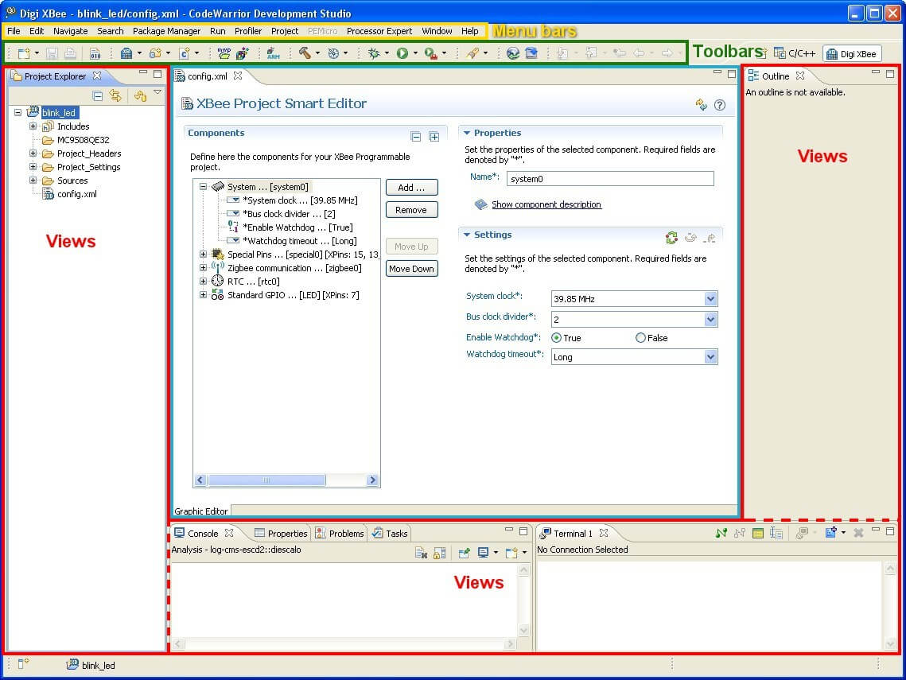
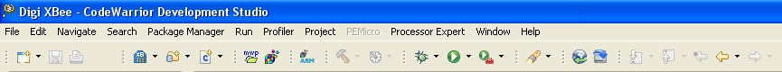
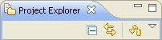
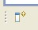
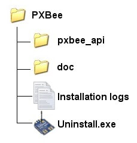
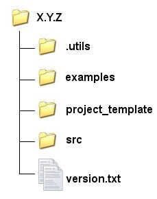

<h1>2. Concepts</h1>

The following sections introduce the CodeWarrior IDE, and the XBee extensions needed to create programmable XBee application projects.

# 2.1. CodeWarrior IDE Concepts

## 2.1.1. Workbench

The term _Workbench_ refers to the desktop development environment. The Workbench 
provides a common environment for the creation, management and navigation of workspace resources.

Each Workbench window offers one or more perspectives. _Perspectives_ contain 
editors and views; and allows the user to control what appears in certain menus and toolbars. Multiple 
Workbench windows can be opened simultaneously.

## 2.1.2. Workspace

The workspace is the directory where the user's projects, folders, and files are stored.

Users can have more than one workspace. To switch to a different workspace, select  **File &gt; Switch Workspace &gt; Other...**.

## 2.1.3. Perspectives

The layout of a workbench window is determined by a perspective, which is a set of related 
menus, toolbars, and views that assist in performing a specific task.

Perspectives control which options display in certain menus and toolbars. These options 
can be changed to customize the perspective. A modified perspective can be saved as a custom perspective to 
be opened later.

To open a perspective from the menu, select  **Window &gt; Open Perspective &gt; Other...**. The active perspective appears in the upper-right of the workbench window.

>  For more information about perspectives, consult the Eclipse Workbench User Guide. To access this guide from the menu, select Help &gt; Help Contents. Under Additional Documents, select Workbench User Guide, and see these topics: 

> * **[Getting started &gt; Perspectives](http://help.eclipse.org/kepler/topic/org.eclipse.platform.doc.user/gettingStarted/qs-43.htm?cp=0_1_0_15)**
> * **[Concepts &gt; Perspectives](http://help.eclipse.org/kepler/topic/org.eclipse.platform.doc.user/concepts/concepts-4.htm?cp=0_2_2)**
> * **[Tasks &gt; Working with perspectives](http://help.eclipse.org/kepler/topic/org.eclipse.platform.doc.user/tasks/tasks-1a.htm?cp=0_3_2)**

## 2.1.4. Views &amp; Editors

Each Workbench perspective contains one or more views and editors to define its layout:

* A view is a visual component within the Workbench. Normally, only one instance of a  particular type of view may exist within a Workbench window. Views have their own toolbars.
* An editor is also a visual component within the Workbench. It is used to edit or browse  a resource. Depending on the type of file being edited, the appropriate editor is displayed in the editor  area. Multiple instances of an editor type can exist within a Workbench window, either stacked or tiled.

To open a view from the menu, select  **Window &gt; Show View &gt; Other...**. All the views of the workbench are listed and organized by categories. Select the view to open.

Different editors can be used to open a file. Generally, each file is opened inside its 
default associated editor. To associate files with a different editor, select  **Window &gt; Preferences &gt; General &gt; Editors &gt; File Associations**.

## 2.1.5. Toolbars

There are four kinds of toolbars in the Workbench:

* The main toolbar, or Workbench toolbar, is located at the top of the Workbench window  under the menu bar. Its content may change depending on the active perspective.

* The View toolbar is the toolbar associated to a certain view. Actions in a view's toolbar  apply only to the view in which it appears. Some views may also include a Menu  button (an inverted triangle), that contains more actions for that view.

* The Perspective toolbar quickly accesses perspectives that are currently open,  or opens new perspectives. This toolbar is usually located in the top-right corner, next to the main toolbar.

* The fast view toolbar is a toolbar which contains icons representing a set of fast views.  A fast view is a shortcut to a certain view. This toolbar usually appears in the bottom left corner of the Workbench window.

## 2.1.6. Projects

A _project_ is a collection of software components that are part of the same 
solution for a target platform. Projects must be given a name, and its must be located on the same directory of the development computer's CodeWarrior workspace.

# 2.2. Structure of of the Programmable XBee SDK

This topic explains the contents of **Programmable XBee <acronym title="Software Development Kit">SDK</acronym>** 
structure.

## 2.2.1. Programmable XBee SDK directory tree

The main **Programmable XBee <acronym title="Software Development Kit">SDK</acronym>** directory has the following structure:

* *pxbee_api*: Contains versions of the XBee	firmware library.
* *doc*: Contains documentation and other text files about the	environment.
* *Installation logs*: Contains logs of the installation process.	These files are necessary for the uninstall process.
* *Uninstall.exe*: Uninstalls Programmable XBee <acronym title="Software Development Kit">SDK</acronym> from your machine.

## 2.2.2. XBee Firmware Library directory tree

The **pxbee_api** directory contains different versions of the 
**XBee firmware library** stored in their corresponding version directory.

The top level directory of each **XBee firmware library** 
version source code distribution contains the following entities:

* *.utils*: Contains the output of the make.py script.
* *examples*: Contains several sample applications using the XBee	firmware library. These examples will be accessible from CodeWarrior.
* *project_template*: Contains the sources and directory structure used by
	the XBee extensions to generate XBee application projects.
* *src*: Contains the set of source and header files which compose the XBee	firmware library.
* *version.txt*: A file containing the version of the	XBee firmware library.

# 2.3. Conventions Used in Help Topics

This help system uses these typographical conventions:

Convention | Use
---------- | ------------------------------------------------------------
*Style*    | New terms and variables in commands, code, and other input.
`Style`    | Used in examples to show the contents of files or the output from commands. Variables to be  replaced with actual values are shown in italics.
**Style**  | Items in the CodeWarrior interface, such as menu items, dialogs, tabs, buttons, and other controls. In examples, to show the text that should be typed literally by the user.
#          | A prompt that indicates the action is performed on the target device.
$          | A prompt that indicates the action is performed on the host computer.
X.Y.Z      | Used to indicate a version, for example XBee firmware library X.Y.Z can refer to XBee firmware library 1.0.1 or any other version.

It also uses these frames and symbols:

>  **This is a warning. It helps solve or to avoid common mistakes or problems.**

>  *This is a hint. It contains useful information about a topic.*

>  *This means that you have just learned how to do something.*

>  *This message indicates the progress of a tutorial.*

>  `$ This is a host computer session`
**`$ Bold text indicates required input`**

>  `# This is a target session`
**`# Bold text indicates required input`**

`This is an excerpt from a file`

**`Bold text indicates required input`**

# 2.4. Programmable XBee hardware resources

Programmable XBee modules handled in this environment are an extension to the standard XBee modules.

Standard XBee modules are built with a single processor Ember radio.

Programmable XBee modules have a second (Freescale) microprocessor.

Both module's pin-outs tend to be pin compatible, so most of the standard module functionality can be achieved or enhanced using the programmable version.  However, the real capabilities of each Programmable Xbee module pin are the ones reported by the Smart-Editor in CodeWarrior, not the ones that can be assumed from the labels in base boards or documentation common for both modules.

As a general rule, the Programmable Xbee SDK provides drivers and makes use of the following available resources:

#### From the Ember radio

Only radio related resources can be used.

* Used: The radio itself and the following pins: commissioning, RSSI PWN, association, On/Sleep#, SleepRequest
* Not Used: Rest of functionality: digital GPIOs, analog GPIOs, PWM, SPI.

#### From the Freescale CPU

All supported peripherals in the SDK are CPU resources.

* Controllers embedded inside the CPU: digital GPIOs, analog GPIOs, PWM, SPI,	I2C, RTC, UART, TPMs (timers, input capture, output compare).
* Emulated through bit banging over standard GPIOs: 1-Wire.
