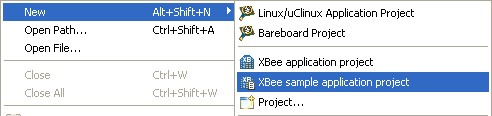
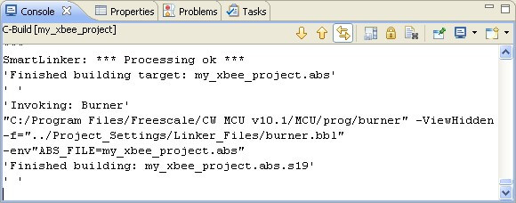
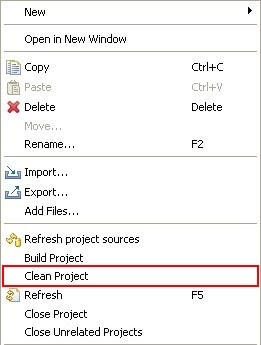

<h1>4. Developing a project</h1>

Learn how to develop projects using the XBee extensions, including methods for creating, building, and launching projects remotely.
 
# 4.1. Creating a project

## 4.1.1. XBee application project wizard

The **XBee application project wizard** creates a new XBee application project ready for the user to start writing code.

There are three ways to open this project wizard:

* From the **File** menu, select  **New &gt; Project...**.  The **New Project wizard** is displayed. Select **XBee application project** under the **Digi XBee** folder and click **Next** to start the wizard.

> 

* From the **File** menu, select  **New &gt; XBee Programmable Application Project**.

> 

* On the main toolbar, click on the XBee icon and select **XBee application project**.

> 

>  *The **Project Explorer Context menu** contains the same options as in the **File** menu.*

Enter the name of the project to be created. For example, *my_xbee_project*.

>  **The name of the project must be unique in the workspace. If there is already a project with the same name inside the workspace, the wizard displays a message and will not continue until a different name is used.

Select the XBee Firmware Library to be used in the **XBee Firmware Library settings** group. By default, the selected library is the same as the one selected in **XBee extensions configuration** preference page (see topic [3.1. XBee extensions configuration](working_xbee_extensions.md#31-xbee-extensions-configuration)).

**Application settings** group lets you to specify if the main.c file will contain a header with the pin distribution of the module based on the configured components. Also, it lets you to specify a name for the application to identify it from the bootloader menu.

Click **Next**. Configure the settings of the XBee module under the **XBee Device settings**.

* **Device Type**: Select the module type to use.
  * **XBee ZB (S2B)**: The standard 20 pins XBee module.
  * **XBee ZB (S2C)**: The SMD version of the XBee module with 37 pins.
* **Memory**: Select the memory size of the module.
  * 32Kb
  * 128Kb
* **Enable floating point**. Check it to enable the floating point support for the project.

>  **The module type and memory size cannot be changed once the project is created.**

Click **Finish** to create the project.

When the project is created, it is displayed in the **Project Explorer** view. Expand it to see its contents.

To open the Project Explorer view select  **Window &gt; Show View &gt; Project Explorer**. If Project Explorer does not appear in the list, select **Other** to open the **Show View** dialog. The Project Explorer view is located under the **General** group

Once the project is created, the configuration file (*config.xml*) will be opened and displayed in the Smart Project Editor view.

## 4.1.2. XBee sample application project wizard

The **XBee sample aplication project** project wizard creates new programmable XBee template-based projects, ready for the user to compile.

To create a new XBee sample application project:

* From the **File** menu, select  **New &gt; Project...**. The **New Project wizard** is displayed. Select In **XBee sample application project** under the **Digi XBee** folder and click **Next** to start the wizard.

> 

* From the **File** menu, select  **New &gt; XBee sample application project**.

> 

* On the main toolbar, click on the XBee icon and select **XBee Programmable Sample Application Project**.

> 

>  *The **Project Explorer Context menu** contains the same options as in the **File** menu.

Configure the settings of the XBee module ti be used in the **XBee Device Settings** page.

* **Device Type**: Select the module type to use.
  * **XBee ZB (S2B)**: The standard 20 pins XBee module.
  * **XBee ZB (S2C)**: The SMD version of the XBee module with 37 pins.
* **Memory**: Select the memory size of the module.
  * 32Kb
  * 128Kb
* **Enable floating point**. Check it to enable the floating point support for the project.

 **The module type and memory size cannot be changed once the project is created.**

Click **Next** to continue.

The **Sample selection** page lists available sample applications with full source code. Select the desired templates using the list check boxes. For convenience, you may use the **Select All** and **Deselect All** buttons. The selected project description is displayed in the details area under the list.

For example, select the project template called **Blink led example** located at GPIOs section.

The wizard has automatically filtered the list to display only those examples compatible with the module settings you configured in the previous page. But it is possible to filter available XBee examples by platforms, selecting the corresponding platform from the list. Or display all the example projects by un-checking the **Show only samples compatible with platform** button.

Click **Next** to continue.

The last page of the wizard displays a list of selected samples and a summary with the module settings. To make changes, click **Back**.

.

Click **Finish** to create the selected samples. The wizard will create as many sample projects as selected. The sample projects are ready to be built.

New sample projects will display on the **Project Explorer** view. Expand it to see its contents.

Once the project is created, the configuration file (*config.xml*) will be opened and displayed in the Smart Project Editor view.

## 4.1.3. XBee application project contents

The Project Explorer view lists all the projects of the workspace in a tree structure. Expand the **my_xbee_project** programmable XBee project to see all of its components:

* **Debug**: Contains the binaries generated by the Debug build configuration.
* **Project_Headers**: Contains the local project header files	and symbolic links to the XBee Firmware Library header files.
* **Project Settings**: Specific XBee module-related files used	by the compiler.
* **Release**: Contains the binaries generated by the Release build configuration.
* **Sources**: Contains the **main.c** file and symbolic links to the XBee Firmware Library source files.
* *config.xml*: The project configuration file.
* *resHostSettingsCache*: Temporal data generated by CodeWarrior containing information to run the project.

# 4.2. Configuring the project

Each project inside the Workbench can be configured using its properties pages. To open the project's properties pages, select the project on the **Project Explorer** view and go to menu **Project &gt; Properties**, or right-click the project and select  **Properties** from the context menu.

An XBee application project has several property pages:

* **Resource**: Shows project information.
* **Builders**: Selects the builders to enable for this project and to specify the order in which they are used. Builders are processes that derive new resources from existing ones, update existing resources, or both. Different builders are invoked for different types of projects. Normally these values won't be changed.
* **C/C++ Build**: Manages the build configurations of the project (create, edit and remove them). By default, a programmable XBee project contains 2 build configurations:
  * **Debug**: Generates the necessary binaries to debug the programmable XBee application under the **Debug** folder.
  * **Release**: Generates the release binaries of the programmable XBee application under the **Release** folder.
* **C/C++ General**: General configuration of the C/C++ Editor.
* **Linked Resources**: Manages the path variables and the linked files	and folders of the project.
* **Processor Expert**: Configuration page of the CodeWarrior's **Processor Expert** tool. The Processor Expert tool is not used by the programmable XBee projects.
* **Project References**: Specifies the projects of the workspace within the application project has dependencies.
* **Resource Filters**: Allows resources to be hidden from the Project Explorer view.
* **Run/Debug Settings**: Displays and manages all launch configurations that apply to the resource.
* **XBee Properties**:
  * **XBee Firmware Library settings**: Allows selection of the XBee Firmware Library version used for the project.
  * **Application settings**
    * **Write a header with the pin legend in the main.c file**: Checking this box will add a header in the main.c file of your project with the XBee pins information.
    * **Application version string**: The name to identify your application project from the bootloader of the XBee module.
    * **Configure the launch binary with the current build configuration automatically**: When set, this option will update the binary path of the project's launch configuration with the bianry of the current build configuration automatically.
    * **XBee Device settings**: Displays the information of the module used for the project.
	

# 4.3. Editing the project: Adding components

With the project created, it is time to add components to it. For the example we will use of one the **<acronym title="XBee Interface Board">XBIB</acronym>** device LEDs to make it blink each second.

At this point your project configuration screen should be similar to this:

The LED of the <acronym title="XBee Interface Board">XBIB</acronym> device is just one of the GPIOs of the XBee module. So you must add a **Standard GPIO** to the project. To do so click the **Add** button.

Expand the GPIO group and select the **Standard GPIO** component. Click **Add** to add the component to the project.

The XBee Editor will assign a pin number to the component automatically (2 in this case), but that pin does not crrespond with any of the LEDs of the XBee Interface Board. To change it, locate the XBee Pins control and modify the **GPIO Pin** from the table. The pin to select depends on the XBee module you have:

* **XBee ZB (S2B) module**: Set it to the pin **7** of the XBee module, which corresponds to the **LED3** of the of the <acronym title="XBee Interface Board">XBIB</acronym> device.
* **XBee ZB (S2C) module:** Set it to the pin **8** of the XBee module, which corresponds to the **LED3** of the of the <acronym title="XBee Interface Board">XBIB</acronym> device.

 When changed, lock the pin so the XBee Editor will not change it when adding other components.

To better identify this component in the code, change its name to **LED**.

>  *Some components, such as the Standard GPIO and IRQ GPIO, can be called from the code with the name you give them in the XBee Editor, making the development process easier.*

When finished, save the project by pressing the **Save** button from the main toolbar. Your project should now look something similar to this:

>  *For more information about the XBee Project Smart Editor, see topic [3.3. XBee Smart Editor](working_xbee_extensions.md#33-xbee-smart-editor).

# 4.4. Editing the project: Writing code

## 4.4.1. Writing code

As any other C project, the programmable XBee projects are composed of headers (*h*) and code (*c*) files. The main() function (starting point of the application) is already declared in the *main.c* 
file, located inside the **Sources** folder of the project. This is where you should write the application code.

Double-click the *main.c* file to open it in the Editor.

Following our **my_xbee_project** example, we will make something with the **Standard GPIO** we added. Remember you called it **LED**. The application will toggle the status of the LED and will store internally the number of times the LED has been toggled.

The first step is to declare the variable that will store the number of times the LED has been toggled. Write the following code before the **void main(void)** line.

>  `int counter = 0;`

The, locate the main() function and, before the **sys_watchdog_reset()** call, write the following line:

>  `gpio_set(LED, !gpio_get(LED));`

That line sets the LED with the opposite value at the moment the line is executed, thus toggling the LED value.

Write the following line just after the preivous one you wrote to increase the value of the counter:

>  `counter++;`

Now you need to set a delay to make the **LED blink each second**. To do so write the following line:

>  `delay_ticks(HZ);`

The application will execute those two lines continuously. Your code now should be similar to this:

Save the project by pressing the **Save** button from the main toolbar.

## 4.4.2. Syntax Errors

One of the features of the C Editor is the syntax error checking. While you are writing your code, the environment will check for syntax errors in the code.

If one or more errors are found in the file, an error icon will display in the line where the error has been detected. For example, if you forget to write a '**;**' after one line of code, you will see it is detected and marked.

## 4.4.3. Populating the project

The <acronym title="Identifier">ID</acronym> also allows you to add new header and source files to your project using very simple wizards.

* To create a new source file, select  **File &gt; New &gt; Source File** or just click on the **Source File** button from the wizard bar of the main toolbar.

> 

> A new dialog will appear where you will be able to configure the name and location  of your new source file.

> 

* To create a new header file, select  **File &gt; New &gt; Header File** or just click on the **Header File** button from the wizard bar of the main toolbar.

> 

> A new dialog will display where you will be able to configure the name and location of your new header file.

> 

* To create a new Source Folder, select  **File &gt; New &gt; Source Folder** or just click on the **Source Folder** button from the wizard bar of the main toolbar.

> 

> A new dialog will display where you will be able to configure the name and location  of your new source folder.

> 

# 4.5. Building the project

Building a project means to compile it and generate the binaries that will run in the XBee module. By default, when a is generated, it has two build configurations:

* **Release configuration:** Generates the debugeable binaries to debug the application in the XBee module.
* **Debug configuration:** Generates the final binaries that will run in the XBee module.

Although you don't need to do any change in the build configurations, you can access them following these steps:

- Select the project in the **Project Explorer** view.
- Right click it and select **Properties**.
- Choose the **C/C++ Build** group form the list.

Once the **C/C++ Build** settings of the project are opened, you can select the active configuration of the project from there. To do so, click on the **Manage configurations...** button to open the build configurations management dialog.

Select a configuration from the list that you want to set as active. Click **Set Active**.

You can also change the active build configuration from the **Manage configurations** tool of the main toolbar (clicking the arrow next to the clock icon). This avoids having to open the settings dialog each time you want to change between configurations.

To build a project, go to the **Project Explorer** view and select the project. On the main toolbar, click the arrow next to the Build (hammer) icon. Select the build configuration for your project (Release or Debug).

>  **Notice this action will also change the active build configuration of the project.

You can also build the project from the **Project Explorer** view's context menu. Select the project from the list of projects in the **Project Explorer** view, right click it and select **Build Project**.

>  **Notice this option will compile the project using the active build configuration of the project (Release or Debug).**

The build process takes some time to finish. It displays the progress in a dialog and the ouput through the **Console** view.

When the build process finishes, you should view something like this in the **Console** view:

If the build fails, the Console will display the number of errors occurred. The project will also be marked with a small error icon (a white cross over red background) on the Project Explorer view.

If you go to the **Problems** view, you will see the list of errors and warnings from the build process.

Double-click on any error or warning and the file will open to the line where the error or warning is located.

If you have built a project and you make some changes in the code, next time you build the project the <acronym title="Integrated Development Environment">IDE</acronym> will only compile the necessary files according to the changes you have made. If you want to perform a full build of the project, you should **clean** it first.

To clean a project select it from the **Project Explorer** view, right click it and select **Clean Project**.

>  **Cleaning a project will only remove the binaries of the active configuration (Build or Debug folders). Next time you build a project the folder corresponding with the active configuration will be generated automatically.**

>  *The binaries will be generated inside the **Release** or **Debug** folder, depending on the active build configuration.*

# 4.6. Launching a project

## 4.6.1. Pre-Launch steps

The first step towards launching a project is to compile it using the Release build configuration. If you have not compiled your project yet, follow these steps:

- Select your project within the Project Explorer view.
- From the main toolbar select **Build &gt; Release**.
> [Build project for release](images/img009a.jpg)
- Wait for the project to be compiled. You can see the process output through the Console view.

Verify that the launch configuration is set to take the binaries from the Release folder. In the Project Explorer view, right-click your project and select **Run As &gt; Run Configurations...**

A new dialog will be displayed listing the launch configurations of all the projects you have in your workspace. Select the configuration that corresponds to the **my_xbee_project** project and verify that the **Application** field is pointing to the Release folder. If the Application field is not pointing to the Release folder, change it manually.

>  There is a setting in the project's properties that, when set, allows the IDE to automatically change the binary path of the launch configuration to match with the current build configuration. Therefore, you will not longer need to worry about configuring these options manually.

> </a>

**Apply** the changes and click Run to launch the project in the XBee module. The launch process will start and the Progress view will display the launch status.

## 4.6.2. Launch process

At this point, the <acronym title="Integrated Development Environment">IDE</acronym> will perform several operations with the XBee module (synchronization, erase, etc.) to prepare it for the transfer. A progress dialog will display the current status of the process.

## 4.6.3. Shortcuts

The application can be launched without opening the Run Configuration dialog. Use the **last Run Configuration** shortcut by clicking on the **Run** icon or by selecting  **Run &gt; Run** from the main menu.

You can also launch the application by selecting the project in the Project Explorer and then clicking on Run &gt; Run As &gt; CodeWarrior Download.

You can also access this option using the **Run** button within the main toolbar.

Or from the context menu of the Project Explorer view.

If you have compiled your project with the Release and Debug configurations, you will be asked to select the place from which to take the binaries when launching the project using the **Run As &gt; Remote CodeWarrior download** option.

Choose the **Release** folder and click **OK** to continue with the process.

All of these shortcuts will save time when re-launching the same project.

# 4.7. Debugging a project

## 4.7.1. Pre-Debug steps

The first step to debug a project is to compile it using the **Debug** build configuration. If you have not done it yet, follow these steps:

- Select your project in the **Project Explorer** view.
- Go to the **Build** action of the main toolbar and select **Debug**	from the drop-down menu.
>
- Wait for the project to be compiled. You can see the process output through the **Console** view.

With the binaries of the project generated for debug, you must ensure the launch configuration of the project is taking the binaries from the **Debug** folder. To do so, select your project in the **Project Exporer** view, right click it and select **Debug As &gt; Debug Configurations...**

A new dialog will display the debug configurations of all the projects you have in the workspace. Select the one corresponding to **my_xbee_project** project and verify that the **Application** value field is pointing to the **Debug** folder. If it is not, change it manually.

>  *There is a setting in the project's properties that, when set, allows the IDE to automatically change the binary path of the launch configuration to match with the current build configuration. Therefore, you will not longer need to worry about configuring these options manually.*

> </a>

**Apply** the changes and click Debug to debug the project in the XBee module.

## 4.7.2. Debug process

Once the Debug button is pressed, the debug process will start and the Progress view will display the debug status.

At this point, the <acronym title="Integrated Development Environment">IDE</acronym> will perform several operations (synchronization, erase, etc.) with the XBee module to prepare it for the transfer. A progress dialog will display the current status of the process.

When the operations finish, the <acronym title="Integrated Development Environment">IDE</acronym> will ask you change to the **Debug** perspective.

The Debug perspective has a layout oriented to debugging. Click **Yes** to open the **Debug** perspective or go to  **Window &gt; Open Perspective &gt; Other... &gt; Debug**.

The application will stop at the first line of code of the *main.c* file.

## 4.7.3. Debug perspective

The Debug perspective shares some views with the XBee perspective, such as the **Editor** and **Outline** views, plus several others: **Debug**, **Variables**, **Breakpoints**, **Expressions**, **Registers**, **Memory**, **Disassembly** and **Remote Console** views.

## 4.7.4. Breakpoints

When a breakpoint is set, the application execution will stop at the line on which it is located. It is possible to add or remove breakpoints when the application is being debugged or even before this process starts.

Breakpoints can be added in the editor view when the active perspective is either **Digi XBee** or **Debug**. The Breakpoints view lists all breakpoints that have been added. To open the Breakpoints view, select  **Window &gt; Show View &gt; Breakpoints**.

To add a breakpoint, double-click on the left border of any code line on the Editor. To remove a breakpoint, double-click on it again.

Add a breakpoint in the **gpio_set(LED, !gpio_get(LED));** line.

The check boxes in the list of breakpoints enable or disable each breakpoint. To display a breakpoint's location in the Editor view, double-click it. To display a breakpoint's properties, right-click and select **Properties**.

In the Properties dialog, conditions for a breakpoint can be set, converting it into a Conditional Breakpoint. For example, to convert the previous breackpoint in conditional, open the breakpoint properties. In the new dialog add the following condition: `counter == 5`.

If you resume the application, it will stop at the breakpoint you added when the value of the counter variable reach 5.

## 4.7.5. Debug view

The **Debug** view shows debugging and remote process information. It is automatically opened when a debug session is launched. To manually open this view, select  **Window &gt; Show View &gt; Debug**.

If the **Stop at main() on startup** option was checked on the Launch Configuration settings, when the debug process starts, the program is automatically suspended at the main method of the application. The Editor view marks the line where the application is suspended with a small arrow and highlights it in a specified color.

The Debug view toolbar has several buttons for controlling the debug session. These are the most important ones:

* **Resume**: Resumes a suspended thread.
* **Suspend**: Suspends the selected thread of a target.
* **Terminate**: Ends the selected debug session and/or process.
* **Disconnect**: Detaches the debugger from the selected process.
* **Step Into (F5)**: Steps into the highlighted statement.
* **Step Over (F6)**: Steps over the highlighted statement. Execution continues at the next line in the same method.
* **Step Return (F6)**: Returns from a statement.

To continue with the debug session until the conditional breakpoint, click **Resume**. When the process is suspended at the breakpoint, the Debug view shows several stack frames instances with the stack frame number, the function name where the debug session is suspended, the source file name, and the line number.

Use the **Step Over** button to execute the code step-by-step, and use **Step Into** to go into a statement. (For example, to go inside *sys_hw_init()* function at line 60.)

>  **Debugging optimized binaries can cause unexpected jumps in the execution trace. The value of variables optimized out will contain random values. Compiler optimizations can be disabled from the project properties page. Right click on the project and, in the contextual menu, select "Properties". Go to "C/C++ Builds &gt; Settings &gt; HCS08 Compiler &gt; Optimizations" and select the "Disable optimization" checkbox.

>  *You can restart the debug process without downloading the project again to the microcontroller by following this little guide: [10.11. Restarting an application in debug mode](tips_tricks.md#1011-restarting-an-application-in-debug-mode).*

## 4.7.6. Disassembly view

The **Disassembly** view is a display for examining the program as it steps into disassembled code. To open the Disassembly view, click the **Instruction Stepping Mode** button in the **Debug** view or select
 **Window &gt; Show View &gt; Disassembly**. 

This view mixes the original source code with the assembly code.

Click **Instruction Stepping Mode** on the **Debug** view and use **Step Into** and **Step Over** buttons to execute every line of disassembly code.

## 4.7.7. Variables view

The **Variables** view displays the values of the variables in the context of the current function during a debug session. To open the Variables view, select 
**Window &gt; Show View &gt; Variables**.

To change the value of a variable, right-click it and select **Change Value...**. Variables that have been modified are highlighted in yellow.

The Variables view has several options:

* **Show Type Names** toggle button: Displays variable type names.
* **Show Logical Structure** toggle button: Changes if logical structures  should be shown in the view or not.
* **Collapse all** button: Collapses all the the currently expanded variables.
* **Add Global Variables** button: Opens a dialog to select from the list the  variables to show in the view.
* **Remove Selected Global Variable** and **Remove All  Global Variables** buttons: Remove variables from the view.

>  *To change the display format of a variable between Natural, Decimal or Hexadecimal, select a variable, right-click on it, and select **Format** on the context menu.

Use the **Variables** view to inspect the values of the variables. To change the format of *numbered* items, select the items on the **Variables** view, right-click, and select **Format &gt; Decimal**.

To modify the value of the variables, select the variable, right-click, choose **Change Value...**, and enter the new value.

## 4.7.8. Expressions view

The **Expressions** view is for viewing and adding variables and expressions. To open this view, select  **Window &gt; Show View &gt; Expressions**.

The **Editor**, **Variables**, and **Outline** views allow you add new watch expressions. Watch expressions are variables or expressions to be supervised. To add a watch expression, select the code to watch, right-click and select **Add Watch Expression**. For example, select the **counter** variable in the code, right-click it and select **Add Watch Expression...**

The **Expressions** view's toolbar offers these options:

* **Show Type Names** toggle button: Displays variable type names.
* **Show Logical Structure** toggle button: Changes if logical structures should be shown in the view or not.
* **Collapse all** button: Collapses all the the currently expanded expressions.
* **Create a new watch expression** button: Opens the **Add Watch  Expression** dialog, which allows you to create a new watch expression and add it to the Expressions View..
* **Remove Selected Expression** and **Remove All  Expressions** buttons: Removes expressions from the view.

## 4.7.9. Memory view

The **Memory** view is used to inspect and change the process memory. This view has several tabs for inspecting multiple sections of the memory. To open this view, select **Window &gt; Show View &gt; Memory**.

To add an address to inspect, click the **Add Memory Monitor** button on the **Memory** view toolbar and enter the address to inspect. For hexadecimal format, use the prefix **0x**.

To remove a memory monitor, select it and click **Remove Memory Monitor** or **Remove All**.

Right clicking on the **Memory** area displays several options:

* **Add Rendering**: Displays new tabs to show the memory monitors in other formats (Hexadecimal, <acronym title="American Standard Code for Information Interchange">ASCII</acronym>, etc.).
* **Remove Rendering**: Removes the current rendering (tab).
* **Reset to Base address**: Resets the Rendering pane to the original base  address.
* **Go to address...**: Goes to the specified address.
* **Format**: Allows changing the width of each column (1, 2, 4, 8, 16 units).
* **Previous page** and **Next page**: Show the  previous and next memory page, respectively.
* **Resize to fit**: Re-sizes all columns so that all text within them can be viewed.
* **Hide Address Column/Show Address Column**: Hides or restores an address column.
* **Copy to clipboard**: Copies the selected portion of the Rendering pane to the clipboard.
* **Properties**: Shows a dialog with the properties for the selected memory address cell.

## 4.7.10. Registers view

The **Registers** view lists information about the registers in a selected stack frame. To open this view, select  **Window &gt; Show View &gt; Registers**.

Values that have changed are highlighted in the Registers view when your program stops.

You can use the Registers view to:

* Add, edit, or remove groups of registers.
* View register details such as explanations of a register's bit fields and values.
* Change register values.
* Import/export register data.

You can also change the number system in which the debugger displays register values. These number systems are supported:

* Binary
* Decimal
* Hexadecimal
* Natural

**Natural** represents the register's default format, which is defined by the debugger implementation. Natural displays the register in the format that is optionally specified in the debug database for each register (by default hexadecimal).

## 4.7.11. Modules view

The **Modules** view displays information about the modules in the current debug session. To open this view, select  **Window &gt; Show View &gt; Modules**.

The **Modules** view has two areas: the modules tree, and the detail panel that shows the details of the module selected in the modules tree.

A module can be expanded in the tree viewer to display module global variables, functions, etc.

The context menu of this view contains several options:

* **Load Symbols**: Loads the symbols of the selected module
* **Load Symbols For All**: Loads the symbols of the all modules of the current session.

## 4.7.12. Shortcuts

It is possible to debug the application again without opening the **Debug Configuration** dialog. Use the **last Debug Configuration** shortcut by clicking on the **Debug** icon or selecting  **Debug &gt; Debug** from the main menu.

It is also possible to debug the application by selecting the project in the **Project Explorer** and then clicking on **Run &gt; Debug As &gt; CodeWarrior Download**.

You may also access this option from the **Debug** button menu of the main toolbar.

Or from the context menu of the **Project Explorer** view.

If you have compiled your project with the **Release** and **Debug** configurations, you will be asked to select the binary file that you want to access when debugging the project using the **Debug As &gt; Remote CodeWarrior download** option.

Choose the **Debug** folder and press **OK** to continue with the process.

All of these shortcuts will save time when the same project is going to be debugged.
