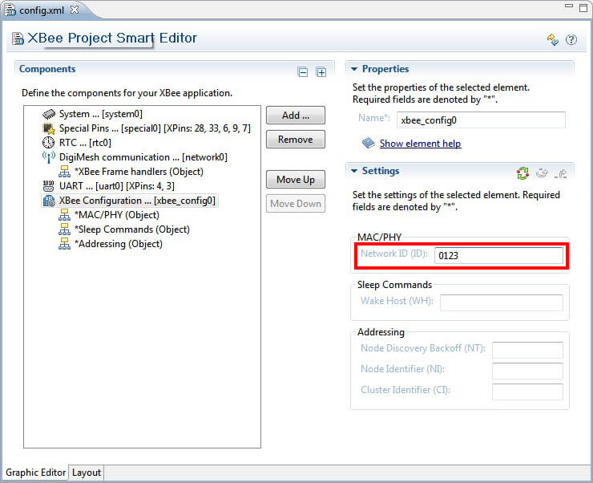
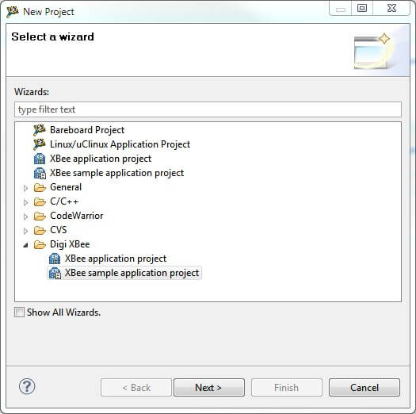
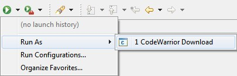
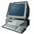
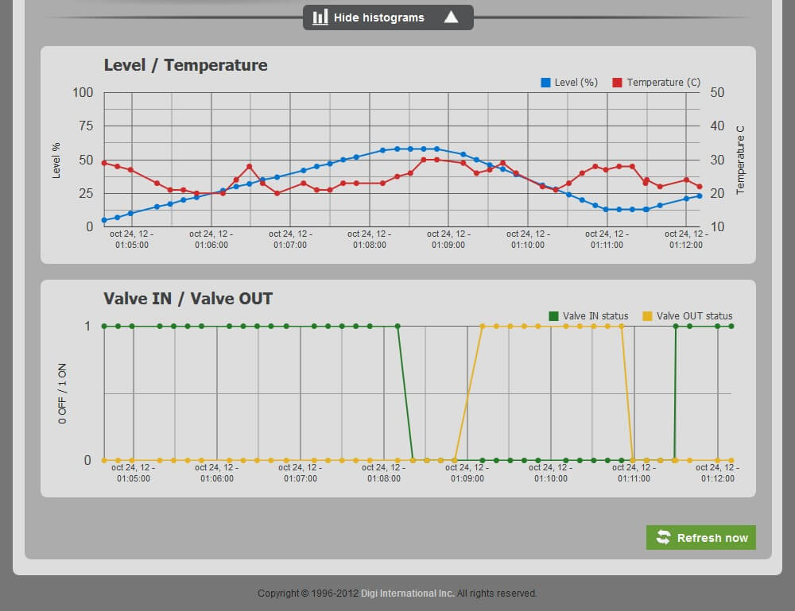
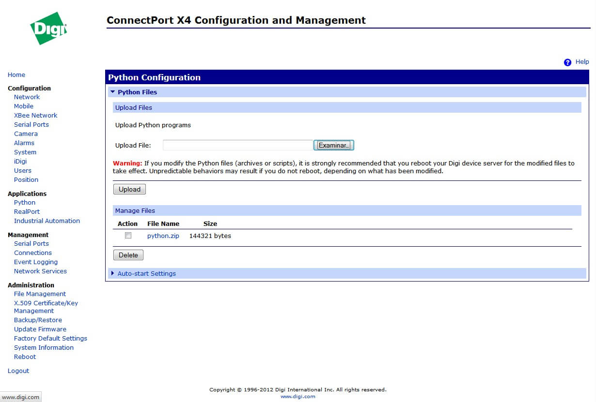
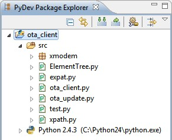
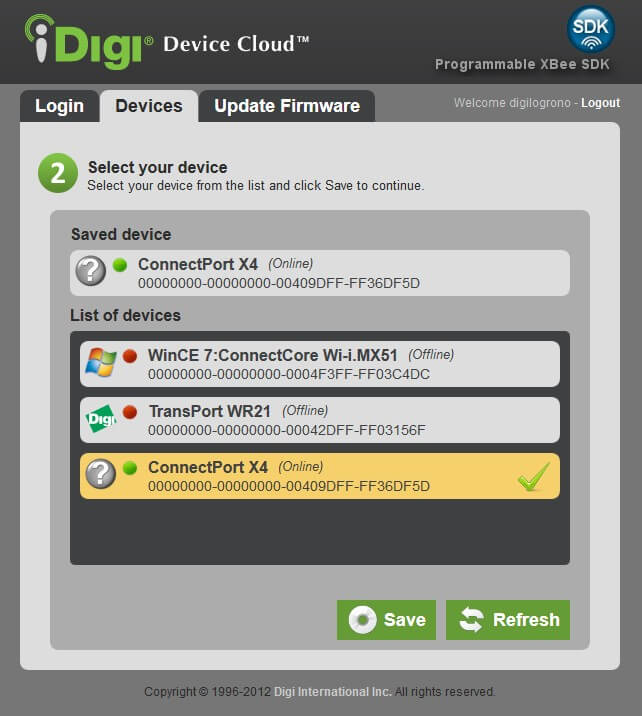

<h1>6. The programmable XBee and iDigi</h1>

Now that you are familiar with the programmable XBee and you have developed your own applications, it is time to go further and connect your XBee modules to the Internet and the iDigi Device Cloud.

The [iDigi Device Cloud](http://www.idigi.com) is Digi's public cloud platform that allows you to connect any device and communicate in two directions from anywhere. 
Refer to the [6.1.1. What is iDigi?](idigi_pxbee.md#611-what-is-idigi) topic for a complete explanation. Some of the advantages to working with the iDigi Device Cloud (related to the programmable XBee modules) are:

* The ability to talk with a specific XBee module of a network located at the other side of the world to perform custom operations.
* Store data sent from different XBee modules and retrieve it later.
* Create new firmware applications and deploy them directly within an XBee module miles away.

### What do I need to connect my XBee module to iDigi?

The first step towards connecting your programmable XBee modules to iDigi is to create an iDigi account. The [6.1.2. Creating an iDigi account](idigi_pxbee.md#612-creating-an-idigi-account) topic describes how to do it.

Then, you need to setup the hardware and software that will connect your XBee network with the Internet and the iDigi Device Cloud. There are several combinations of hardware + software available, but in all combinations the hardware used needs to have an XBee interface and internet access.

This section will explain how to setup the XBee Internet Gateway (XIG) running on a laptop or PC. Read the [6.2. XBee Internet Gateway](idigi_pxbee.md#62-xbee-internet-gateway) topic for further information.

### How does it work?

The ConnectPort X Gateway + XIG software combination acts as a bridge between your XBee network and iDigi. This means that using the capabilities provided by the iDigi Device Cloud, you will not only be able to talk with the ConnectPort X, but also with all the XBee modules of the network individually. Similarly, all the XBee modules will be able to report data to the iDigi Device Cloud and store it there to be retrieved later.

Consumer applications (web apps, mobile apps, etc.) can use iDigi web services to retrieve data stored by the XBee modules and represent it in different ways, or talk directly with any of the programmable XBee modules to perform a specific task programmed within the firmware application.

This section will help you to give iDigi connectivity to your programmable XBee devices, and demonstrate some examples of the different tasks you can perform with your XBee modules using the facilities provided by the iDigi Device Cloud. 

# 6.1. iDigi Device Cloud

## 6.1.1. What is iDigi?

 The [iDigi Device Cloud](http://www.idigi.com) is a Machine Relationship Management (<acronym title="Machine Relationship Management">MRM</acronym>) delivery platform; the next step in the machine-to-machine (<acronym title="Machine To Machine">M2M</acronym>) technology revolution. It supplies the fundamental components for enterprise applications and remote machine assets (devices) to easily work together. The iDigi Device Cloud is based on industry-standard protocols and open technology for customers and partners to extend specifically for their industry. iDigi solutions significantly reduce time to market and lower business costs.

The iDigi Device Cloud is an on-demand service. There are no infrastructure requirements. Remote devices and enterprise business applications connect to the iDigi Device Cloud via standards-based Web Services. The user is able to simply connect to the iDigi Device Cloud and get to work.

## 6.1.2. Creating an iDigi account

Before you can start working with iDigi you need to create a free iDigi Device Cloud account. If you already have an account you can continue with the next step.

To create a free iDigi Device Cloud account, select **Window &gt; Preferences**

Click on **iDigi Configuration** to open the iDigi Configuration preferences page.

Click on the **Create a new iDigi Account** link within the iDigi Configuration preferences page.

This will open a new web browser dialog containing the iDigi account registration form.

Fill in all the required fields and follow the steps as indicated to successfully create a new iDigi Device Cloud account.

**Close** the web browser dialog when finished.

## 6.1.3. Configuring the iDigi settings

Once you have created a iDigi Device Cloud account, enter your iDigi account settings in the **iDigi Configuration** preferences page.

Click **Apply** to save the changes and close the dialog when finished.

## 6.1.4. iDigi documentation and resources

The iDigi Device Cloud has an online support page plenty of documentation and resources that will help you on your first steps towards developing iDigi enabled and client side applications.

To access the support page just click the following link: [http://www.idigi.com/support/](http://www.idigi.com/support/).

You may also want to take a look to the [iDigi FAQ](http://www.idigi.com/faq), it will give you responses to the more commonly asked questions regarding iDigi.

# 6.2. XBee Internet Gateway

## 6.2.1. What is the XIG?

 The **XBee Internet Gateway** (XIG) is an open source piece of software that makes it easy to connect XBee radios to the Internet. Plug a sensor into your XBee and stream environmental data right into your online application. Attach a switch, motors or lights to an XBee, then activate them from the Internet. It allows XBee radios to upload data, receive remote text and commands, access Internet resources such as web pages, databases, social networks, and use the **iDigi Device Cloud**.

The XIG runs on Windows, Macintosh and Linux computers as well as the Digi ConnectPort X series of dedicated gateways. For further information about the XIG project, please visit its official web page at [http://code.google.com/p/xig/](http://code.google.com/p/xig/).

## 6.2.2. Installing the XIG

The XIG will be used in the Programmable XBee SDK to demonstrate how to connect the programmable XBee radios to iDigi using the XIG as bridge. This will allow you to send commands to specific XBee devices from anywhere and read data from them using the capabilities within iDigi. For this purpose, you will install the XIG in your PC and use an X-Stick or XBee module for the ZigBee or DigiMesh interfaces respectively.

This section will guide you in the installation and configuration steps of the XIG in your PC.

### 6.2.2.1. Hardware setup

Before installing the XIG you need to correctly setup the RF hardware interface of the XIG. Depending on the kit you're using, you will follow a different set of steps.

#### 6.2.2.1.1. Programmable XBee ZB Dev Kit

The Programmable XBee ZB Dev Kit comes with an X-Stick configured as its coordinator. This is the device you will use for the ZigBee interface of the XIG. Perform the following steps for configuration:

- Plug your X-Stick into one of the USB ports on your computer.
- In case your X-Stick does not have the Coordinator API firmware installed, use the X-CTU software to update the firmware of the X-Stick to be **Coordinator API**. By default X-Stick devices come preconfigured with	Coordinator API firmware.
- Also, using the X-CTU, configure the following parameters of your X-Stick:
  * Set a **PAN ID** for the ZigBee network that will generate the XIG. Remember that you must also configure the rest of the XBee modules of the network with the same PAN ID.
  * Set the **AO** parameter to **3** to allow the XIG to handle ZDO commands.
  * Set the **BD** parameter to **3** to configure the baud rate to 9600.
  * Set the **D7** parameter to **1** to enable the flow control.

If you don't know how to use the X-CTU to update the firmware of the XBee device or change its parameters, see [10.2.2. Re-flashing the XBee firmware](tips_tricks.md#1022-re-flashing-the-xbee-firmware) and [10.2.3. Changing XBee firmware settings](tips_tricks.md#1023-changing-xbee-firmware-settings).

#### 6.2.2.1.2. Programmable XBee DigiMesh Dev Kits

The Programmable XBee DigiMesh Dev Kits do not include an X-Stick (an X-Stick with DigiMesh protocol does not exist). Instead, they include an extra Programmable DigiMesh module. You will use one of the three programmable XBee DigiMesh modules attached to an XBIB device to be the DigiMesh interface of the XIG. Follow these steps for configuration:

- Plug your XBIB device into one of the USB ports on your computer.
- Create the XBee sample application project called **Serial Bypass** (within the WPAN &gt; XBee section) and open its configuration file.
> 

> We are using this application to make the module enter in bypass mode even when it gets reset.

- Within the XBee Project Smart Editor, click the **Add** button and select the **XBee Configuration** component, then configure the Network ID setting for this component. Remember that you must also configure the rest of the XBee modules of the network with the same PAN ID.
> 
-Build the project with the **Release** configuration and run the application in the programmable XBee DigiMesh module.

Your programmable XBee DigiMesh module is now ready to be used by the XIG.

### 6.2.2.2. Software setup

Follow these steps to install the XIG software in your PC:

- Download the latest version of the software from [http://code.google.com/p/xig/downloads/list](http://code.google.com/p/xig/downloads/list).
- Extract the zip file into your C drive to install it.
- Open the XIG folder and double-click the *xig_app.exe* file to start the XIG application.
 
You will see a command-line window open in the background:

Your default web browser will be launched and directed to _http://localhost:8000_ and the online user interface for the XIG will be displayed:
](images/img019b.jpg)
- If you have the X-CTU open, close if before performing this step. Use the **COM Port** drop-down menu to select the correct COM port for your X-Stick or XBee module and then use the **Baud** drop-down menu to select the correct baud rate, (usually 9600 or 115200).

With the correct COM port and baud rate selected, your XBee Status should change to a green "Joined or Formed Network" indicator.
- Enter a description for your XBee Internet Gateway into the **Description** field.

Your XIG is now installed and running. The XBee devices joined to the ZigBee or DigiMesh network initialized by the XIG have Internet access and can make use of the basic XIG commands to read remote web pages, databases, social networks, etc. However, they are still missing the iDigi Device Cloud capabilities.

For further information about the available XIG commands, see the [XIG Usage section](http://code.google.com/p/xig/wiki/UserDocumentation#III._USAGE).

## 6.2.3. Changing the iDigi server instance

By default, the XIG connects to the US iDigi server. If your iDigi account belongs to the EU iDigi server, you will need to change the iDigi server the XIG connects with, otherwise you can coninue reading the next chapter, [6.2.4. Registering the XIG in iDigi](idigi_pxbee.md#624-registering-the-xig-in-idigi).

To change the iDigi server that the XIG connects to, follow these steps:

- You need to run the XIG at least one time to generate the JSON settings file. If you have not done it yet, run the XIG and	then close it.
- Go to the folder where the XIG is installed on your PC and open the **settings.json** file with a text editor.

- Locate the **idigi_server** setting and change its value from **my.idigi.com** to **my.idigi.co.uk**, which is the iDigi EU server.

When finished, save and close the file.
- Re-start the XIG; it will now connect to the EU iDigi server.

## 6.2.4. Registering the XIG in iDigi

To enable the XBee devices of the XIG to communicate with iDigi, you need to register the XIG into your personal iDigi Device Cloud account. To do so, follow these steps:

- Click the iDigiMe button from the main toolbar to access to your iDigi account.

-Once logged in, select the **Devices** menu within the **iDigi Manager Pro** tab.

- Click the **Add device** button within the Devices page toolbar.

- The Add Devices applet will be displayed; click the **Add Manually** button within the applet.

- Select the **Device ID** option from the drop-down menu and enter the Device ID of your XIG into the text field with "00000000-00000000-" prepending it.

[
- Click the **Add** button; your device will be displayed within the window as shown:

- Click **OK** to close the Add Devices applet and add this device to your iDigi device inventory.

- Your device should now appear within your device list.

Now you'll be able to use the **idigi_data** service of the XIG to send data to iDigi and the **idigi_rci** service to accept commands coming from iDigi that were sent using a do_command request with target "xig".

## 6.2.5. XIG Demos

Within the Programmable XBee SDK, there are some elaborated applications that demonstrate the communication between a programmable XBee and iDigi using the XIG as bridge. These applications will show you how to send data to iDigi from a programmable XBee as well as to listen for commands coming from iDigi. This is the list of the current provided demos.

### 6.2.5.1. XIG LEDs

#### 6.2.5.1.1. Introduction

The XIG LEDs application is a simple demo that demonstrates the connectivity between a programmable XBee device and iDigi using the XIG software. The demo consists of controlling and monitoring 2 LEDs from the XBIB device. This control can be performed directly from the XBIB device (pressing buttons) or from anywhere using a web application and the capabilities provided by the iDigi Device Cloud. The connection between the XBee module and iDigi is established by the XIG software.

This demo is divided in 2 parts:

* **XIG LEDs XBee application**: This is an XBee application that detects when buttons are pressed from the XBIB	and changes the status of the corresponding LEDs. Whenever a button press occurs, it sends an XBee packet to the XIG with the new	status of the LEDs and the XIG sends the new LEDs values to iDigi. The XBee application also listens for XBee packets coming from	the XIG to toggle the LEDs values.
* **XIG LEDs Web application**: This second application is a web application developed with the Google App	Engine technology. It allows you to monitor the LEDs of the XBIB device and change their values remotely. The web application	reads the LEDs values from within iDigi and when you want to change the status of an LED using the web interface, it sends the	corresponding query to iDigi. The iDigi Device Cloud transmits the query to the XIG and finally the XIG sends the XBee packet	to the XBee application running in the programmable XBee. 

>  *It is assumed that you have the XIG installed and running on your PC. If that is not the case, follow the steps you will find in the [6.2.2. Installing the XIG](idigi_pxbee.md#622-installing-the-xig) chapter to do so now.*

#### 6.2.5.1.2. XIG LEDs XBee application

##### 6.2.5.1.2.1. Creating the project

The XBee application project for the programmable XBee is provided as a sample project in the XBee sample application project wizard. To create it, follow these steps:

- From the **File** menu, select **File &gt; New &gt; Project...**; the New Project wizard is displayed. In the Digi XBee folder select **XBee sample application project** and click **Next** to start the wizard.

>  *From the Package Explorer context menu you can find the same options as in the File menu.*
- In the first XBee sample application wizard page you must configure the settings of the XBee module to be used. Select the XBee device you are using and the memory size of the module using the drop-down menus, then click **Next**.

- In Sample Selection wizard page check the **XIG - XBee Internet Gateway LEDs and Buttons** example within the **iDigi &gt; XIG** category to select it. Then click **Next** to continue.

- The Preview page displays the selected sample project's information. Verify that this information is correct and click **Finish** when you are done.

- The new sample project will be created and appear within the **Package Explorer** view.

- The configuration file of the project will also be opened and displayed in the **XBee Smart Project Editor** view. Select the XBee Configuration component from the list displayed. Configure the **PAN ID** setting of this component to match the PAN ID configured in the XIG (X-Stick).

##### 6.2.5.1.2.2. Building the project

To build the xig_led_buttons project, select it in the Package Explorer view. Select the **Build** (hammer) option from the main toolbar and then select the **Release** option from the drop-down menu.

The build process takes a while and displays its progress using a progress dialog and within the Console view of the IDE.

##### 6.2.5.1.2.3. Launching the project

The next step in this process is to launch the xig_leds_buttons application project. Before running the application make sure that the XIG is running.

Next, select the project from the Project Explorer view, right-click on it and select the **Run As &gt; CodeWarrior Download** option from the context menu.

>  *In the future, you can launch your project by clicking the **Run** button from the main toolbar.* 

This action will launch the XIG LEDs application in your XBee device:

##### 6.2.5.1.2.4. Testing the application

Once the application is running in the XBee device, it is time to test it. Each SW3 push button press should toggle the DS4 LED on the XBIB device and each SW4 push button press should toggle the DS3 LED on the XBIB device. Press SW3 and SW4 to test this behavior.

#### 6.2.5.1.3. XIG LEDs Web application

The XIG LEDs web application allows you to monitor the 2 LEDs and change their status remotely. To access the web application, click the following link: [http://xig-leds.appspot.com](http://xig-leds.appspot.com)

The first page asks you for your iDigi account credentials. Here you must select the iDigi server your account belongs to and enter the iDigi account login information you used when you registered your XIG:

The second page lists the available devices that are registered to your account. Here you must select your XIG and click the **Save** button:

Finally, you will be redirected to the main application page; this page displays a representation of the XBIB device, the LEDs and the buttons.

If you have not done so yet you need to enter the MAC address of the XBee device that is running the application with the following format: **XX:XX:XX:XX:XX:XX:XX:XX**. When finished, click the **Save** button. This will tell the application the address of the XBee device it should gather the LEDs status from. Also, the next time you login the application, your XBee choice will be automatically loaded.

>  *You will find the MAC address of the XBee device on a sticker on the rear side of the module.*

Try changing the status of the LEDs from the XBIB device and from the web application, you should see the changes in both the XBIB device and web application interface.

>  **When changing the value of an LED by pressing its corresponding button in the web interface, you may see the change immediately in the real XBIB device, but the web application could be still displaying the old state.**

> **This is because the XIG does not upload the status change of an LED just when it happens. Instead, it executes a periodic task every 30 seconds to upload LED status to iDigi.**

> **You can change this value by following the steps you will find in the [10.12. Modifying the upload rate of the XBee Internet Gateway](tips_tricks.md#1012-modifying-the-upload-rate-of-the-xbee-internet-gateway) section.**

The application is configured to automatically refresh the status of the LEDs from iDigi every 10 seconds. However, you can click the **Refresh now** button to refresh them immediatley.

##### 6.2.5.1.3.1. Web application sources

The Programmable XBee SDK includes the sources of the XIG LEDs web application. Since the XIG LEDs is a Google App Engine web application the Google App Engine Eclipse plug-ins are needed to import the web application project. Unfortunately, CodeWarrior is not compatible with the Google App Engine plug-in, so if you want to import the project you will need to install a new Eclipse development IDE. You can download any Eclipse IDE version from the Eclipse web site: [http://www.eclipse.org/downloads/](http://www.eclipse.org/downloads/)

After installing an Eclipse IDE, you need to install the Google App Engine Eclipse plug-ins. You can install them by following the instructions found here: [https://developers.google.com/eclipse/docs/download](https://developers.google.com/eclipse/docs/download)

Once you have the Google App Engine Eclipse plug-ins installed, follow these steps to import the XIG LEDs web application's sources:

- Open your Eclipse development IDE and go to **File &gt; Import...**. In the dialog that opens, select the **Existing Projects into Workspace** option within the **General** folder and click **Next**.

- Within the Import Projects dialog, choose the **Select archive file** option.

- Click **Browse** and look for the zip file containing the sources of the XIG LEDs web application. This file is located in the following path:
>  **`<path-to-sdk>/demos/xig/xig_leds/xig_leds.zip`**

> Where **&lt;path-to-sdk&gt;** is the path where the Programmable XBee SDK	<acronym title="Software Development Kit">SDK</acronym> is installed.

- Click **Open** to continue.

- Finally, select the project found in the zip file and click **Finish** to import the	project.

- The project will be copied into your workspace and opened in the Eclipse IDE.

#### 6.2.5.1.4. XIG LEDs references

The web application communicates with the XBee through iDigi using the iDigi RCI service. To know more about the iDigi RCI service, you can take a look to the **Remote Command Interface (RCI) Specification** document hosted in the iDigi support page:

* [iDigi support page](http://www.idigi.com/support/).

The RCI commands used by the web application are specified in the XIG documentation web page:

* [Sending Messages from the Internet to an XBee Using iDigi RCI](http://code.google.com/p/xig/wiki/UserDocumentation#D._Sending_Messages_from_the_Internet_to_an_XBee_Using_iDigi_RCI).
* [Setting or Getting Remote XBee AT Settings via iDigi RCI](http://code.google.com/p/xig/wiki/UserDocumentation#E._Setting_or_Getting_Remote_XBee_AT_Settings_via_iDigi_RCI).

The way the XBee application sends data to iDigi is covered in the following XIG documentation chapter:

* [Sending Sample Data to iDigi](http://code.google.com/p/xig/wiki/UserDocumentation#F._Sending_Sample_Data_to_iDigi).

Finally, the web application reads the XBee data from iDigi using the **Dia Web Services API**. You will find help about it in the **iDigi Web Services Programming Guide** document hosted in the documentation section of the iDigi support page:

* [iDigi support page](http://www.idigi.com/support/).

### 6.2.5.2. XIG Tanks

#### 6.2.5.2.1. Introduction

The XIG Tanks application is an elaborated demo that illustrates the connectivity between a programmable XBee device and iDigi using the XIG software. The demo consists of the monitoring and management of a tank emulated by a programmable XBee module (emulates the tank's behavior) and an XBIB device (emulates the valve's behavior). This control can be performed directly from the XBIB device (pressing buttons) or from anywhere using a web application and the capabilities provided by the iDigi Device Cloud. The connection between the XBee module and iDigi is established by the XIG software.

This demo is divided in 2 parts:

* **XIG Tanks XBee application**: This is an XBee application that emulates the workflow of a liquid tank. Two buttons	of the XBIB emulate the input and output valves of the tank and two LEDs indicate their status. The application sends XBee packets to the XIG periodically with the properties of the tank (level, temperature, etc.) depending on the status of the valves. The XBee	application also listens for XBee packets coming from the XIG to toggle the status of the valves emulated by the buttons and LEDs.
* **XIG Tanks Web application**: This second application is a web application developed with the Google App Engine technology. It allows you to monitor a tank emulated by a programmable XBee device attached to an XBIB device and change its valves remotely. The web application reads the tank properties within iDigi and when you want to change the status of a valve using the web interface, sends the corresponding query to iDigi. The iDigi Device Cloud transmits the query to the XIG and finally the XIG sends the XBee packet to the XBee application running in the programmable XBee. 

>  *It is assumed that you have the XIG installed and running on your PC. If that is not the case, follow the steps you will find in the [6.2.2. Installing the XIG](idigi_pxbee.md#622-installing-the-xig) chapter to do so now.*

#### 6.2.5.2.2. XIG Tanks XBee application

##### 6.2.5.2.2.1. Creating the project

The XBee application project for the programmable XBee is provided as a sample project in the XBee sample application project wizard. To create it, follow these steps:

- From the **File** menu, select **File &gt; New &gt; Project...**; the New Project wizard is displayed. In the Digi XBee folder, select **XBee aample application project** and click **Next** to start the wizard.

>  *From the Package Explorer context menu you can find the same options as in the File menu.*
- In the first XBee sample application wizard page you must configure the settings of the XBee module to be used. Select the XBee device you are using and the memory size of the module using the drop-down menus, then click **Next**.
> 
- In Sample Selection wizard page check the **XIG - XBee Internet Gateway Tanks Simulation** example within the **iDigi &gt; XIG** category to select it. Then click **Next** to continue.
> 
- The Preview page displays the selected sample project's information. Verify that this information is correct and click **Finish** when you are done.
> 
- The new sample project will be created and appear within the **Package Explorer** view.
> 
- The configuration file of the project will also be opened and displayed in the **XBee Smart Project Editor** view. Select the XBee Configuration component from the list displayed. Configure the **PAN ID** setting	of this component to match the PAN ID configured in the XIG (X-Stick).

##### 6.2.5.2.2.2. Building the project

To build the xig_tanks project, select it in the Package Explorer view. Select the **Build** (hammer) option from the main toolbar and then select the **Release** option from the drop-down menu.

The build process takes a while and displays its progress using a progress dialog and within the Console view of the IDE.

##### 6.2.5.2.2.3. Launching the project

The next step in this process is to launch the xig_tanks application project. Before running the application make sure that the XIG is running.

Next, select the project from the Project Explorer view, right-click on it and select the **Run As &gt; CodeWarrior Download** option from the context menu.

>  *In the future, you can launch your project by clicking the **Run** button from the main toolbar. 

This action will launch the XIG Tanks application in your XBee device:

##### 6.2.5.2.2.4. Testing the application

Once the application is running in the XBee device, it is time to test it. The XBee module is now emulating a liquid tank with its level and temperature and the SW3 and SW4 buttons of the XBIB are emulating the input and output valves of the tank respectively. The DS4 LED of the XBIB indicates the status of the input valve (illuminated when the valve is on) and the DS3 LED indicates the status of the output valve.

Every time you press the SW3 button of the XBIB you are toggling the status of the input valve. The same happens when you press the SW4 button, but this time with the output valve. Toggling the status of the tank's valves causes the tank's levels to change. It is, when the input valve is ON, the tank starts filling and the level is increased. When the output valve is ON, the level of the tank starts decreasing.

#### 6.2.5.2.3. XIG Tanks Web application

The XIG Tanks web application allows you to monitor a tank (emulated by a programmable XBee module) and change the status of its input and output valves remotely. To access the web application, click the following link: [http://xig-tanks.appspot.com](http://xig-tanks.appspot.com)

The first page asks you for your iDigi account credentials. Here you must select the iDigi server your account belongs to and enter the iDigi account login information you used when you registered your XIG:

The second page lists the available devices that are registered to your account. Here you must select your XIG and click the **Save** button:

Finally, you will be redirected to the main application page; this page displays the layout of a tank and its values.

If you have not done so yet you need to enter the MAC address of the XBee device that is emulating the tank with the following format: **XX:XX:XX:XX:XX:XX:XX:XX**. When finished, click the **Save** button. This will tell the application the address of the XBee device it should gather the tank status from. Also, the next time you login to the application, your XBee choice will be automatically loaded.

>  *You will find the MAC address of the XBee device on a sticker on the rear side of the module.*

Try changing the status of any valve from the XBIB device by pressing its corresponding button and from the web application by clicking the desired valve in the tank layout. You should see the changes in both the XBIB device (the LEDs indicate the status of the valves) and the web application interface.

>  **When changing the status of a valve from the web interface, you may see the change immediatley in the XBIB device (the corresponding LED of the valve is toggled), but the web application could be still displaying the old state. This is because the XIG does not upload the status change of a valve just when it happens. Instead, it executes a periodic task every 30 seconds to upload the tank's properties to iDigi. You can change this value by following the steps you will find in the [10.12. Modifying the upload rate of the XBee Internet Gateway](tips_tricks.md#1012-modifying-the-upload-rate-of-the-xbee-internet-gateway) section.**

The application is configured to automatically refresh the status of the selected tank from iDigi every 10 seconds. However, you can click the **Refresh now** button to refresh it immediately.

If you click the **Show histograms** button, the application will display 2 charts; one containing level/temperature values and the other containing valve statuses for the last 5-7 minutes.

Hovering over a sample in the histograms will display a dialog containing the exact value and time of that sample.

If you click the **Hide histograms** button, the charts will be hidden from view once again.

##### 6.2.5.2.3.1. Web application sources

The Programmable XBee SDK includes the sources of the XIG Tanks web application. Since the XIG Tanks web application is a Google App Engine web application the Google App Engine Eclipse plug-ins are needed to import the web application project. Unfortunately, CodeWarrior is not compatible with the Google App Engine plug-in, so if you want to import the project you will need to install a new Eclipse development IDE. You can download any Eclipse IDE version from the Eclipse web site: [http://www.eclipse.org/downloads/](http://www.eclipse.org/downloads/)

After installing an Eclipse IDE, you need to install the Google App Engine Eclipse plug-ins. You can install them by following the instructions found here: [https://developers.google.com/eclipse/docs/download](https://developers.google.com/eclipse/docs/download)

Once you have the Google App Engine Eclipse plug-ins installed, follow these steps to import the XIG Tanks web application's sources:

- Open your Eclipse development IDE and go to **File &gt; Import...**. In the dialog that opens, select the **Existing Projects into Workspace** option within the **General** folder and click **Next**.
> 
- Within the Import Projects dialog, choose the **Select archive file** option.
> 
- Click **Browse** and look for the zip file containing the sources of the XIG Tanks web application. This file is located in the following path:
>  **`<path-to-sdk>/demos/xig/xig_tanks/xig_tanks.zip`**
- Where **`<path-to-sdk>`** is the path where the Programmable XBee SDK <acronym title="Software Development Kit">SDK</acronym> is installed.
- Click **Open** to continue.
> 
- Finally, select the project found in the zip file and click **Finish** to import the project.
> 
- The project will be copied into your workspace and opened in the Eclipse IDE.
> 

#### 6.2.5.2.3. XIG Tanks references

The web application communicates with the XBee through iDigi using the iDigi RCI service. To know more about the iDigi RCI service, you can take a look to the **Remote Command Interface (RCI) Specification** document hosted in the iDigi support page: [iDigi support page](http://www.idigi.com/support/).

The RCI commands used by the web application are specified in the XIG documentation web page:

* [Sending Messages from the Internet to an XBee Using iDigi RCI](http://code.google.com/p/xig/wiki/UserDocumentation#D._Sending_Messages_from_the_Internet_to_an_XBee_Using_iDigi_RCI).
* [Setting or Getting Remote XBee AT Settings via iDigi RCI](http://code.google.com/p/xig/wiki/UserDocumentation#E._Setting_or_Getting_Remote_XBee_AT_Settings_via_iDigi_RCI).

The way the XBee application sends data to iDigi is covered in the following XIG documentation chapter:

* [Sending Sample Data to iDigi](http://code.google.com/p/xig/wiki/UserDocumentation#F._Sending_Sample_Data_to_iDigi).

Finally, the web application reads the XBee data from iDigi using the **Dia Web Services API**. You will find help about it in the **iDigi Web Services Programming Guide** document hosted in the documentation section of the iDigi support page:

* [iDigi support page](http://www.idigi.com/support/).

# 6.3. XBee Management using iDigi

The iDigi Device Cloud allows you to perform different operations remotely with your XBee modules. For this purpose, you need a device that connects your XBee network with iDigi. Among all the products that Digi offers, you can find the **ConnectPort X** devices in the [Gateways](http://www.digi.com/products/wireless-routers-gateways/gateways/) and [Routing Gateways](http://www.digi.com/products/wireless-routers-gateways/routing-gateways/) families. They have XBee interface and are ready to be connected to iDigi. Also, they offer an easy application development environment via iDigi Dia and Python scripting.

>  **The XIG software emulates a ConnectPort running in your PC, but at the moment it is missing the XBee iDigi capabilities, so you cannot use it for the functionality explained in this section.**

>  *In order to perform any of the operations explained in this section, you must ensure that your ConnectPort X device and your XBee modules are in the same network (have the same PAN ID) and your ConnectPort X device is connected to the Internet and registered in your iDigi account.*

This is the current list of the operations you can perform with your XBee modules (programmable or not) using iDigi and a **ConnectPort X** device.

## 6.3.1. Editing the parameters of an XBee module through iDigi

Using a _ConnectPort X_ family gateway and the capabilities offered by the iDigi Device Cloud, you can change and configure remotely some radio parameters of an XBee module. Before starting make sure that your _ConnectPort_ device is already registered within your iDigi account, then follow these steps:

- Click the iDigiMe button from the main toolbar to access to your iDigi account.

- Once logged in, select the **XBee Networks** menu within the **iDigi Manager Pro** tab. This view displays all the XBee modules connected to any of your registered devices in iDigi.

- If you don't see all the XBee modules of an XBee network, select the coordinator XBee module corresponding to	the network you want to refresh, right-click on it and select the **Rediscover (clear cache)** option to perform a node	discovery in that network.

When the discovery process finishes, you should be able to see all the modules corresponding to that XBee network.

- Double-click one of your XBee modules in the list to access its properties page. This page allows you to change some	basic settings regarding addressing and networking.

- If you click the **Advanced** option from the left, you will access to a bigger list of settings for the XBee module. From here you will be able to change almost the same settings than the X-CTU software allows.

- Perform your changes in the settings and when finished, click on **Save** at the bottom of the page.

## 6.3.2. Enabling the radio firmware update through iDigi

The _ConnectPort X_ family of gateways provides a feature for automatically updating an XBee Radio's firmware to the latest version using iDigi. This section describes how to enable this functionality assuming that your _ConnectPort_ device is already registered within your iDigi account.

Before you start, you will need to download the necessary firmware files in order to upload them to your iDigi account. You	can download these files from [Digi's Support website](http://www.digi.com/support/). To locate your module's specific support	page, type your module's name into the search field or use the drop-down menu to locate your module. Once you've selected your specific module	you will be redirected to its support page.

> 

- From your module's support page, click the Firmware Updates menu to expand its contents. Select the necessary firmware files	from the list to download the latest firmware files for your module. Once downloaded, unzip the file; the firmware binary files are the ***.ebl** ones.

> 

- Click the iDigiMe button from the main toolbar to access to your iDigi account.

> 

- Once logged in, select the **Devices** menu within the **iDigi Manager Pro** tab.

> 

- Double-click your device in the list to access its properties page.

> 

- Within your device's properties page, select the **XBee** option.

> 

- Select the **Enable over the air firmware updates** and **Automatically update nodes to the latest firmware version** checkboxes; selecting **Stop automatic updates if an update error occurs** checkbox is optional.

> 

- Click the **Upload a file** button of the dialog.

> 

- Click the **Browse...** button within the Upload File dialog, then navigate to the location where you unzipped the ***.ebl** files and select one.

> 

- Click the **OK** button within the dialog and wait until the file upload is complete.

> 

- Once the file upload is complete, you will see your file added to the XBee Firmware Files section of the page.

> 

- Finally, click on **Save** at the bottom of the page.

> 

Now if an XBee module connects to the XBee network of your ConnectPort device and its radio has an older firmware version, the _ConnectPort_ device will automatically update the module's firmware using the XBee Over-the-air Firmware Update service.

>  *For further information about the radio firmware update service refer to the documentation of your ConnectPort device.*

## 6.3.3. Updating the application firmware through iDigi

### 6.3.3.1 Introduction

One of the features of the Programmable XBee SDK is the ability to update the application firmware of a programmable XBee module from anywhere using the capabilities provided by the iDigi Device Cloud.

To use this feature the Programmable XBee SDK includes 2 items:

* **OTA firmware update Python application**: This application must run in the ConnectPort X device. It listens for queries sent by iDigi to perform an Over The Air (OTA) update of the specified application file to an XBee module located in the same XBee network as the ConnectPort device.
* **OTA firmware update Web application**: This application is a web application developed with the Google App	Engine technology. It allows you specify the XBee module and application binary to be updated. The OTA firmware update process is then	performed with just a mouse click.

>  *In order to make this feature work properly you must enable the OTA service within the configuration of your project. The setting is located in the **ZigBee/DigiMesh communication** component.* 

### 6.3.3.2 Python application

The first step towards enabling this service is to upload the XBee OTA Python application to the ConnectPort X device. To do so, open a web browser and enter the IP Address of the device to access its Home page.

](images/img023a.jpg)

Navigate to **Applications &gt; Python** from the left menu; this will open the Python Configuration page.

Within this page you must upload the files corresponding to the OTA firmware update Python application. You will find these files in the Programmable XBee SDK installation directory:

>  **`<path-to-sdk>/pxbee_api/<library-version>/gw_apps/pxbee_ota_update`**

Where *&lt;path-to-sdk&gt;* is the path where the Programmable XBee <acronym title="Software Development Kit">SDK</acronym> is installed and **&lt;library-version&gt;** is the folder of the latest XBee Firmware Library. You must upload the following files:

* *ota_client.py*. This is the main application file.
* *ota_client.zip*. Contains all the Python modules needed by the application.

Next you must enable the auto-execution of the application so that it will start every time the ConnectPort is initialized. To do so, go to the **Auto-start settings** section of the Python page (it is a link located below the files list). There, enter **ota_client.py** in the first slot of auto-start applications and check its enablement checkbox to activate it. Click **Apply** to save your changes.

Once the files of the application are uploaded and the application is configured to be executed automatically, you have to reboot the ConnectPort. To do so, click the **Reboot** button within the left menu.

Wait until the reboot process finishes; the application will start running.

>  *At this point you can perform an OTA firmware update through a Telnet session without using iDigi and the web application. If you want to know how to do it, read the [10.13. Over The Air firmware update through Telnet](tips_tricks.md#1013-over-the-air-firmware-update-through-telnet) section.*

#### 6.3.3.2.1 Python application sources

If you'd like to take a look to the code of the OTA firmware update Python application, the Programmable XBee SDK includes the sources of the project. It has been developed with Digi's Digi ESP for Python software; therefore, if you want to import the project  you will need to download and install the Digi ESP for Python. You can download it from the [Digi's web page](http://www.digi.com/products/wireless-wired-embedded-solutions/software-microprocessors-accessories/software/digiesp#overview).

Once you have the Digi ESP for Python installed, follow these steps to import the OTA firmware update Python application's sources:

- Open your Digi ESP for Python development IDE and go to **File &gt; Import...**. In the dialog that opens, select the **Existing Projects into Workspace** option within the **General** folder and click **Next**.

> 

- Within the Import Projects dialog, choose the **Select archive file** option.

> 

- Click **Browse** and look for the zip file containing the sources of the OTA firmware update Python application. This file is located in the following path:

>  **`<path-to-sdk>/pxbee_api/<library-version>/gw_apps/pxbee_ota_update/src/pxbee_ota_update.zip`**

Where **&lt;path-to-sdk&gt;** is the path where the Programmable XBee <acronym title="Software Development Kit">SDK</acronym> is installed and **&lt;library-version&gt;** is the folder of the latest XBee Firmware Library.

- Click **Open** to continue.

> 

- Finally, select the project found in the zip file and click **Finish** to import the project.

> 

- The project will be copied into your workspace and opened in the Eclipse IDE.

> 

### 6.3.3.3 Web application

The OTA firmware update web application allows you to remotely update an application to a programmable XBee device. To access the web application, click the following link: [http://xbee-ota.appspot.com](http://xbee-ota.appspot.com)

The first page asks you for your iDigi account credentials. Here you must select the iDigi server your account belongs to and enter the iDigi account login information you used when you registered your ConnectPort device:

The second page lists the available devices that are registered to your account. Here you must select your ConnectPort device and click the **Save** button:

Finally, you will be redirected to the main application page; this page is a very simple form with three settings that you must configure.

* **XBee module**: When the page loads, it displays a list with the XBee modules connected to the ConnectPort. Here you must select the XBee module you want to update from the list.
* **Application file**: Click the **Browse** button to load the binary of the XBee application to transfer. Usually you will navigate to the Debug or Release folder of a CodeWarrior XBee project and select the file with *.bin format.

* **OTA Password**: Optionally, if the application currently running in the XBee has the OTA service protected with a password, you must enter it in this field.

When finished click the **Update Firmware** button to start the OTA firmware update.

>  **The OTA update process will take some time to complete, please be patient.**

#### 6.3.3.3.1 Web application sources

The Programmable XBee SDK includes the sources of the OTA firmware update web application. Since the OTA firmware update is a Google App Engine web application the Google App Engine Eclipse plug-ins are needed to import the web application project. Unfortunately, CodeWarrior is not compatible with the Google App Engine plug-ins, so if you want to import the project you will need to install a new Eclipse development IDE. You can download any Eclipse IDE version from the Eclipse web site: [http://www.eclipse.org/downloads/](http://www.eclipse.org/downloads/)

After installing an Eclipse IDE, you need to install the Google App Engine Eclipse plug-ins. You can install them by following the instructions found here: [https://developers.google.com/eclipse/docs/download](https://developers.google.com/eclipse/docs/download)

Once you have the Google App Engine Eclipse plug-ins installed, follow these steps to import the OTA firmware update web application's sources:

- Open your Eclipse development IDE and go to **File &gt; Import...**. In the dialog that opens,	select the **Existing Projects into Workspace** option within the **General** folder and click **Next**.

> 

- Within the Import Projects dialog, choose the **Select archive file** option.

> 

- Click **Browse** and look for the zip file containing the sources of the OTA firmware update web application. This file is located in the following path:

>  **`<path-to-sdk>/demos/ota_update/ota_update.zip`**

Where *&lt;path-to-sdk&gt;* is the path where the Programmable XBee SDK	<acronym title="Software Development Kit">SDK</acronym> is installed.

- Click **Open** to continue.

> 

- Finally, select the project found in the zip file and click **Finish** to import the project.

> 

- The project will be copied into your workspace and opened in the Eclipse IDE.

