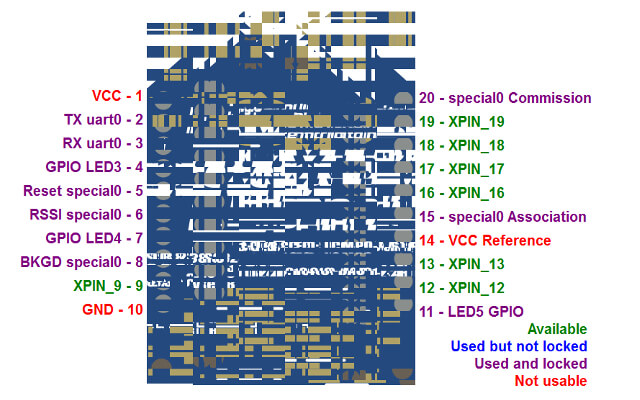
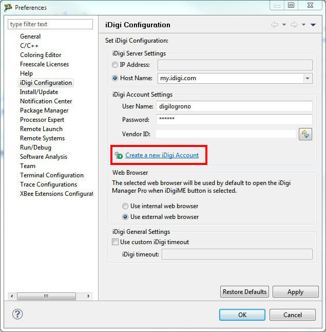
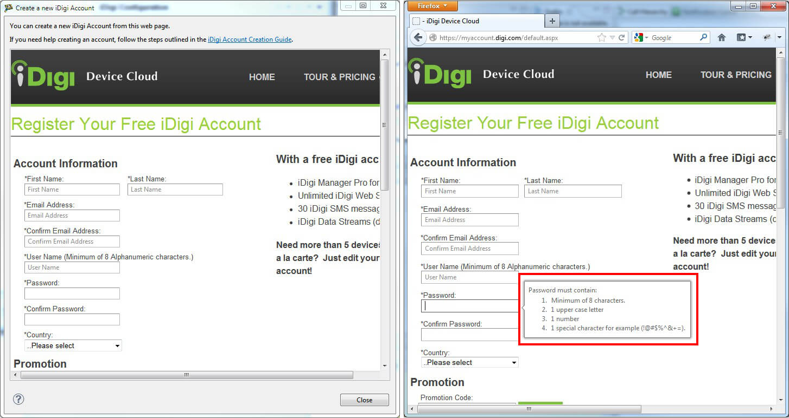

<h1>11. Known issues and limitations</h1>

This is the current list of issues and limitations regarding the Programmable XBee SDK:

# 11.1. XBee Firmware Library

* The **Virtual EEPROM** is not currently supported by the **128KB module** variants.
* Special considerations must be taken into account, regarding some special pins on the XBee ZB (S2B/S2C):
	* The **RESET** pin, when used as standard GPIO, has to be configured as input (due to a limitation of the 9S08QE).
	* The **BKGD** pin, when used as standard GPIO, has to be configured as output (due to a limitation of the 9S08QE).

# 11.2. XBee Extensions for CodeWarrior

* Depending on your graphic card and drivers, you may see that the module image of the Smart Editor's Layout view is not correctly drawn after some resizes. Resizing the dialog again may fix this problem.

* When creating a new iDigi using the link provided in the iDigi Configuration page, there could be	instances where the tooltips of the account creation page are not displayed correctly. This may be a result of the Internet Explorer version	you have installed on your PC. If you are experiencing this issue, we recommend that you go directly to [https://myaccount.digi.com](https://myaccount.digi.com) using an external web browser in order to ensure that all help tooltips are displayed correctly.

</body>