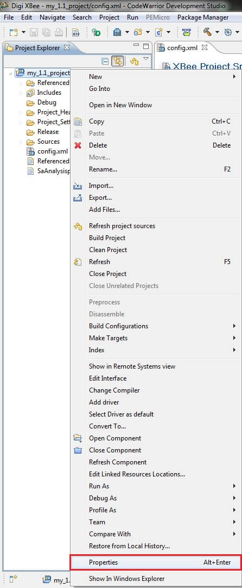
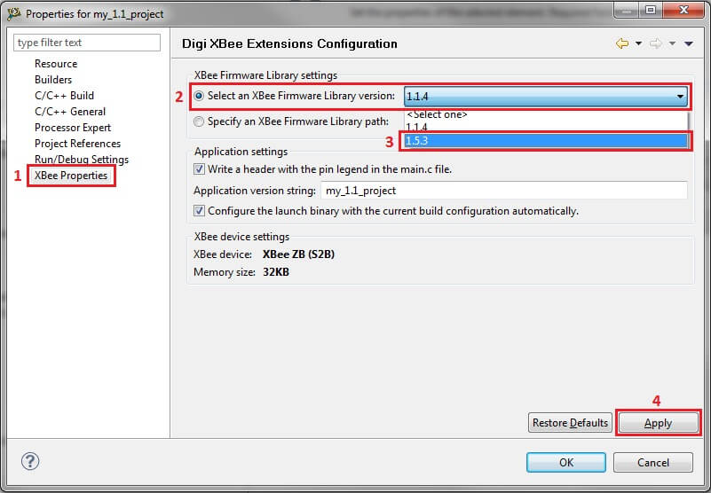
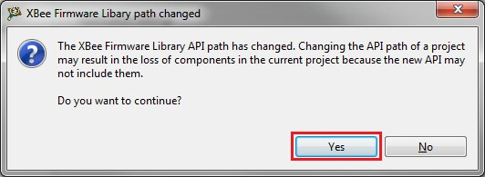
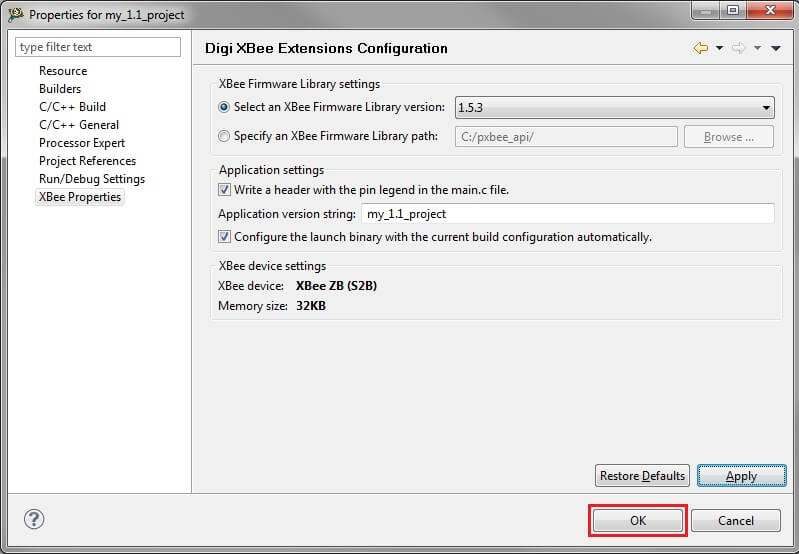
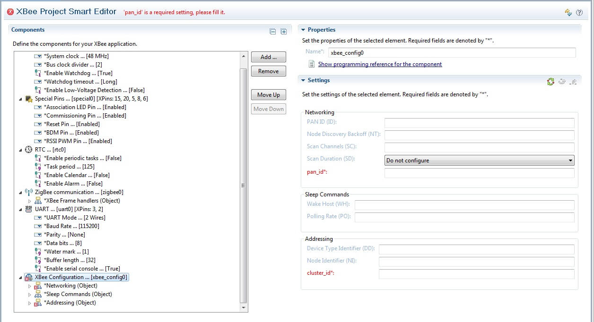
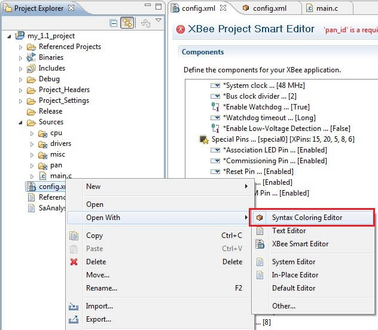
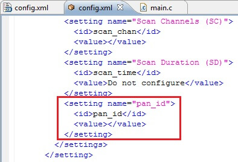
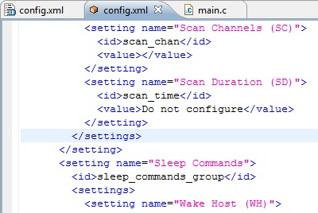
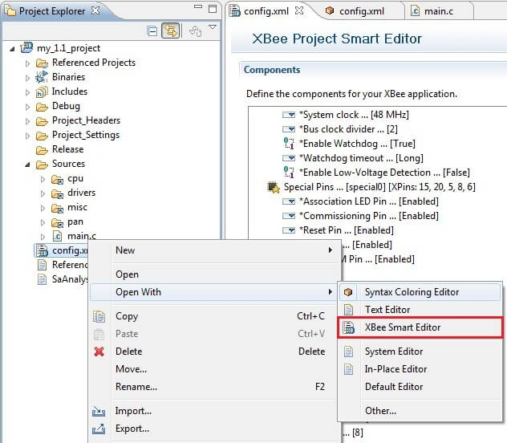

<h1>8. Migrating my XBee projects to 1.5 version</h1>

This section explains how to migrate projects created with version 1.1 of the library to version 1.5. Depending on the complexity of the project, this process is completed almost automatically.

This new version of the library added, removed or changed some of the settings in Smart-Editor's components. These changes are explained in topic [8.1. Migrating the project](migrating.md#81-migrating-the-project). Some drivers have changed their functions or argument lists, especially the ones related to the ZigBee library. These changes are explained in topic [8.2. Migrating the code](migrating.md#82-migrating-the-code).

# 8.1. Migrating the project

The first step in the process of migrating a project to the latest version of the SDK is to link the new library sources. To do so follow these steps:

- Right-click the project in CodeWarrior's Project list and select Properties.

- In the dialog that opens, click on **XBee Properties**.
- Select **Select an XBee Firmware Library Version** under the **XBee Firmware Library settings**.
- Select the new library version.
- Click the **Apply** button; a message will pop-up.

- Click **Yes**; the project sources will automatically be refreshed.

- If the refresh was successful, click **OK** to close the Properties dialog.


Now your project is up to date with the new library. All settings that were not present in the previous version are now included with their default values. For example, the _Low-Voltage Detection_ feature has been added to the **System** component.

Bear in mind that some settings' options have changed, so you should verify that every component's settings are as expected. For example, in the **XBee Configuration** component, the _PAN ID_ field's ID has changed and you will have to re-write it in the proper field. Also, in the **ZigBee Communication** component, the _Process incoming frames_ setting has changed to a single _Enabled/Disabled_ option.

The settings that were removed in this version (for example, _Cluster ID_ field in the **XBee Communications** component) are ignored. However, they still remain in **config.xml**. The settings that are now deprecated in the new library are highlighted in red by the Smart-Editor.



Although these deprecated settings are not harmful (the project will still build and run properly), you might want to remove them from the *config.xml* file. To do so, follow these steps:

- Select the *config.xml* file. Right-click on it, then select **Open with...&gt; Syntax Coloring Editor**.

> 

- In this editor, look for the setting that is causing the error. For example _pan_id_, that in this version was renamed to _zigbee_id_

> 

- Delete the lines that correspond to this setting.

> 

- Repeat this process for all settings that need to be corrected.

- To avoid CodeWarrior opening the *config.xml* file every time with **Syntax Coloring Editor**, right-click this file	and select **Open with...** and then select **XBee Smart Editor**.

> 

# 8.2. Migrating the code

Your projects that were using the XBee communications library will need some tune-up to get them running with the new library. This section explains how to migrate the code.

## 8.2.1. Frame reception handling

The 1.1 SDK inserted two different code-snippets depending on the way the frames were received (AO = 0, AO = 1 or AO = 3). In AO = 0 mode, all frames received were parsed in one handler with no information regarding end-points or clusters. However in AO = 1 or AO = 3 mode the user had to define clusters (and optionally end-points) for each destination end-point and/or cluster expected.

In this version, these problems are simplified by setting the frame reception to Explicit Mode (AO=3) by default, and automatically adding the Digi serial cluster handler in main.c. This way, the user only has one handler for all "simple frames" and the possibility to add custom cluster/end-point handlers by declaring macros in the _custom.h_ header file (this feature is documented with two new examples). All of the old end-point tables and cluster tables that were inserted by SmartEditor in _main.c_ when working with AO = 3 mode were moved to a header and a source file (_endpoints.h_ and _endpoints.c_).

You do not have to worry about the over-the-air firmware update cluster or the node announcement cluster, as they are handled automatically by the SDK and the callbacks (if any) are inserted in _main.c_.

#### Simple RX Frames (AO = 0)

The old handler looked like the following:

```
#ifdef ENABLE_XBEE_HANDLE_RX_SIMPLE_FRAMES
int xbee_rx_simple_handler(xbee_dev_t *xbee, const void FAR *raw, uint16_t length, void FAR *context)
{
    xbee_frame_receive_t *rx = raw;
    uint16_t payload_len = length - offsetof(xbee_frame_receive_t, payload);
    return 0;
}
#endif
```

While the new one looks as follows:

```
#ifdef ENABLE_XBEE_HANDLE_RX
int xbee_transparent_rx(const wpan_envelope_t FAR *envelope, void FAR *context)
{
    /* Add your code here... */

    return 0;
}
#endif
```

The old handler had a _raw_ argument which needed to be cast as an _xbee_frame_receive_t_ pointer; this is no longer necessary because the new one has a _wpan_envelope_t_ pointer. This structure not only has the payload and sender's addresses (extended and network) but also the source/destination endpoints and cluster/profile IDs.

For example, the payload is available in _envelope-&gt;payload_ instead of the old _raw-&gt;payload_, and its length in envelope-&gt;length. The "context" argument is always NULL and should be ignored in this version.

#### Explicit RX Frames (AO = 1) or ZCL RX Frames (AO = 3)

These projects are a slightly more complicated to migrate because the end-point tables and cluster tables that were inserted in _main.c_ by the Smart Editor have been moved to _endpoints.h_ and _endpoints.c_. If the project did not modify the default items, the following code can be removed:

```
const wpan_cluster_table_entry_t digi_data_clusters[] = {

    /* Other clusters should go here, sorted by cluster ID... */

    // transparent serial goes here

    { DIGI_CLUST_SERIAL, xbee_transparent_rx, NULL,

    WPAN_CLUST_FLAG_INOUT | WPAN_CLUST_FLAG_NOT_ZCL },

#ifdef ENABLE_XBEE_HANDLE_ND_RESPONSE_FRAMES

    {DIGI_CLUST_NODEID_MESSAGE, xbee_discovery_cluster_handler, NULL,	/* cluster 0x0095 */

            WPAN_CLUST_FLAG_INPUT | WPAN_CLUST_FLAG_NOT_ZCL},

#endif

    WPAN_CLUST_ENTRY_LIST_END

};

/* Used to track ZDO transactions in order to match responses to requests

    (#ZDO_MATCH_DESC_RESP). */

wpan_ep_state_t zdo_ep_state = { 0 };

const wpan_endpoint_table_entry_t endpoints_table[] = {

    /* Add your endpoints here */

    ZDO_ENDPOINT(zdo_ep_state),

    /* Digi endpoints */

    {

        WPAN_ENDPOINT_DIGI_DATA,&nbsp;&nbsp;// endpoint

        WPAN_PROFILE_DIGI,        // profile ID

        NULL,                     // endpoint handler

        NULL,                     // ep_state

        0x0000,                   // device ID

        0x00,                     // version

        digi_data_clusters        // clusters

    },

    { WPAN_ENDPOINT_END_OF_LIST }

};
```

To learn how to add custom clusters and end-points, please refer to the **Adding a cluster handler to Digi's endpoint** and the **Adding a custom Endpoint** examples.

## 8.2.2. Node Discovery Feature

In version 1.1 the behavior of this feature was different depending on the reception mode (AO) selected. In AO = 0 the node announcement frame was handled in a different callback than the node discovery response (an AT command response). This caused a lot of unnecessary code to be inserted into _main.c_:

```
#ifdef ENABLE_XBEE_HANDLE_ND_RESPONSE_FRAMES

int xbee_disc_atnd_cmd_response_handler(xbee_dev_t *xbee, const void FAR *raw,

                                        uint16_t length, void FAR *context)

{

    static const xbee_at_cmd_t nd = {{'N', 'D'}};

    const xbee_frame_local_at_resp_t FAR *resp = raw;

    xbee_node_id_t node_id;

    if (resp->header.command.w == nd.w &&

        resp->header.status == XBEE_AT_RESP_SUCCESS) {

        /* this is a successful ATND response, parse the response

         * and add the discovered node to our node table */

        if (xbee_disc_nd_parse(&amp;node_id, resp-&gt;value) == 0) {

            node_add(&amp;node_id);

            xbee_disc_node_id_dump(&amp;node_id);

        }

    }

    return 0;

}

/* Node Identification Indicator (0x95) frame handler */

int xbee_node_identification_handler(xbee_dev_t *xbee, const void FAR *raw,

                                     uint16_t length, void FAR *context)

{

    const xbee_frame_node_id_t FAR *frame = raw;

    xbee_node_id_t node_id;


    if (xbee_disc_nd_parse(&amp;node_id, &amp;frame-&gt;node_data) == 0) {

        node_add(&amp;node_id);

        xbee_disc_node_id_dump(&amp;node_id);

    }

    return 0;

}

#endif
```

In version 1.5 the node discovery callbacks and node announcements are handled in a unique callback were information is packed into a _node_id_t_ structure. This makes much easier to implement the node discovery functionality in your modules.

```
#ifdef ENABLE_XBEE_HANDLE_ND_RESPONSE_FRAMES

void node_discovery_callback(xbee_dev_t *xbee, const xbee_node_id_t *node_id)

{

    /* This function is called every time a node is discovered, either by

     * receiving a NodeID message or because a node search was started with

     * function xbee_disc_discover_nodes() */

    return;

}

#endif
```

In this version, the node discovery must be started using only the _xbee_disc_discover_nodes()_ function. This callback is called every time a node announcement message (cluster 0x95) is received or every time an ATND response is received. If a node discovery returns a timeout, the _*node_id_ pointer will be NULL.

## 8.2.3. Over-The-Air Firmware Update

In version 1.1 there was an example explaining how to parse all received frames, and if a matching password was found, to trigger an OTA Update. This functionality has been added as a feature and is completed automatically by the XBee library. The only thing you must do is enable the feature in the _ZigBee Communication_ or _DigiMesh communication_ component, and optionally add a password.

If the module has a serial console enabled, this feature prints some information when the OTA is started or the password is wrong. If this is not desired, the macro SILENT_OTA_UPDATE must be defined in the custom.h header file.

Before rebooting the module for the OTA update, the radio saves all parameters to non-volatile memory to avoid the module connecting to a different network.
