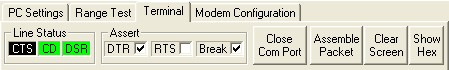
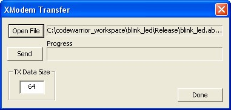
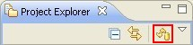

<h1>10. Tips & Tricks</h1>

# 10.1. Getting back into the bootloader

If you have your XBee module already flashed with an application, you can go back to the bootloader (in case the module has it) by following these steps:

- Connect your <acronym title="XBee Interface Board">XBIB</acronym> device with the XBee module attached to any of <acronym title="Universal Serial Bus">USB</acronym> or serial ports of your <acronym title="Personal Computer">PC</acronym>.
- Locate the **Terminal** view in **CodeWarrior** and open the COM port where your <acronym title="XBee Interface Board">XBIB</acronym> device is connected to.

>  **If you can't find the *Terminal* view, you can open it by going to *Window &gt; Show view &gt; Other...* and clicking on *Terminal view* under *Terminal* category.**
- Toggle the **BRK** (break) button of the Terminal toolbar.

- **Reset** your <acronym title="XBee Interface Board">XBIB</acronym> device. You may have to power-off and power-on the device to force a reset.
- Toggle the **BRK** button again.

- Type **Space** or **Enter** in the Terminal view to access the bootloader.

# 10.2. Configuring the programmable XBee module

In order to flash or configure a firmware in your programmable XBee module, you must use the **X-CTU** software. If you don't have it already installed, you can find it at the following link:

[http://ftp1.digi.com/support/utilities/40002637_c.exe](http://ftp1.digi.com/support/utilities/40002637_c.exe)

When the download finishes, execute the file to start the installation process. Follow the installation steps until you are asked to look for new firmware updates.

Click **Yes** to start the search.

>  **Internet access is required to successfully find and download the new firmware updates.**

The installer will complete the search and install the firmware updates.

## 10.2.1. Setting the bootloader in bypass mode

Connect the XBee device you want to re-flash or configure to your <acronym title="Personal Computer">PC</acronym> and execute the X-CTU application by double-clicking the shortcut from your desktop.

X-CTU will open and display the list of Serial ports for your <acronym title="XBee Interface Board">XBIB</acronym>. Select the one that the XBee device is connected to (in this case **COM1**) and configure with the following parameters:

* **Baud**: Select **115200**.

Click on the **Terminal** tab and follow these steps to access the XBee module bootloader:

- **Uncheck the RTS** setting.
- **Check the Break** setting.

- Reset the programmable XBee module.
>  **If you are using an <acronym title="XBee Interface Board">XBIB</acronym> device you need to use the **Reset button**. Disconnecting the <acronym title="Universal Serial Bus">USB</acronym> cable will break the serial connection to your <acronym title="Personal Computer">PC</acronym>.**
- **Clear the Break** setting.

- Press **&lt;Enter&gt;** a few times to display the bootloader menu. If you dont see the menu, go to the **PC Settings** tab and configure the **Baud** to **9600**, then try again.

- Enter '**b**' and press **&lt;Enter&gt;** to set the bootloader in **bypass mode**.

## 10.2.2. Re-flashing the XBee firmware

The programmable XBee module's bootloader must be in bypass mode in order to re-flash its firmware. See [10.2.1. Setting the bootloader in bypass mode](tips_tricks.md#1021-setting-the-bootloader-in-bypass-mode).

>  *X-Stick devices don't have bootloader, and therefore don't require setting the bypass mode.*

Connect the XBee device you want to re-flash and execute X-CTU.

In the **<acronym title="Personal Computer">PC</acronym> settings** tab, X-CTU will display a list of serial ports of your <acronym title="Personal Computer">PC</acronym>. Select the serial port that your XBee device is connected to (in this case **COM1**) and configure with the following parameters:

* **Enable <acronym title="Application Programming Interface">API</acronym>**: Select this option.
* **Baud**: Set to **115200** if you are reflashing an XBee module and **9600** if it is an X-Stick.

Click the **Test / Query** button to verify communication between the PC and the XBee device.

If the communication was successfully established, you will see something like this:

>  *The modem type, firmware and Serial Number may vary depending on the XBee device.*

If communication has not been established you will get the following message:

 

If this happens, follow these steps until you get a communication success message:

- Change the **Baud** setting with a different value and retry the process until you get a communication success message.
- Your XBee device could be configured in AT mode. Uncheck the **Enable API** setting and try again, repeating step 1.

When finished click on the **Modem Configuration** tab in the X-CTU application.

Use the following settings to configure the firmware to flash in the XBee device:

* **Modem**. Select the firmware family to use, commonly **XB24-ZB**.
* **Function Set**. Choose the type of firmware to flash (coordinator, router or end device). It is recommended you choose the API version of the desired firmware type.
* **Version**. Select the version of the firmware.

Enable the **Always update firmware** setting.

>  </td> *If you do not see the specified firmware, click the **Download new versions...** button to look for firmware updates.*

Click **Write** and wait until the XBee device flashing completes.

## 10.2.3. Changing XBee firmware settings

The programmable XBee module's bootloader must be in bypass mode in order to configure its firmware. See [10.2.1. Setting the bootloader in bypass mode](tips_tricks.md#1021-setting-the-bootloader-in-bypass-mode).

>  *X-Stick devices don't have bootloader, and therefore don't require setting the bypass mode.*

Connect the XBee device you want to configure and execute X-CTU.

In the **<acronym title="Personal Computer">PC</acronym> settings** tab, X-CTU will display a list of serial ports of your <acronym title="Personal Computer">PC</acronym>. Select the serial port that your XBee device is connected to (in this case **COM1**) and configure with the following parameters:

* **Enable <acronym title="Application Programming Interface">API</acronym>**: Select this option.
* **Baud**: Set to **115200**.

Click the **Test / Query** button to verify communication between the PC and the XBee.

If the communication was successfully established, you will see something like this:

>  *The modem type, firmware and Serial Number my vary depending on the XBee device.*

If communication has not been established, you will get the following message:

 

If this happens, follow these steps until you get a communication success message:

- Change the **Baud** setting with a different value and retry the process until you get	a communication success message.
- Your XBee device could be configured in AT mode. Uncheck the **Enable API** setting and try	again, repeating step 1.

When finished click on the **Modem Configuration** tab located at application's top.

Click **Read** to display the firmware settings of the XBee device.

Configure the desired settings and click **Write** to save them in the XBee device.

# 10.3. Cleaning a project

Sometimes changes in code will not be applied correctly when rebuilding an existing project. This is because CodeWarrior doesn't compile the entire project if it finds pre-compiled code in the Release and/or Debug export folders.

To avoid this problem, **clean** the project by removing the export directory and its contents:

- Select your project in the **Project Explorer** view.
- Right click it to open the context menu.
- Select the **Clean Project** option.

>  **Note that the Clean Project option only removes the export directory of the active configuration (either Release or Debug). For example, if your active configuration export directory is set to "Release" only the Release folder will be removed. The Debug folder will not be affected (if one exists).

# 10.4. Navigating over the XBee firmware library

One of the advantages of the XBee firmware library is that it abstracts you from all the initialization process of the different hardware interfaces of the device. You configure all the components and settings of your XBee application project through the graphic editor and then, you can focus on the application.

The library and the initialization process have been developed that way intentionally, but it does not mean that you don't have access to see and edit the code that some methods like the hardware initialization one perform.

There are some tricks to easily navigate over the code of the XBee firmware library, select a member of your code and then a right click to open the context menu. There, you will find some interesting code navigation aids:

* **Open declaration**: Will attempt to navigate to the exact definition of the selected element if the selected element is a reference or a declaration. Otherwise, it will attempt to navigate to a declaration of the selected element. Open declaration requires your file to have the proper include paths set up to the declaration.

> 

> 

* **Open Type Hierarchy**: Tries to resolve the element referenced at the current code selection and opens the element in the **Type Hierarchy view**.

> 

> 

* **Open Call Hierarchy**: Tries to resolve the method referenced at the current code selection	and opens the element in the **Call Hierarchy** view.

> 

> 

# 10.5. Searching in the XBee firmware library

By default, the search process does not include the referenced headers and code files of the XBee firmware library. Follow these steps to include them in the search results:

- Select the project you want to search in the **Project Explorer** view.
- Refresh the project contents by right-clicking the project and selecting the **Refresh** option. This	will avoid unsynchronization problems with the files of the project.
- Select **Search &gt; Search...** in the main menu to open the search dialog.
- Enter the text you want to search. Check the **Consider derived resources** setting and	choose the **Selected resources** option under **Scope**.
> 
- Click **Search** to start the searching process.

Your search results should include all the files referenced in your project.

# 10.6. Flashing a programmable XBee application via XModem

When you build a programmable XBee project, the process generates two kinds of binaries in the corresponding build folder (Release or Debug):

* ***.s19** file: An Srecord file used by CodeWarrior to transfer and debug the application through the debugger.
* ***.bin** file: A binary file that can be used by other programs to transfer the application to the XBee module.

You can upload an application to the XBee module via serial port or over the air using any **XModem** program. In this case you will upload an application over the serial port using the XModem function built into **X-CTU**.

The ***.bin** binary will be the file used to transfer the an application via XModem. Build your project using the Release configuration to generate the binary files.

## 10.6.1. Transfer process

The first step is to display the bootloader of the XBee module using the X-CTU. Follow all the instructions in [10.2.1. Setting the bootloader in bypass mode](tips_tricks.md#1021-setting-the-bootloader-in-bypass-mode) section, **except the last one**, which sets the bootloader in bypass mode. We only want to display the bootloader for the transfer process.

Once the bootloader of the XBee module is displayed, follow these steps to transfer your application:

- Click **XModem** to display the XModem Transfer window.

> 

- Click **Open File** and browse to the desired project's binary output file (*.bin) in	the **Release** folder of the project.

> 

- Click **Open**. The path to the selected file will populate the top box.

> 

- In the **Terminal** tab, enter '**F**' to initiate a wired firmware update. A series of '**C**' characters will be displayed within the Terminal tab.

> 

- In the XModem window, click **Send**. The '**C**' characters are a visual indication of the timeout during which the app file can be sent. If you miss that timeout, you can type in an '**F**' to start the process again. The file will be sent to the module.

> 

- Click **Done** to close the XModem Transfer window.

The bootloader will run the newly loaded application automatically.

# 10.7. Removing the launch progress dialog

When you launch or debug an application, a dialog displays the progress of the process. This dialog is blocking the <acronym title="Integrated Development Environment">IDE</acronym>, so you are not able to perform other tasks while a project is being launched.

It is possible to configure the launch configuration to not to display the progress dialog when launch the project. To do so follow these steps:

- Select the project from the **Project Explorer** view, right click it and select **Run As &gt; Run Configurations**.

- The Run Configurations dialog displays. Select the run configuration of the project from the list.

- Click the **Common** tab and check the **Launch in background** option.

- Press **Apply** and close the dialog.

Next time you launch the project, the progress of the launch process will be displayed in the progress status bar.

<  **Note that you must perform this process for all the projects you want to be launched in background.

# 10.8. Refreshing the project sources

When a XBee application project is created, the wizard adds the **XBee firmware library sources** to the project creating **symbolic links** to all the files. This way the library is common for all the XBee application projects and, if you make a change in any file, all the projects will take it when built.

The problem comes when instead of making a change in one of the library files, you add or remove a file. Then, when you build a project you could receive errors indicating that there are some files missing, or that some files are not found.

It is then when you should perform a refresh of the sources of the project. Refreshing the sources of a project means that the symbolic links will be updated adding more links or removing others. To perform the refresh follow these two steps:

- Select your project in the **Project Explorer** view.

- Click **Refresh project sources** in the toolbar of the view.

	* If the project has a valid XBee firmware library configured, the process will start and a progress dialog will display.
> 
	* If the XBee firmware library configured in the project does not exist or is not valid, a configuration dialog will display. There you can configure the XBee firmware library of the project to continue with the process.
> 

# 10.9. Renaming a project

There could be scenarios where you may want to start working with an example and then give it a name that is more appropriate to your application. To do so, be sure to follow these steps in order to get your binaries renamed and avoid launching problems:

- Select your project in the Project Explorer view.

- Right-click on your project and select **Rename...**

- Enter the new name of your project into the dialog displayed, for example	**alarm_light**, and click **OK**.

- Your project should be displayed, including the new name you created in the	previous step, within the Project Explorer view. Right-click on your project and select	**Properties**.

- Select the **Settings** item from the **C/C++ Build** menu.

- Select the **Artifact** tab and enter the new name of your project into the **Artifact name** field, and then click **OK**.

- The binaries of your project should be generated using the new name you created, but the launch configuration of the project is still pointing to the old application name. To correct this issue select your project within the Project Explorer view, then right-click on it and select **Run As &gt; Run Configurations...**.

- Select the launch configuration of your project from the list of launch configurations. Enter the new name of your project into the **Application** field. Click **Apply** to apply this change, and then **Close** the dialog.

- Now, your project can be built and launched correctly with the new name.

# 10.10. Configuring an XBee network

The Programmable XBee Kit comes with the XBee components already configured to create your own XBee netowrk. The X-Stick is configured to start an XBee network with a random identifier (PAN ID), and the modules are configured to join the first XBee network they find.

Under these circumstances, the XBee modules should always join the XBee network started by the X-Stick, but that is not always the case. A problem can arise when there are other nearby XBee networks and the XBee modules join one of those networks instead of the one started by the X-Stick. To avoid this problem you can configure your network with a **custom identifier** (PAN ID). You will need to configure it for all the devices in the network.

* **X-Stick**: To configure the PAN ID of the X-Stick, follow the instructions of the [10.2.3. Changing XBee firmware settings](tips_tricks.md#1023-changing-xbee-firmware-settings) section and in the last step, configure the **ID** setting with a specific 64 bit value.
* **XBee module**: You can configure the PAN ID of the XBee module using one of the following methods:
	* Follow the instructions of the [10.2.3. Changing XBee firmware settings](tips_tricks.md#1023-changing-xbee-firmware-settings) section and in the last step, configure the **ID** setting with **the same value as the X-Stick**.
    * Use the Smart Editor to add the **XBee Configuration** component. Then edit its **Network ID** setting by filling it with **the same value as the X-Stick**.
> 

# 10.11. Restarting an application in debug mode

When debugging a project, it is very common to want to restart the application and debug it again (without making changes in the code). For that purpose you can execute the debug process again by downloading the application to the microcontroller. However, that process is a bit harmful, as it will re-write the flash of the 
module.

Fortunately, there is an option to restart the program when debugging without re-flashing the module again. To do  so follow these steps:

- In the Debug view, select the debug process corresponding to the project you are currently debugging.

- Right-click on it and select the **Restart** option.

- The debug process will be restarted without re-flashing the module and it will stop at the first	code instruction of the project.

# 10.12. Modifying the upload rate of the XBee Internet Gateway

By default, the XBee Internet Gateway is configured to upload samples (in case it receives some) to iDigi every 30 seconds. There could be some scenarios where this time is too little or too big. For such instances, it is possible to change this value.

- If the XIG is running, close it. Make sure that both the application and the web interface are closed.
- Go to the folder where the XIG is installed on your PC and open the *xig_config_default.py* file with a text editor.

- Locate the line where the **idigi_data_max_rate_sec** variable is declared and change its value (30 by default) to your desired upload rate to iDigi (in seconds).

> When finished, save and close the file.
- Re-start the XIG; the change in upload rate will be applied.

# 10.13. Over The Air firmware update through Telnet

If you already have the OTA firmware update Python files uploaded in your ConnectPort X device, you do not need to use the web application provided with the Programmable XBee SDK in order to perform an Over The Air (OTA) firmware update. Instead you can connect with the ConnectPort through a Telnet session and launch the OTA process from there. To do so, follow these steps:

>  *It is assumed that the OTA firmware update Python application is already transferred to the ConnectPort device.*

- If you had the Python auto-start setting enabled, you need to disable it. To do so, go to the Home page of your ConnectPort device (by entering the device's IP address into your browser). Once there, navigate to **Applications &gt; Python** from	the left menu and then select the **Auto-start settings** menu. Uncheck any configured auto-start scripts.

> 

- Next you must transfer the firmware application binary to the ConnectPort device. Again navigate to **Applications &gt; Python** from the left menu. Click the **Browse** button and look for the binary file of the application you want to upload. Click **Upload** to transfer the file to the ConnectPort device.

> 

> 

- Open a Telnet session with the ConnectPort device. You can make use of the Terminal view embedded	within the CodeWarrior IDE. Go to **Window &gt; Show view &gt; Terminal** within CodeWarrior to open this view.

> 

> Click the Terminal settings button and configure the Telnet connection.

> 

> Enter the IP Address of your ConnectPort device and click **OK** to open the connection.

> 

- In the Telnet session, enter the following command: `python ota_client.py` and wait for the OTA firmware update application to start. The first task that will be performed is a node discovery.

> 

- When the node discovery finishes, you will be prompted for the index of the XBee device you want to transfer the application.

> Enter the index of the XBee module and press **Enter**.

- Next, you will be prompted for the OTA password.

> If the OTA service currently running in the module does not have password, leave it in blank and press **Enter**.

- Finally, you will be asked for the name of the application binary to be updated to the XBee module. This is the name	of the file you uploaded to the ConnectPort in the step 2.

> 

> Enter the name of the file and press **Enter**.

- The OTA firmware update process will start.

>

When it finishes, you will see a success message.

>

The remote XBee node is now updated with the new application.
