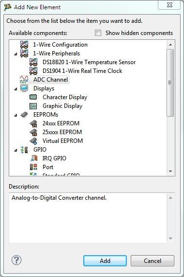
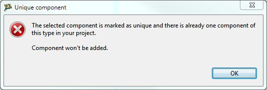
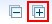
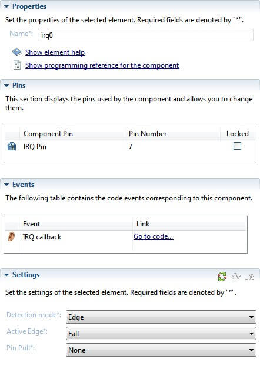
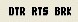
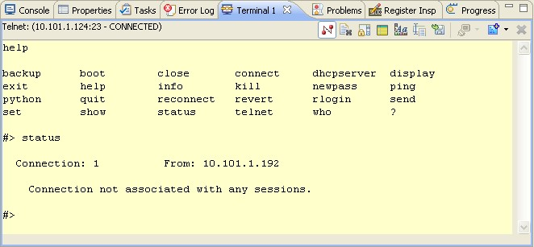
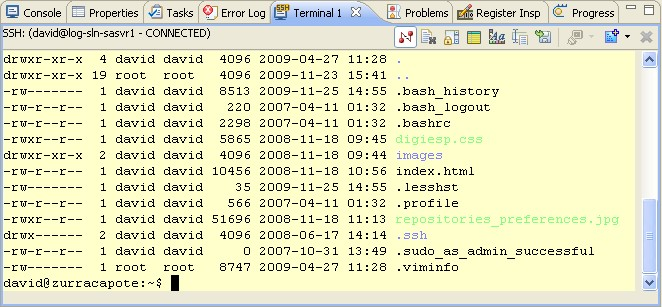

<h1>3. Working with the XBee extensions</h1>

This topic provides detailed documentation to work and configure the XBee extensions for CodeWarrior.

# 3.1. XBee extensions configuration

Open CodeWarrior by clicking the icon in the desktop.

When CodeWarrior launches, it prompts for a **workspace** directory:

The **workspace** is the directory where projects and configurations will be stored. 
The default location for this directory is *C:\workspace*.

Type the location of the workspace, and click **OK**. CodeWarrior 
will open and the Welcome screen will display.

## 3.1.1. XBee extensions preferences

To make sure the Workbench is properly configured, select  **Window &gt; Preferences**.

The **XBee extensions Configuration** contains the main preferences of the XBee extensions:

* **XBee extensions installation path**: Specifies the directory where the XBee extensions	files are installed. By default, this value is the folder you selected in the installation process.
* **XBee Firmware Library Settings**: Specifies	the default XBee Firmware Library to be used.
	* **Select an XBee Firmware Library version**: Lists all the versions installed inside the **pxbee_api** directory of the XBee extensions path selected above.
    * **XBee Firmware Library Path**: Allows the specification of a XBee Firmware Library directory	in your <acronym title="Personal Computer">PC</acronym>.

>  **If a parameter is not configured or has invalid values, the preference pages display an error and will not allow applying the values until the problem is solved.**

# 3.2. XBee extensions perspective

When the **Welcome** view is closed, the **XBee extensions** perspective is displayed. This perspective and all the included views and buttons are specifically designed for developing **programmable XBee** projects.

The **XBee extensions** perspective can also be opened by selecting it in the perspective dialog  **Window &gt; Open Perspective &gt; Other**.

By default, this perspective includes several views:

- Project Explorer
- Console
- Properties
- Problems
- Tasks
- Progress
- Terminal
- Editor
- XBee Smart Editor
- Outline

But it can be modified:

* To add new views which are not visible by default, select  **Window &gt; Show View &gt; Other** and select a new view from the **Show View** dialog.
* To customize the perspective, such as adding or deleting action sets, menu options, etc., select  **Window &gt; Customize Perspective...**.
* To reset the current perspective to its original layout, select  **Window &gt; Reset Perspective**.

> 
	* To save a modified perspective, select  **Window &gt; Save Perspective as...**
	* To remove a custom perspective, select  **Window &gt; Preferences &gt; General &gt; Perspectives**, select the perspective to delete, and click **Remove**.

## 3.2.1. Project Explorer

**The Project Explorer** shows all **programmable XBee** projects with their files in a tree structure.

To open the Project Explorer view, select  **Window &gt; Show View &gt; Project Explorer**. If the Project Explorer is not listed, select **Other** to open the **Show View** dialog. The Project Explorer view is located under the 
**General** group.

The Project Explorer view has a toolbar with several buttons:

* **Collapse All**: Collapses the tree expansion state of all resources in the view.

> 

* **Link with Editor**: Toggles whether the Project Explorer view selection is linked to the active editor. When selected, changing the active editor automatically	updates the Project Explorer selection to the resource being edited.

> 

* **Refresh project sources**: Refreshes the linked resources of the project creating the XBee firmware library symbolic links again. If you add or remove files from the XBee	firmware library, you must select a project and press this button to re-synchronize the sources.

> 

> This option is also accessible from the context menu of the view. Select a project in the	**Project Explorer** and right click it. You will find the **Refresh project sources** in the menu.

> 

The **Project Explorer** view also includes a menu (displayed as an inverted triangle), that contains more actions like managing working sets, applying filters, etc.

>  If there are many projects inside the workspace, they can be organized into working sets. 

## 3.2.2. Editor view

The **CodeWarrior editor view** provides specialized features for editing C code: Syntax highlight, auto-completion, error markers, etc.

## 3.2.3. XBee Smart Editor

The **XBee Project Smart Editor** view is used to configure the functional components of a programmable XBee project.

To know more about this view see topic [3.3. XBee Smart Editor](working_xbee_extensions.md#33-xbee-smart-editor).

## 3.2.4. Outline view

**Outline** view displays the structure of the file currently open in an editor.

## 3.2.5. Console view

**Console** view displays output messages from build tools.

The Console view toolbar includes several buttons:

* **Clear Console** clears the console.
* **Scroll Lock** toggles the Scroll Lock.
* **Pin Console** forces the Console view to remain on top of other views in the window area.
* **Open Console** opens a new console view.

The build console also includes a context menu with edit and find options.

## 3.2.6. Properties view

**Properties** view shows attributes of the currently selected item in a view or editor.

## 3.2.7. Problems view

**Problems** view displays errors or warnings that occur while writing code or during a build.

## 3.2.8. Tasks view

**Tasks** view keeps track of tasks, either as a schedule of things to do or a history of things that have been done.

## 3.2.9. Progress view

**Progress** view displays information about the jobs currently in progress such as build or launch processes.

## 3.2.10. Terminal view

**Terminal** allows users to open Serial, <acronym title="Secure Shell">SSH</acronym> and Telnet connections to interact with a remote device.

To know more about this view see topic [3.4. Terminal view](working_xbee_extensions.md#34-terminal-view).

# 3.3. XBee Smart Editor

To edit an existing programmable XBee project, double click on its *config.xml* project file from the **Project Explorer view**. The **XBee Project Smart Editor** will open allowing you to configure the components of the project. The editor has 2 different views accessible via the tabs located at bottom of the page.

*   Graphic Editor view
*   Layout view

Both views represent the components that form part of the XBee application project, but only the first one allows you to configure them. By default the Graphic Editor view is displayed when opening the editor.

## 3.3.1. Graphic Editor view

The Graphic Editor view displays all the contents of the selected project graphically. From this view you can intuitively **add**, **remove** or **edit** any of the project components directly.

The **Editor** is divided in several parts:

* Components list
* Component properties
* XBee pins table
* Events table
* Component settings

### 3.3.1.1. Components list section

The components list displays all the components that define the programmable XBee project. A component can be understood as a **functionality block** or **interface** of the XBee device. Some components may need to use XBee pins to work. 

This list is located in the left side of the editor. Each component may be expanded to see the list of configurable settings. Special settings such as **lists**, **tables** or **objects** can also be expanded to see their children:

The components list is built using an internal <acronym title="Extensible Markup Language">XML</acronym> elements database that provides the necessary information to build component templates. These templates are filled later using the information of the project. You can refresh the templates database by clicking in the **Refresh Components Templates Data Base** icon, located in the top right corner of the editor:

Components in the list are labeled by their type, followed by the name used inside the project. Components that make use of XBee pins are followed by the list of pins that they use; for example, the **Special Pins** component.

If any component has invalid values or is not properly configured, the component will be marked with an **error image** in the lower left corner of its icon. If you expand the component with errors, you will see the setting or settings that have errors marked with the same icon:

At the right side of the list you can find 4 buttons:

* **Add...**: Opens a new dialog to add a new component to the project.

> 

> 

> From this new dialog, you will be able to see the list of available components; some of them are grouped by categories. To add a new component, select it and click the **Add** button. The list of available components is generated from the  **internal <acronym title="Extensible Markup Language">XML</acronym> components database**, which may be enlarged with the installation of new packages or the addition of custom ones.

> By default the project contains some components that must be always present. If, for any reason those components disappear from the project, you can see them in the list of components by checking the **Show hidden components** option.

> 

> Some components have **special requirements** that will be shown to the user when the item is added:

> 

> This means that this component is unique and it is not possible to add another one to the project.

> 

> This message means that the component that is being added requires the addition of another component in order to work properly. This is known as components dependency.

* **Remove**: Removes the selected component from the project.

> 

* **Move Up**: Moves the selected component up one position inside the project.

> 

* **Move Down**: Moves the selected component down one position inside the project.

> 

The components list has its own **context menu** and can be accessed with a **right click** over the list:

> 

These are the **context menu** items:

* **Add new**: If a component is selected, this menu allows the addition of one of the selected components:

> 

> If a setting that may contain other elements (for example a table or a list) is seleted, this menu allows the addition of a child setting:

> 

* **Move up**: Moves the selected component up one position inside the project.
* **Move down**: Moves the selected component down one position inside the project.
* **Copy**: Copies the selected component or child setting from a table or list setting.
* **Paste**: If the copied item is a component, this menu action pastes it into the list. If the copied item is a child setting from a table or list, this menu action pastes the copied child setting into the selected setting. Please note that this only works if the source container setting and the destination container setting are compatible.
* **Delete**: Removes the selected component or the selected child setting.

In the **top-right** corner of the **component list section**, there are two action buttons to interact with 
the components tree:

* **Collapse all**: This action collapses all the tree items:

> 

* **Expand all**: This action expands all the tree items:

> 

You can edit or interact with the **Properties**, **XBee Pins table**, **Events table** and **Settings** of each component by selecting the desired component from this list and view the contents in the sections on the right side of the editor:

### 3.3.1.2. Properties section

Displays the main properties of the selected component.

This section is located at the top of the right side of the editor and has two different elements:

* **Name**: Name assigned to this component inside the project.

> 

> This name is editable and it must not be repeated. If you try to enter a duplicated name, you will get a warning message and name will be set to a valid one:

> 

* **Show component description**: This link opens the API reference page of the component:

> 

> 

* **Show programming reference for the component**: Some components have an additional link that points to a little programming guide for the component located in the documentation.

> 

> 

### 3.3.1.3. XBee pins section

Some components (normally interfaces) make use of some XBee pins to work. These components will include a section in the right side of the editor called **XBee Pins** to manage them.

The table displays the following fields:

* **Component Pin:** The name to identify the pin's function in the	component.
* **XBee Pin Number:** The pin number of the XBee module.
* **Locked:** Prohibits automatic pin re-assignation by the editor when it looks for a components solution (this will be explained now).

Some XBee module pins can be configured to automatically replace the have the pin number with another one that shares the same functionality. This is common in the GPIO where most of the XBee pins can be configured as GPIO. To set this up, just click in the pin cell of the table to display the list of compatible pin values.

If the pin selected is being used by another component in the project, the editor will display a warning message. Clicking **Yes** on the warning will allow the editor to search for a global solution, but may re-assign pins in other components.

Before re-assigning pins, the editor will display a list with the pin changes that will be performed. At this point you can choose to apply the specified pin changes or to cancel the process

If the editor does not find a solution you will receive an error message and the pin number will return to its previous value.

If you don't want the editor to change the pin value of a component when it looks for solutions (when it re-assigns pins), you can **lock** the pin. To do so, just check the checkbox of the desired pin in the **Locked** column.

Pins with the locked option set, won't be re-assigned when the editor looks for solutions.

### 3.3.1.4. Events section

Some components, like the RTC, can generate different events when the application is running. The editor will automatically write the event's callbacks in the *main.c* file of the project and will display the component's list of events in the **Events** section.

The table displays the following fields:

* **Event:** The name to identify the event type in the component.
* **Link:** Direct access to the event callback in the code.

Pressing the **Go to code...** link of any event will open the *main.c* file of the project pointing to the line where the callback is declared.

>  The callback declarations are written in the main.c file when the project is saved in the Editor. If the callback has not been found, you will receive a message like this asking you to save the project:

> 

### 3.3.1.5. Settings section

This section is located in the bottom-right side of the editor and shows all the editable parameters of the selected component. Required parameters are marked with an ***** after their names.

You can view specific information for each parameter in the pop-up dialog that displays when cursor is over the setting name.

To view and edit a setting individually, select it from the **elements list**. The setting will display along with its description and a navigation bar with the path of the setting inside the element.

There are several types of settings:

* **Boolean settings**: Value can be set to **True** or **False** using the radio buttons.

> 

* **Numeric settings**: Input text boxes that only accept numeric values.

> 

* **Text settings**: Input text boxes accepting alphanumeric values.

> 

* **Combo settings**: Displays a list of possible values for the setting.

>

* **Object (container) settings**: Settings that do not have a specific value, but instead more nested settings are categorized as object or container settings. They are represented by a group of settings:

> 

* **List settings**: List settings are those that can contain a list of fixed values as children or just a list of other settings.

> 

> These kinds of settings are represented by a **list** at the left side and a set of **three buttons** at the right:

* 
	* **Add button**: Adds a new element or setting to the list.
	* **Remove button**: Removes the selected element or setting from the list.
	* **Edit button**: Click to edit the selected element or setting in the list. Different dialogs will display, depending on the setting type.

> 

* **Table settings**: Table settings are like list settings with the added ability to modify children setting's labels or identifiers, as well as their values. Children settings do not have a fixed value for their label or identifier, so the user is free to add different identifiers with different values. They behave the same as a map or dictionary.

> 

> These kinds of settings are represented by a **table** with identifier and value columns at the left side and a set of **three buttons** at the right.

* 
	* **Add Entry**: Adds a new entry to the list.
	* **Remove Entry**: Removes the selected entry from the list.
    * **Edit Entry**: Click to edit the selected entry in the list. This button will cause  the editor to point to the entry setting that will be modified.

> 

> Both **list** and **table** settings have a **context menu** that can be accessed with a right-click over the list or the table.

> 

* These are the menu items:
	* **Add new**: Allows the addition of a new element to the list or the table.
    * **Edit**: Click to edit the selected element or entry. This action behaves the same as the **Edit button**.
    * **Copy**: Copies the selected element or entry from the list or table.
    * **Paste**: Pastes the copied item into the list or the table.	Please note that this only works if the source container setting and the destination container setting are compatible.
    * **Delete**: Removes the selected item from the list or the table.

* **Unknown settings**: Settings that are not recognized in the element database template. They are identified by a question mark icon before their name.

> 

> Unknown settings have no hover information regarding their purpose. Instead, a predefined message will be displayed: 

If a required setting is not filled, the element will be marked as invalid and an error message will be displayed at the top of the editor.

Text settings may have a format associated with them in order to validate the value of the setting. If the setting value is not valid, an error message will be displayed at the top of the editor.

There are some special settings that must be unique for each project. If the setting value is repeated in another component, an error message will be displayed at the top of the editor.

Other settings, such as numeric variables, require the value to be between a range of numbers. An error message will display at the top of the editor if the value of the setting is out of that range.

Any incorrect or problematic settings will be marked in red.

There are three action buttons to interact with the selected setting or element in the **top-right** corner of the **settings section**.

* **Reset to defaults**: This action will reset the selected element or setting to its default values.

> 

> 

* **Go to parent**: If the selected item is a setting, this action navigates throught the settings hierarchy to the parent level, displaying the parent setting or the element.

> 

* **Go to root**: If the selected item is a setting, this action navigates through the settings hierarchy to the top parent level, displaying the parent element.

> 

All the sections located in the right side of the editor can be docked or collapsed for better navigation between the component options. To collapse a section, just press the arrow located before the section title.

> 

## 3.3.2. Layout view

The Layout view, accessible from the Layout tab, displays a representation of the project's XBee module layout. It also shows the pin usage of the module as well as their distribution along the layout.

A legend within the view displays pin usability. When a pin is available, it will be represented with the name of the pin written in green. Red indicates that the pin cannot be used (maybe it is a VCC pin, GND, etc.). If a pin is in use by any component in the application it will display the name of the component that is using the pin followed by the pin functionality and, depending on whether the pin is locked or not, it will be purple or blue.

If you hover over a used pin in the layout, a tooltip will be displayed showing some information about the component that is using that pin.

The layout of the module that the view displays depends on the XBee module type used by the project. If the project is using a Through-Hole technology (THT) XBee module, the view will display the following layout:

However, if the module used in the project is a Surface-Mount Technology (SMT) XBee module, the view will display the following layout:

If you right-click on a pin within the Layout view, a context menu will be displayed offering you the following actions concerning that pin:

* **Add new**: You can add a new component directly from the context menu. Depending on the pin that opened the context menu, the Add New components will be filtered displaying only those ones compatible with the pin. If the pin that opened the context menu is in use, this option will not be available.

> 

* **Edit Component**: This option is only available if the pin that opened the context menu is in use. It will redirect you to the **Graphic Editor** view where the component that was using the pin is already selected and ready to be configured.

> 

>  *Double-clicking on a pin also performs this action.*

* **Lock/Unlock Pin**: This option is only available if the pin that opened the context menu is in use and allows you to lock or unlock a pin. If the pin does not support this feature, the option will be disabled.

> 

* **Change to Pin**: If the selected pin is used and unlocked, this option allows you to directly choose a different pin for the selected component functionality.

> 

* **Remove Component**: Removes the component that is using the pin.

> 

>  **All project components related changes made in the Layout view, will also take effect in the Graphic Editor view.**

If you add a component from the context menu of the Layout view, this component will also be added to the pin that opened the context menu and will automatically lock the pin. For example, if you want to add a GPIO to pin 18, right-click that pin.

In the context menu, go to **Add new &gt; GPIO &gt; Standard GPIO** to add a GPIO component to that pin.

The name of pin 18 will change from **XPIN_18** to **gpio0 GPIO** and its color will change to purple indicating that the pin is used and locked.

# 3.4. Terminal view

The **Terminal view** provides a raw serial or network connection to your remote device. This view is useful for monitoring output on a device's serial port or making a telnet connection to a device.

To access this view, click  **Window &gt; Show view &gt; Other...** and click **Terminal view** under **Terminal** category.

**Multiple Terminal view** instances can be active at the same time, connected to a number of remote systems or disconnected and just holding their settings ready for re-connect.

The Terminal view is **activated** by choosing  **Window &gt; Show view &gt; Other &gt; Terminal**.

A text label reports the state of the console (connected or disconnected), and the connection settings.

This view's toolbar includes:

* **Connect/Disconnect**: Establishes or finishes the selected connection.
* **Clear Console**: Removes all console contents.
* **Scroll Lock**: Toggles scroll lock.
* **Settings**: Opens the Terminal Settings dialog. While connected, only the connection's title can be changed.
* **Configure Terminal**: Sets appearance parameters of the terminal such as colors, fonts, etc.
* **Toggle Command Input Field button**: Toggles the Command Input field, for editing complex command lines on dumb terminals.
* **Capture data button**: Captures remote data to a file.
* **Display Selected Connections**: Selects a Terminal connection to show in this view instance. (Only available when multiple connections have been defined in this view.)
* **New Terminal**: Opens another Terminal connection in the current view or in a new Terminal view instance.
* **Remove Terminal**: Removes the currently selected Terminal Connection from this view. (Only available when multiple connections have been defined in this view.)

Each instance of the **Terminal** view can hold multiple connections, each of which can be connected to a different remote endpoint (either serial or network). Of course, the number of serial connections is limited by the number of serial ports.

The context menu for this view includes some of these options (**Connect**/**Disconnect**,**Clear Console**, **Scroll Lock**, etc.), plus edit (**Copy**, **Paste**, **Select All**) options.

## 3.4.1. Terminal Settings

Use the **Terminal Settings** dialog to configure your connection.

**View Title**: Enter a name to your Terminal View instance.

**Connection Type**: Select Serial, SSH, Telnet or X3 Command Console.

The **Settings** area displays different fields, depending on the Connection Type selected.

### 3.4.1.1. Serial Connection Settings

If Serial Connection Type is selected, the following fields will display in the Settings area:

* **Port**: Select the serial port connected to the device (by default, **COM1**).
* **Baud Rate**: Select the baud rate of the connection (default 9600 bps).
* **Data Bits**: Select the number of data bits of the frame (default 8).
* **Stop Bits**: Select the number of stop bits (default 1).
* **Parity**: Select None, Even, Odd, Mark or Space (default None).
* **Flow control**: Select None, RTS/CTS or Xon/Xoff (default None).
* **Timeout**: Enter the number of seconds that the connection will time out.

When the Serial settings have been properly configured, click **OK** to save them and initiate the serial connection.

Serial connection information appears in the header of the Terminal view.

When you open a serial connection, 3 new buttons appear in the toolbar of the view.

* **DTR** button: Select the serial port connected to the device (by default, **COM1**).
* **RTS** button: Select the baud rate of the connection (default 9600 bps).
* **BRK** button: Select the number of data bits of the frame (default 8).

### 3.4.1.2. Telnet Connection Settings

If Telnet Connection Type is selected, the following fields will display in the Settings area:

* **Host**: Enter the IP address to connect to.
* **Port**: Enter the network port to connect to.
* **Timeout**: Can be changed for very slow networks.

When the Telnet settings have been properly configured, click **OK** to save them and initiate the Telnet connection.

Telnet connection information appears in the header of the Terminal view.

### 3.4.1.3. SSH Connection Settings

If SSH Connection Type is selected, the following fields will display in the Settings area:

* **Host**: Enter the IP address to connect to.
* **Port**: Enter the network port to connect to.
* **User**: Enter the remote user id to use.
* **Password**: This field is optional, since SSH can re-use your private keys as specified on the  **Window &gt; Preferences... &gt; General &gt; Network Connections &gt; SSH2**.
* **Timeout**: Can be changed for very slow networks.
* **KeepAlive**: Enter a value to specify an interval in seconds, by which the Terminal automatically sends a packet to the remote host in order to keep the connection alive even	in case of inactivity.

When all settings are specified, click OK**. This applies the configuration and initiates the SSH connection.

## 3.4.2. Terminal Preferences

This view's default settings are configured on the Preference Pages:  **Window &gt; Preferences... &gt; Terminal Configuration**.

